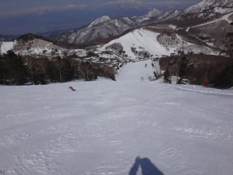
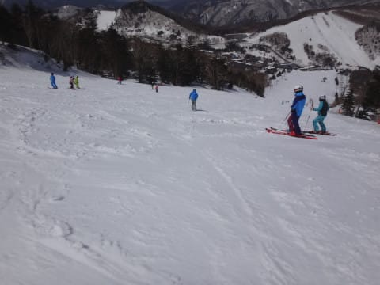
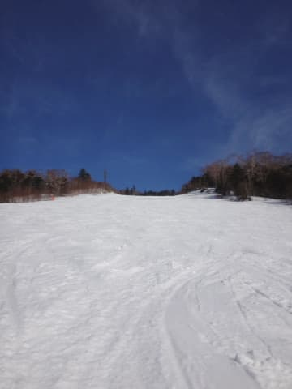

# 4月16日，日曜日の志賀高原の詳細レポート…一の瀬は朝は締まったGood斜面！天気も良く，楽しい春スキーの一日

📅 投稿日時: 2017-04-18 02:05:11

🏷️ カテゴリ: [2017スキー滑走日記](c7d777cecfc91bdf0fa464ad62c6d49ab.md)

えー．

どうやら，18日は暴風雨の予想が出ているようですが．

志賀高原の18日．

風が強くて奥志賀ゴンドラは動かない可能性が

高いけど．

そして，気温も+12℃以上にまで上がりそうだけど．

…でも，朝には雨もやんで．

それほどゲレンデはひどい状態にはならなさそう…

と，思っている今日この頃，いかがお過ごしでしょうか．

ってことで．

本日は．

昨日速報した，日曜の志賀高原詳細レポート，行きます～！

…昨日速報したように．

超すっきり晴天で始まった，日曜の朝．

そして，朝イチのゲレンデは…

うはー！

見事なシマシマ！

まだ誰も滑ってない，ピカピカバーンが

お出迎え！！

すっきり晴れたおかげで，

放射冷却がしっかり入り．

朝はマイナスまで気温が冷え込んだので…

ゲレンデはかなりいい感じで締まってますね～！

…ってか．

これ，ちょっと硬くない…？

って感じの，アイスバーン気味にしっかり

固まったバーン条件でスタート！

朝イチは全体的に硬かったけど．

9時過ぎには，硬いながらもある程度エッジが

引っかかる，気持ちいい大回りバーンになっていき．

いや～！人も少ないし．

4月の晴天で，雪がザブザブに緩まず．

こんな締まった雪を，大回りで気持ちよく

飛ばせるとは！

やっぱり今シーズンは恵まれてる！！

…しかし…

正面に見える焼額も．

まだ全面雪があって，全く土が出てる気配

無いですね～…

これで営業しないなんて…

勿体ない！

午前10時ごろには，ちょっとゲレンデの人も増えてきましたが．

驚くことに．

11時ごろまでは，固めのしっかりした下地をキープして．

その表面が緩んできた…

という感じのバーンコンディションをキープ！

だけど．

さすがに，11時過ぎには，

表面の雪がちょいとしっとりしてきて．

正面バーンは，ちょいと荒れ始めてきたかな…

って感じになったけど．

でも．

パーフェクターコースに出てみると…

え？

なに？

もう昼が近いというのに…

コースの半分がポールで貸し切りになっているからか．

滑る人も少なく…

超フラットで，エッジも適度に効く雪で，

さらに誰も滑ってない貸し切り状態バーン

なんですけど！！？？

た，楽しいんですけど！？？

4月の中旬の，晴天の昼間で．

こんな恵まれたバーンを滑れて，いいんですか！？？？

って感じで滑ってたけど．

さすがに昼を過ぎると．

うーむ．

ちょっと日差しで表面の雪が溶けて．

雪の滑りが悪くなってきたかな…？

…と，思ったそのタイミングで．

空に雲が増えてきて…

をを！

絶妙なタイミングで，

雲が太陽を隠してくれて．

板が滑る雪になってくれましたよ！

…そして．

パーフェクターコースのポールも撤去され．

え？？

いいんですか？？

午後になってもこんな無人のフラットバーンを

かっ飛ばせて，いいんですか？？

4月中旬と考えると．

こんなシアワセなバーン状況でいいんですか？？

ポールバーンだったので，ちょっと硫安が効いている感じの．

フラットな気持ちよく飛ばせるバーンで，

いいんですか？？

正面バーンはさすがに午後2時ごろには

荒れ気味になってきたものの…

それでもコブコブになることなく．

板が潜るような雪になることなく．

そこそこ楽しく滑れる感じで．

…そして．

日差しが弱まり，気温が下がり始める午後3時すぎ．

絶妙なタイミングで，また太陽が顔を出し始めましたよ～！

この時間なら，日が射しても雪が緩まないし．

ゲレンデが見やすくなるので大歓迎！

いやー．

さすがに3時過ぎの正面バーンはちょいと

重めの雪で，荒れ気味だったとはいえ…

でも．

写真に人が写ってないことから分かるように．

もう誰も滑ってないんですが？？

ほとんど貸し切りバーンなのですけど！？？

ってことで．

最後1時間半ほど．

ほとんどゲレンデに誰もいなくなったところで．

「やっぱり最後まで滑ってるのは，この人たちか…」

と思うような，いつも見る人達だけが滑っている

ゲレンデを．

リフトストップの4:20まで，

たっぷり滑り倒したのでした…

しかし．

まだまだゲレンデの雪はたっぷりあるし．

この日も，しっとりと重い春雪にはなったものの．

緩みまくって板が潜ってしまうような，

ザブザブ雪にはならなかったし．

朝イチはしっかり硬い雪でかっ飛ばせたし．

普段の同じ時期と比べれば，かなり良かったな～．

いや．

今シーズン．

恵まれてますよ…

## 💬 コメント一覧

### 💬 コメント by (いー)
**タイトル**: Unknown
**投稿日**: 2017-04-18 13:58:23

土日はありがとうございました❗

日曜日は寺子屋、高天ヶ原に行ったけどあんまり雪が滑れず数本にて撤収…

ファミリーが一番滑り易かったです。

最近、最後まで滑っている一人になってます(笑)

またよろしくお願いします‼

### 💬 コメント by (Skier_S)
**タイトル**: いーさま
**投稿日**: 2017-04-19 02:44:46

週末はお世話になりました～！

しっかり最後まで滑ってらっしゃいましたね（笑）．

私も，午後は奥志賀に行こうかな…とか

思ってましたが，思いのほか一の瀬ファミリーが

良かったので，結果的に一日ファミリー張り付きでした．

また志賀でお会いしましょう！

