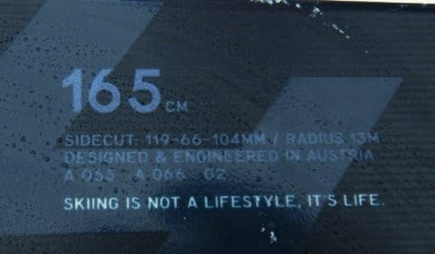

# 2021シーズンモデルのスキー板の試乗レポート，ついにスタート！…FISCHER RC4 SC Pro

📅 投稿日時: 2020-03-13 01:46:00

🏷️ カテゴリ: [スキー板試乗](c0bd8048615710cee890e403a36cc9a2b.md)

えー．

本日朝の志賀高原ですが．

特派員からの報告によると，

2-3cmの積雪があったらしく．

この積雪のおかげで，硬めながらも

晴天ピカピカの，意外と楽しめる

コンディションだったようですね．

（某特派員の方，写真お借りしました…）

まぁ，下地は硬かったので，一の瀬

ファミリー正面バーンはやっぱり

ツルツルになったようですが…

でも．

やっぱり積雪がないからか…

焼額のオリンピックコース．

ところどころブッシュが出てきて．

さらに積雪不足で非圧雪になって

しまったようです（涙）

（[焼額山Facebook](https://www.facebook.com/yakebitaiyama/posts/2762492610512734?__xts__[0]=68.ARD1oO1V7Txw9nc19WdkYEf9oC34mXtP2d2L6dRL1z-nnUqkew8ayWapQbyCHvnO95UuoYKi3rWM8pbu0F78kxyhVTopvSzu5TbtUut3K1TRfeYt5-6F1nRxkVIguw8T0mvy6K2l8YKgzALs5nFSn7N59y46WmuB39PVpfG3XJZhxYpbe1ums_wFxRqWqB5phXMn6D9oE_xTUjWuuwNhjTvZ9QIpok18EMTSUnBlSw8zXBm_9Mp574E5MBDif8GsO4OWNIFaJALT2IGRDiMFXHHuHQprBb5MCAaJm-wP2VbCgSESSuFcttBiFBNRsWtrfqD9biZzXxT8yFH-yyXiFA&__tn__=-R)より）

うーむ．

とりあえず，週末の14日，15日と．

かなり冷えて，うっすらながらも雪が

積もってくれそうなので．

週末はそんなにひどいガリガリバーンには

ならずに済みそうな予感がしますが．

特に15日．

皆さんの日ごろの行いが良ければ

朝に10cmほど積もってくれそうなので．

そうすれば，そこそこ冷えたいい雪で

滑れるはず！！

…というわけですので．

皆様におかれましては．

これから週末にかけて．

すばらしく品行方正な行いを続けて

くださいますよう，くれぐれも

お願い申し上げます…

ってな感じの前フリの後は，本題へ．

えー．

先週末の志賀高原にて．

なぜだか突然，某ショップの方に

2021シーズンモデルの板をいくつか

試乗させてもらうチャンスをいただいたので．

…今回は，例年より早い，来シーズンモデルの

スキー板試乗レポートです！

この日の雪質は，いつもの春雪での

試乗とは違って．

結構冷え冷え，下地はしっかり締まり気味の

圧雪で，その上に2-3cmの柔らかい雪が乗った

いい感じのコンディション．

硬すぎず，柔らかすぎずのトップシーズンの，

営業開始後2時間程度で．

あさイチの完全フラットから多少荒れ始めた

感じの，シーズン中によくあるバーン状態で

試乗できました…！

ってなことで．

プライズも指導員資格も何も持っていない

単なるレジャースキーヤーが，極めて主観的に

好きか嫌いかを書いていくという，

あまり役に立たないスキーレポート．

まずはFISCHERから．

では，どうぞ～！

○FISCHER RC4 SC Pro 165cm

基礎小回り

2020モデルのFischerのSCは，

Racetrackビンディングが着いた

比較的優し目のSC Racetrackと，

強めのCurve Boosterが着いた

ガッチリしたSC Curve Booster Yellowbaseの

2種類がありましたが．

これはどうやら，Curve Booster Yellowbaseの

後継機になるらしい，結構ガッチリした

プレートが入った，強めのモデル．

この，強めのモデルは，2021シーズンは

SC Proと呼ばれるようです…

で．

履いてみたところ．

かなりエッジグリップがしっかりしていて．

トップからテールまで，板の長さすべての

エッジがしっかり効いているような，

トップとテールのグリップの強さが感じられます．

そして，そんなに軽い板ではないけど，

履いた感じはすごく軽く，軽快に感じます．

エッジがしっかり捉えて，ググッとたわむ際に，

金属ばねのような圧の溜まりが感じられ，

切り替えに向かってばねが解放されるような，

気持いい早めの返りがあります．

そして，谷回りの捉えが早い！

谷回りの早い段階から板のたわみが出せて，

そのたわみに乗って谷回りを作って行けます．

谷回りで板を動かしていく量をコントロールすれば，

小回りから大回りまで，比較的自由に

旋回半径を作ることができます．

R=13という，完全小回り用と思える

サイドカーブの板にありがちな，

どうしようもなく板の行きたい方向に

滑らされてしまう…ということがありません．

R=13と思えないほど旋回半径の自由度があります．

ロングターンも十分引っ張って行けますし，

縦に落としていくターンもできます．

高速耐性も十分．

ホントのトップスピードを出した時の耐性は，

私が今履いているSXの方がわずかに上かな…？？

とも思いましたが．

スピードを出して行っても安定感があり，

振動吸収性が強いのか，荒れた斜面でも

滑らかに乗り越えていく感じ．

高速で荒れた斜面を滑っても，フラット斜面を

滑ってるかのような安定感で，かなり

コントロール性は高いです．

だけど，SL競技用モデルほどガッツリ激烈

グリップではなく，ズラして滑る際の

コントロール性も高くて．

急斜面でフルカービングが無理な状況でも，

積極的にズレを使った小回りが結構きれいに

決まります．

うむ．

昨年も，FISCHERのRC4 WC SC Yellowbaseは

次期主力戦闘機候補だったけど．

2021モデルのFISCHER RC4 SC Proも，

間違いなく次期主力戦闘機候補ですね…！

ヤバい感じで，物欲を刺激する板でした．

## 💬 コメント一覧

### 💬 コメント by (Northfox)
**タイトル**: Unknown
**投稿日**: 2020-03-13 12:47:54

試乗は奥志賀でしょうか？

先週、リフトの上からVOLKLらしき板で滑るS様らしき人を見かけ、早くも物欲選手権が行われたのか‼️と思いました。

その後、SXで滑るホンモノ？のS様がいたので、人違いかなって思っていました。

### 💬 コメント by (レインボー)
**タイトル**: Unknown
**投稿日**: 2020-03-13 15:44:31

本日金曜日の志賀高原情報

2ゴン8時17分発、パノラマ、カラマツ共に、無人のシマシマ絶頂バーン。オリンピックは今日から非圧雪なので、おそらくバリバリでこぼこ。良い子は危険を犯しません。

完全無欠のＧＳから、目的地の奥志賀エキスパートへ。

今日も我らを歓待してくれましたよ。最高です。

10時15分頃のダウンヒルは、もうすっかり緩んでいました。

北東斜面の勝ちーっ！

そこから白樺経由で一気にコンスケリフト下の蕎麦屋へ。

ファミリーは前日よりも私に優しく接してくれましたが、私には今ひとつ硬め。

南東斜面、東斜面は、朝の２時間が勝負と思います。

### 💬 コメント by (Skier_S)
**タイトル**: 今週末は良さそう
**投稿日**: 2020-03-13 23:10:11

＞Northfoxさま

…あら．

見られてましたか．

正解です…

＞レインボーさま

今日も朝イチは良かったんですね…

でも，昼間はやっぱり緩みましたか．

明日，よろしくお願いします～！

### 💬 コメント by (炎の北海道民)
**タイトル**: Unknown
**投稿日**: 2020-03-18 01:31:37

S様

トップに穴が空いたスキーは春の湿雪が穴を通過してズボンにぶつかり、股間まで濡れてしまいます。

### 💬 コメント by (Skier_S)
**タイトル**: ＞炎の北海道民さま
**投稿日**: 2020-03-18 01:52:26

大丈夫です！

このモデルは，穴の部分に透明プレートがはまってます！

