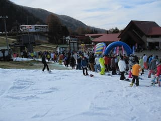

# 11月13日丸沼

📅 投稿日時: 2010-11-14 02:56:33

気温：10度前後．結構あったかい

天気：うす曇

雪質：アイスクラッシュ．やわらかめ

積雪：40～20cm．ところどころはげる

リフト：最大待ち20分

路面：ドライ

ということで．

金曜日にオープンしたての丸沼へ行ってきました．

朝は8:15から営業開始．

初すべり期間ということで，リフト1日券は3300円です．

リフト営業開始時間から…すでにリフト待ち5分．

今日は込みそうだなぁ～

気温は結構暖かく，スキーウェアを着ていると暑いくらいです．

でも，水曜～木曜の冷え込みで降った雪が，日陰には一部

残ってるくらいなので，そこそこ降ったんですね．

朝イチリフトでゲレンデに上ってみると…

アイスクラッシュの雪質が，Yetiと結構違う…

Yetiは割としっかりと踏み固められたような雪質ですが，

丸沼の雪は粒が大きめのザラッとした雪で，

やわらかくてちょっと板が潜るような感じ．

これは，人がいっぱい滑ったら荒れそうだ…

コース長さは約400m．

コース幅20m程度．

人がいなければ，中回りが可能なコース幅．

ロングターンは厳しいですね…

ちょっと幅が足りないのと，吹きだまったみたいに

足を取られぎみなざくざくした雪だったので…

イエティと違って，ボーダーよりスキーの人が多いですねー．

それも，レーサー系の人が多くて，レベルが高い…

リフト待ちは，最大20分．

待ちましたね～（涙）．

平均15分程度で，1時間3-4本が精一杯．

いつもならリフトが込むと山頂行きのバスが出て，

リフトとバスの並行輸送になりますが，今日は

バスは出ず．

あらら．ちと残念．

でも，バスが出ない分ゲレンデの人口密度はすいていたかな？

でも，オープンイベントの抽選会を11時ごろから1時間弱

やっていて，その間はリフト待ち5分以下！

この間にがしがしすべる！！！！

案の定，ゲレンデのリフト前の落ち込み部分は

11時ごろからは荒れ始め，2-3箇所下地のブラシが

見えてきました．

コースは，1時過ぎには，こぶ斜面になりかけ，

2時ごろには，「こぶ斜面だなぁ～」…．

上2/3はそれほど荒れてないんですけど，

最後の1/3がコブ化しました．

ということで，2時ごろ切り上げ．

なんだかんだいっても，今日の滑走標高差2000m．

先週のイエティと同じです．

リフト待ちは長かったけど，滑れる量はイエティと変わらないんだなぁ…

