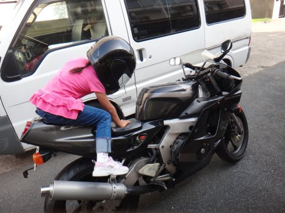
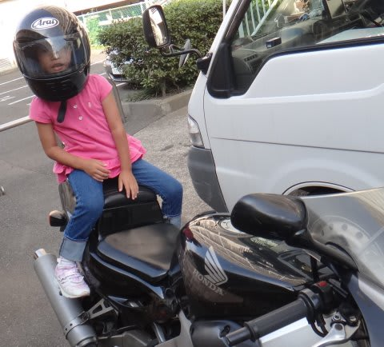
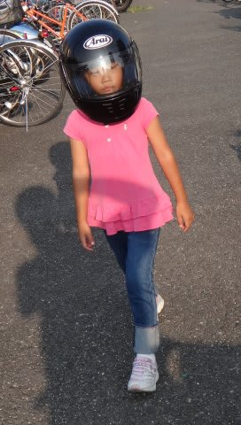

# どうやら，我が娘はスピードに強いらしい…

📅 投稿日時: 2013-08-01 01:24:41

🏷️ カテゴリ: [日記](cc4b5682fb7b8b144980957a978653fb0.md)

えー．

先日．

娘も幼稚園年長さんになったことだし．

娘が生まれて以来ずっと．

一体いつ実行しようか…と悩んでいたアレを．

…ついに実行してみることにしました．

そうです．

バイクの後ろに乗っけてみました…

＃このバイクは妻のものです

自分でバイクによじ登れるようになったし，

いろいろ危機回避能力も備わってきたので．

そろそろ大丈夫かな～，って．

最初は

「後ろの娘，振り落とされたりしないかな～」

って，私のほうが恐る恐る走ってましたが．

「たのし～っ！！！」

って，娘の歓喜の声が後ろから聞こえてきて．

私「もう少しスピード出しても大丈夫？」

娘「もっと速く～」

…

…娘の育て方，間違えたかな…

とりあえず．

20～30分ほど，郊外の道路の流れに乗って走っても

全然恐がらなかったので．

…娘を後ろに乗せて，ツーリングに行っても

大丈夫そうなことが分かりました…

＃ヘルメットがすごくでかく見える…

これでまた，娘との楽しみが増えますね！

## 💬 コメント一覧

### 💬 コメント by (マルハバ)
**タイトル**: Unknown
**投稿日**: 2013-08-01 07:19:45

やっぱりバイクにも乗られてましたか・・・

スキーやる人には絶対面白いですもんね！

もう私は乗ってませんが

スキーがカービングになって

より一層感覚が近くなったんじゃないでしょうか？

地図を開いては

ぐにゃぐにゃのワインデングロードを探していた

あの頃が懐かしい・・・（笑）

夏モードの楽しみがまた増えるかな？

### 💬 コメント by (KENKEN)
**タイトル**: 実は私も
**投稿日**: 2013-08-01 22:51:58

ライダーでもあります。

月に1-2回しか乗りませんが。

いやーびっくりです。

奥様がバイク(CBRかな？)に乗るのもびっくりですが・・・・

(うちの妻はバイク免許ないです。)

うちの娘はまだ公道デビューしてませんが、バイク整備のついでに家周りで少し乗せたことがあります。

キャッッキャ言ってたので、素質はあるかも。

ヘルメットは同じくぶかぶかでした。

今年は公道デビューを目論んでみようかな。

ちなみに私は生産中止になったZZR250に乗ってます。

### 💬 コメント by (miya)
**タイトル**: 実は…
**投稿日**: 2013-08-01 23:15:19

私もバイク乗りでした。

娘も私のバイクの後ろに乗りたいと

言っていたので、ひそかに中古でゼファーか

CB400でも買おうかと目論んでましたが、

妻の大反対でとん挫してしまいました…。

一応、娘が中学生になったら買ってもいいと

言っています。ホントかな。

そういう妻もFZR250に乗っていたんですけどね。。

### 💬 コメント by (Skier_S)
**タイトル**: ライダーが多いようで…
**投稿日**: 2013-08-02 01:52:20

＞マルハバさま

「やっぱり」なんですね…

私も，スキーヤーはライダーが多いのでは？

と思っています…

でも，私は最近はバイクはのんびりツーリング派で，

がんがん攻めたりしません(笑）．

昔はCRMとか，オフ車にも乗って林道走ったりも

してたんですが…

### 💬 コメント by (miya)
**タイトル**: Unknown
**投稿日**: 2013-08-02 18:34:16

スピードで思い出しました。

娘が年長で身長制限クリアしてすぐに

富士急ハイランドのフジヤマに乗せました。

さすがにその時は泣きが入りましたが、

それ以来絶叫マシンが大好物になってしまいました…。

TDL、TDSはもちろん、八景島のコースターや107mから

自然落下するブルーフォールってやつまで、

楽しんでます…。

バイクも楽しむこと間違いなしです。。

### 💬 コメント by (Skier_S)
**タイトル**: miyaさま
**投稿日**: 2013-08-03 01:32:30

うちの娘も，身長制限110cmのジェットコースターなら

乗れるようになって．

…どうやら，ジェットコースター，好きみたいです．

まだ，そんなにヘビーなやつは乗せてないんですけどね～

とりあえず，1歳の時から背負ってゲレンデをかっ飛ばして

いたのが効いてるのかな～？？

＃背負ったままコブ斜面も結構滑ったし

しかし，フジヤマ大丈夫なら，バイクは大喜びでしょう！

大人を後ろに乗せると運転つらいですけど，

子供は軽いので二人乗りも楽でした．

ぜひ，親子ツーリングを！

