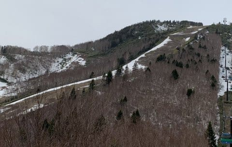

# ご無体！土曜のスキーは諦めた…そして4月14日の志賀高原スキー場，特派員情報！

📅 投稿日時: 2023-04-15 03:36:38

🏷️ カテゴリ: [日記](cc4b5682fb7b8b144980957a978653fb0.md)

えー．

Skier_Sは今週末も志賀高原へ行っていると

お思いでしょうが．

明日の土曜にスキーに行くのは諦めました…

いや．

年度末を乗り越えて，仕事がリアルに

死ぬかと思うほど忙しい状態を乗り越え，

むちゃくちゃ忙しいという程度に収まって

きたので．←収まってきた表現には思えない…

ホントは土日に滑りに行く気マンマンで

いたのですが．

ここ数日，かなり突発的な事象が相次ぎ．

部署Aの人「Sさん，●×社の偉い人が来るから対応を…」

私「そもそもその日は朝から晩まで会議が

　詰まってて時間がない．断る」

部署Aの人「うちの社長の招待で，社長同伴の来訪です．

　Sさんが断ったって言うことになりますが…」

私「…断りたいんだけど…（涙）」

部署Cの人「×〇国の人が▼◇に来るので準備と対応を…」

私「うちの部署の仕事じゃない．

　そもそも会議が詰まっていて▼◇まで

　行く時間はない．断る」

部署Cの人「副社長のご指名です…断りますか？」

私「なぜ…」

自部署の人A「Sさーん！！なんでこの会議突発的に

　リスケなんですか？金曜夜9時しか空いてないので

　そこに会議入れますね～」

自部署の人B「Sさん…これ，今週中締め切りだったん

　ですが，会議リスケですか！！！

　もうSさんの空き時間が朝7時半からしかないので，

　早めに開始でお願いしますね」

　

総務関係の人「Sさん，年度初めのこの書類と

　この書類と，この書類を記入して．

　部署の人数分のこの書類の承認作業お願いします．

　あと，●×の書類も作ってください」

私　「年度末と始めの書類が多すぎる…（涙）」

上司　「Sくん…チミにお願いした○○が進んでないようだが？？

　それが自部署の…チミの本業のはずだが？」

私　「じ，自分の本業をやる時間をくれ～！！！！（心の叫び）」

…ってな話はフィクションですが．

実際にはこんなやり取りはありませんが．

もう，これを越えるようないろいろご無体で，

案件が大量に放り込まれ，

書かなきゃいけない書類も溜まってるし．

処理できないメールも2-3日分溜まってる

ような状態で…

既にGWも2日間は出張で仕事することが

確定しました（泣）

とりあえず．

土曜は終日雨という予想というのもあり．

明日の土曜はスキーは諦めて，家で泣きながら

スタックした仕事をやっつけます．

なんとか土曜で仕事やっつけて，日曜は

志賀高原へ行く予定…！！

ってなことで．

今日も志賀高原から，特派員情報が送られてきましたが…

今日はいい天気のようですね！！

…なぜ，金曜まで天気がよくて，

土日に狙ったように天気が崩れるかな…（涙）

雪は一見シマシマですが．

朝から気温は高く，日差しが強かった

のもあり，朝からかなり緩いユルユル雪

だったようです…

今日は朝9時半の段階で+7℃！！

昼間は+10℃を越えたようで．

午前中のゲレンデは，日差しと

黄砂の影響か，ちょっと滑りが

悪かったみたいです…

…いや．

しかし．

雪が減りましたね…（涙）

この状況でも，ちょっとでも長く営業

するため，焼額では大々的な雪出しを

やっているようで…

GSコースが途切れないように，

オリンピックコースの雪が大量に

GSコースに出されたようで．

もう，オリンピックコースの雪は

完全に消え去ってますね…

いや．

すごい．

完全に雪が無くなっているので，

かなり気合を入れて雪出ししたんだろうなぁ…

このおかげで，GSコースは雪が薄く

なりながらも，まだ維持してますね…

いつも一番薄くなる，コースが突き当たって

右に曲がる落ち込み部分．

ここも幅が狭くなりながらも，運んできた

雪で何とか維持しているようです…！

ただ，2ゴン側のパノラマコースから

1ゴンに戻ってくるところ．

さらに幅が狭くなってきている

ようで…

ここが切れたら，パノラマコースは

滑れなくなるのかな…

でも，パノラマコースは，まだ雪があって，

楽しめるみたいです！

うーん．

連絡コースが切れないで，パノラマコースが

来週まで滑れるように願いたい…

ちなみに，天気は昼過ぎから曇ったようで．

晴れている昼過ぎまでは板の滑りが悪かった

みたいですが，曇ってきた午後2時以降は

滑りが良くなって，楽しかったようです…！

うーむ．

でも…

クローズしたオリンピックコースや

イースト・白樺コースから大量に雪出しを

している焼額はまだオープンしているコースは

マシな状況を維持してますが．

雪出しするところがないダイヤモンドは，

もう雪の少ない年のGW並みしか雪が

残ってませんね…（泣）

明日土曜日は，朝から終日雨が

降り続けそうですが．

果たしてゲレンデはもつのか…？？

うーん．

まともに滑れるのは今週末が最後，

ギリギリ来週は幅が狭い廊下っぽい

コースで滑れるかな…

という状況の予感…

これはやはり．

+10℃で水が凍るように祈るしかないのか？？？

…いや．

+10℃と言わず，+30℃で水が凍れば

年中スキーができていいよね！！←地球は氷河におおわれて生き物が生きていけなくなるから
