# 1月4日の志賀高原・焼額山のゲレンデ状況は…正月休み最終日は晴れのち曇り

📅 投稿日時: 2015-01-05 02:13:28

本日，正月休み最後なわけで．

つい先ほど，帰宅したSkier_Sです．

そろそろ，志賀高原レポートも

飽きたころでしょうが．

飽きたと言われようとも．

もういいよ，と言われようとも．

なんと言われようとも．

本日もいつも通り，スキー場レポートを

お送りします．

で．本日の朝イチは…

予想通り，ピカピカ晴天でスタート！

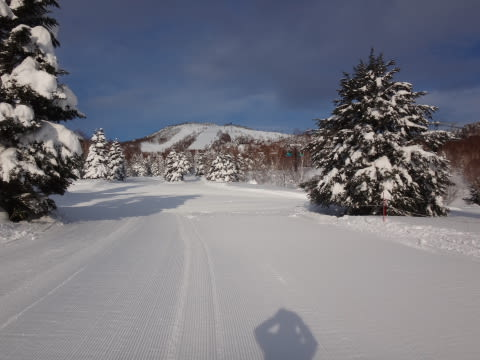

ゴンドラで山頂に登ると…

山頂の気温は，マイナス7度と．

ここ数日に比べると，高めの気温ですな．

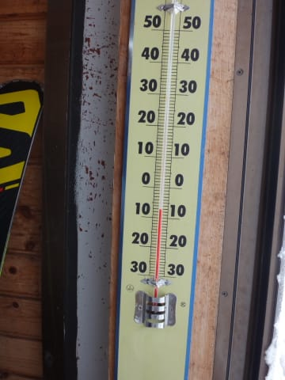

でも．

雪質は，ピカピカシマシマの圧雪バーンが広がり…

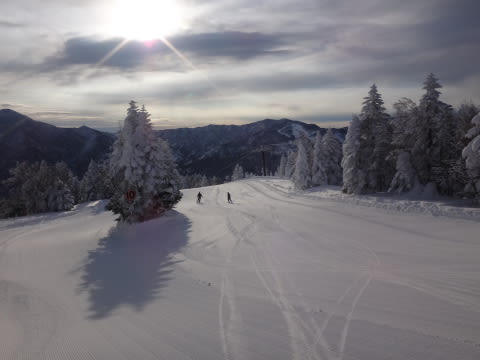

朝イチ，晴天の誰もいないシマシマバーンは…

もう，超快楽の脳内麻薬大放出バーン！

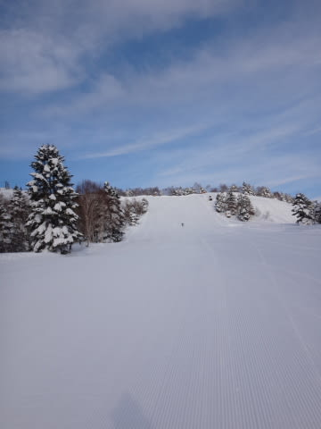

ぐはははは！

新雪の朝も最高だけど．

きれいな圧雪で，どこまでもスピードを上げられる

こういうバーンも，人生のシアワセですなっ！！

このシアワセを知らずに過ごしている人は，もったいないっ！

昼間は日差しがあったので，結構あったかく感じたけど…

でも，最高気温はマイナス5度程度で，雪質は

昼間まで最高のまま．

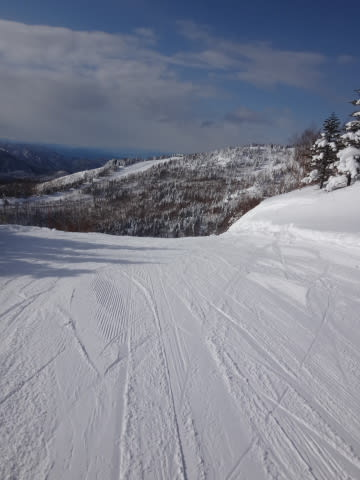

…そして，

今日は正月休み最終日ということもあり．

みんな，早めに帰った人が多いのか．

正月休みの恒例となっていた，午前中のゴンドラ待ちが

全く無いというのも，シアワセ…．

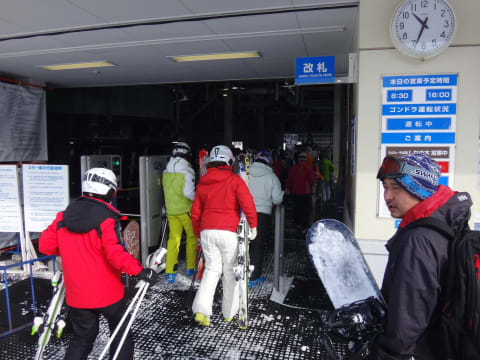

昨日からの積雪は無いものの，

非圧雪コースはまだそこそこパフパフも残っているし．

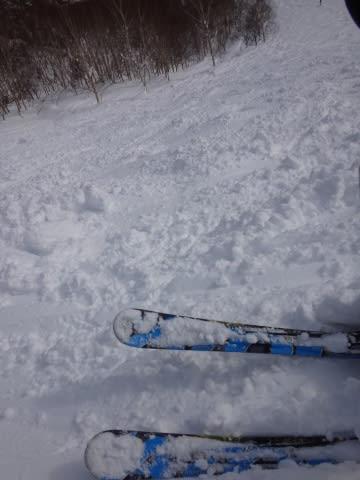

ゲレンデの人も，昨日より少なく．

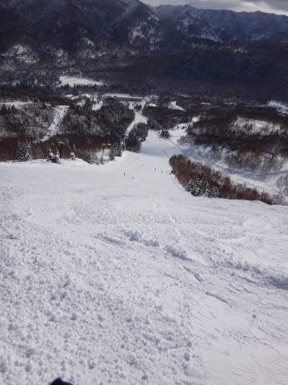

いやいや．

晴天で快適な一日だな～っ！！

…と，思っていたら．

昼過ぎから雲が多くなり，午後1時ごろからは太陽が

完全に隠れちゃいました…

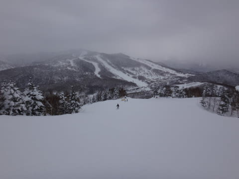

んで，午後2時過ぎにはチラチラと雪も舞うタイミングも…

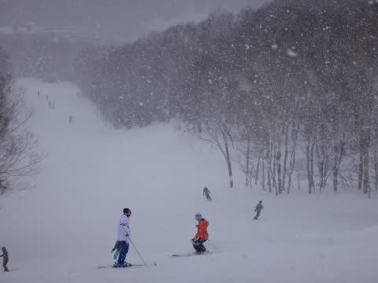

まぁ，そんな本降りにならなかったし．

人も少なく，ゲレンデも荒れなかったので．

今日は午後まで，結構快適に滑れたかな～．

ってことで．

午前中は晴天ガラガラ快適のスーパー快楽大回りを楽しめ．

人も少なめで，午後までゲレンデも荒れず，滑りやすく．

結構楽しめた一日で．

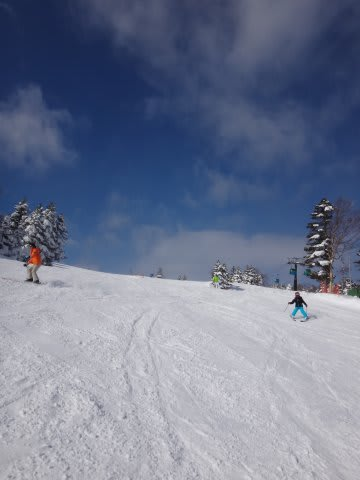

…今回．

全体的にコンディションに恵まれた正月休みを過ごせた気がするな～．

けど．

今回．

最後の最後にちと残念なことがあったのが，惜しい…（涙）．

＃何があったのか，気が向いたら書きます（泣）．

＃つーか．本日，ブログ書いてる場合じゃないという説も…

## 💬 コメント一覧

### 💬 コメント by (いの～)
**タイトル**: 最後の最後に…
**投稿日**: 2015-01-06 13:55:38

初コメです

災難でしたね…

このところボーダーの事後が多いですな。  

同じような 事故を経験しましたが、あれって結構キツイですよ(怒)

突然 コース脇からの飛び出し!

松葉杖までは、逝かなかったなけど 大クラッシュでむち打ちになりました(T0T)

お大事にして下さい

そうだ! よく焼額山でお見かけしますよ～♪

今度 お声かけしてみます!

### 💬 コメント by (Skier_S)
**タイトル**: いの～さま
**投稿日**: 2015-01-07 02:19:44

初コメありがとうございます！

いやー．災難でしたよ．

ぶつかった瞬間を見ましたが，

ほとんど止まっていた妻の両板が外れて

吹き飛ぶくらいの衝撃だったので，

かなりだったかと…

骨折しなかったのが奇跡なくらいだと思ってます．

で．

焼額山で，発見されていますか…

そちらも焼額山へ来られる頻度はかなり高いのでしょうか？

また今度お会いしましたら，よろしくお願いします～！

