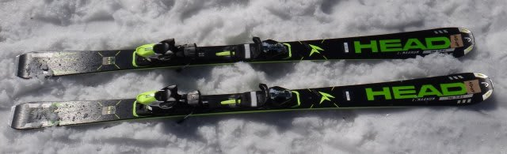
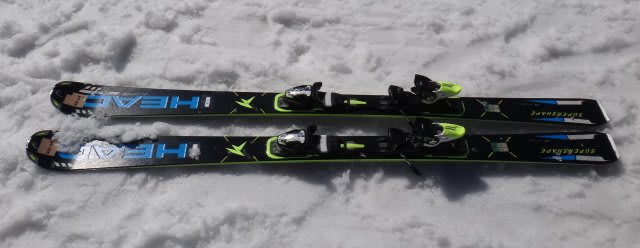
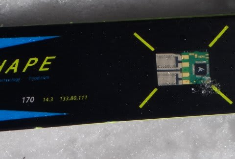
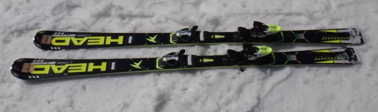
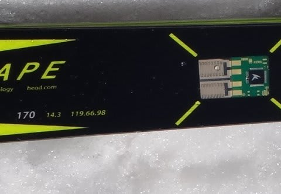

# おまたせ！2014シーズンモデルのスキー試乗レポートその2…HEAD編

📅 投稿日時: 2013-03-26 01:08:06

えー．

2泊3日の志賀高原レポートをはさんだので．

ちょっとお待たせしましたが．

ようやっと，試乗レポート再開です．

今度は，HEAD編です．

では，どうぞ～！

----

○HEAD i.Supershape MAGNUM 170cm

あー．久しぶりにMagnum履きますねぇ．

初代と2代目は履いたことがあるけど，それ以降しばらく履いてなかったんですが…．

滑ってみたところ…

…これは，去年までのHEADの感じそのものですね～．

ターン初期は，まるでぺらぺらな板を踏み込かのような感じで，

ほとんど板からの反力を感じることなく，すっと板がたわんでいきます．

で，ぺたぺたな感じでたわむのに，一旦たわんだあとは，スピードを出して荒れた

斜面に突っ込んでも，ガツンガツン乗り越えていくように，板の硬さが出てくるという…

HEAD独特の，不思議な感じがします．

得意ターンはミドルからショート目でしょうか．

グリップはマイルド目です．

あ，横Gに耐えられずにグリップを失っていく…ってほどルーズってわけではないです．

ターンマキシマムでずらそうと思うと簡単にずらせるくらいのグリップ力．

ずらしに入れやすいです．

また，張りや返りの強さもそんなに無くて，圧をためて板を走らせる…

って感じの攻撃的な滑りをするような板ではない感じ．

でも，幅の広さとR=14.3という比較的小さめのサイドカーブのおかげで，

荒れた斜面でもかなりラクに曲がっていけます．

あまり力をいれずに，どんな斜面でもラクに滑って行きたい…

でも，そこそこの高速耐性もほしいなぁ，

って人には良いのでは．

○HEAD i.Supershape TITAN 170cm

Magnumと同じサイドカーブで，センターを80mmと広くした板らしいですが…

うむ．

幅が広すぎて，ちょっと板が引っかかる…

特に，硬い斜面では致命的なほどトップとテールが引っかかる感じがします．

うーむ．

荒れた斜面でも，センター幅80mmでサイドカーブ14mはきつすぎるかな…

トップとテールの引っ掛かりがちょっと邪魔な感じ．

幅広な板は，サイドカーブで曲がるより，むしろ緩めのサイドカーブ＆柔らかめのフレックスで，

たわみで曲がる板のほうがコントロールしやすいんだなぁ…

と思った私でした．

○HEAD i.Supershape SPEED 170cm

…Supershape Speedは，どうやら去年からまったく変わったようです．

で，Magnumと同じサイドカーブらしいんですが．

うむ？

これまでのHEADとぜんぜん違う．

去年までのHEADとも違うし，これまで履いた今年の2機種とも違います．

これは…かなりいい．

トップからテールまでのしっかりした張りの強さ．

しっかりとした圧の溜まり方に，これまでのHEADとの違いが感じられます．

メタルが効いてるっぽい，比較的元気な張り＆返りを感じます．

で，谷回りのたわみ量コントロールで，かなり自由に回転弧を作れます．

しっかり板のトップからテールまでのエッジがきいてる感じ．グリップもしっかりしてます．

トップとテールが利いて，きれいにたわんだエッジに乗って板が回ってきます．

荒れた斜面でも安定性よし．

HEADのKERSテクノロジーらしい，振動の少なさを感じます．

Magnumより，Rは大きく感じますね～．

得意なターンはミドル～ロング目．

…これで，R=14.3って，Magnumと一緒なサイドカーブなんだ…

とてもそうとは思えないです．もう少し大きく感じますねー．

でも，ショートっぽいのも行けます．

あと，履いた感じは結構軽いです．

うん．

ミドルからロング目ベースの，ゲレンデ履きオールラウンドとして

結構いい感じの板でした．
