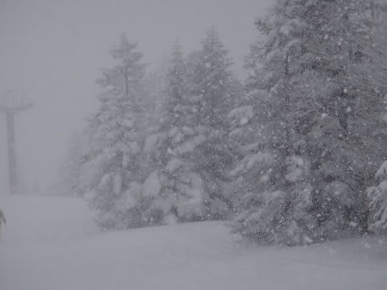

# 3連休最終日，2月11日の志賀高原は…ひたすら雪

📅 投稿日時: 2013-02-12 01:26:21

ってなわけで．

本日も当然のごとく，焼額山を滑っていたんですが．

今日は朝から．

雪だなぁ…

でも，この雪．

昨晩からじゃなく，朝になってから降り始めたようで．

朝，ゲレンデに出る前は，せいぜいこの程度の積雪．

気温はめっちゃ冷えてて…

マイナス13度．

北風が強く，寒いよっ！！

んで．

朝から積もり始めたばかりなので，積雪はそれほどでも無かったけど…

ゲレンデオープンのころから，かーーーーーなり激しい降りになり．

朝イチオリンピックコースは，ブーツ～脛パフくらい．

予想外のぱふぱふ！

軽くて最高っ！

んで．

朝は天気が悪かったからか，

ほとんど誰も滑っておらず．

それでいて降りが激しかったので…

なんだか，だんだん雪が深くなっていくんですけど…

昼前に向けて，積雪が積み増していくという…

志賀高原にしては，珍しいパターン．

そして，昼間の最高気温も…

なんと．マイナス12度！

昼間でこれは…寒いよっ！

ホントに今日は寒かった．

北風も強く，体感温度は今シーズン1，2を争う寒さ．

風を防げるゴンドラが無かったら死んじゃいます．

リフトに乗ったら凍死確実．

ビバ！ゴンドラ！

でも．

マイナス12度の寒さで終日激しく雪が降り続き…

午後になっても，パフパフなんですけど．

午前中は多少人がいたけど，午後は人が減っていき…

ゴンドラ待ちは最高でもこのくらい．

基本的に，今日はゴンドラ待ちほとんど無し．

ああ，快適…

雪が降り続けて，人が少ないってことは…

いつまでもパフパフってことで…

午後3時でも，こんな状況．

…でも．

その代わり．

午後になると，コースのかなりの部分，パフパフ雪が蹴散らされて，凸凹

してきて．

さらに，降雪で視界が悪いので，見えない凸凹や吹き溜まりを察知するための

野生のカンを，最大出力で発揮する必要がある，ちょーいとむずかしめのバーン．

んでも．

雪がやわらかいから．

どうやっても滑れちゃう．

パフパフ．幸せ…

＃多くの人にとっては幸せじゃないコンディションだったかも

ってことで．

午後3時に焼額第1ゴンドラ山頂で，無料で配られるホットドリンクも

ありがたくいただいて．

リフトストップまで楽しんだ，3連休最終日なのでした…

＃今日の天気予想が大はずれだったのは黙っておこう…＜ここに書いてる時点でバレバレ

## 💬 コメント一覧

### 💬 コメント by (ゆうこ)
**タイトル**: ついに！
**投稿日**: 2013-02-12 08:19:16

昨日、ついに第一ゴンドラに乗り込むSkier_Sさんを発見したのですが、惜しくも私は一つ後ろのゴンドラ乗車で話しかけられませんでした。残念です。

うーん、今度こそ！

### 💬 コメント by (mari)
**タイトル**: Unknown
**投稿日**: 2013-02-12 09:46:41

昨日は空いてましたね～。

熊の湯もガラガラ（まあ、焼額に比べればいつもがらがらですけど…）でした。

午後はプライベートゲレンデ状態だったので、上の子と二人で新たなルート開拓に勤しんでおりました。

しかし寒かった！

焼額のゴンドラうらやましいです。

風も強かったので、熊第三クワッドが減速運転で、寒かったのなんのって…（涙

下ちびが「（家族）みんなでいっしょに（リフト）のるー！」とだだこねるので

仕方なく第三乗りましたが、馬の背上部の吹きっさらしで凍え死ぬかと思いました。。。

それでもちびが歓喜の雄たけびを上げつつ新雪わしわし滑ってる姿見れて良かったですが。

最終日だから早く帰ろうかと思ってたんですが、結局最後まで滑っちゃった。

今日は仕事にならないかも…（汗

### 💬 コメント by (aqura)
**タイトル**: Unknown
**投稿日**: 2013-02-12 12:44:37

いゃーよく降りましたねぇ～ヾ(≧∇≦)。

降りがいいので、高天原スタートで、ブナ平、西館、タンネを滑っていましたが…　寒かったですねぇ(^^;)

### 💬 コメント by (ひろりん)
**タイトル**: Unknown
**投稿日**: 2013-02-12 23:15:11

妙高野沢行ってきました♪

妙高、ゴンドラ待ち40分とか死ねます（＞＜）

待ってて大腿筋が痛くなった（汗）

ヤケビ第1も混雑してますね～!さすが連休中日！！

X-Kart、今まで悩んでたことを板が勝手にやってくれますｗ

キレキレのショートターン～中回りが思いのまま♪

深雪も楽々ターン。というか、板が勝手にやってくれるので、荷重を合わすだけでOK。かかと荷重な感じで自分のオガよりちょっと後ろが気持ちいい感じです。

これ履いてると絶対ヘタになると思うｗｗｗ

次回はオガに戻ります・・・

### 💬 コメント by (Skier_S)
**タイトル**: 3連休，皆さん楽しまれたようで…
**投稿日**: 2013-02-13 00:21:04

>ゆうこさま

あららら．

見つけられちゃいましたかっ！

でも，よくわかりましたね～．

やっぱり，板で判別したんでしょうか…．

ゴンドラ降りてからは見失ったんですか？？

また，次の機会に…！

（でも，ウェアをちょくちょく変えるので次も発見できるかな～）

>mariさま

うわーーーー．

熊の湯の寒いリフトに宙吊り…

特に熊の湯は北斜面だから，北風の昨日は寒かったかと…

でも，下の子が新雪わしわしですかっ！

それはすごい…

うちの子供は寒さに弱いので，ちょっとでもふぶいてると

もう外に出たがりません（涙）．

>aquraさま

よく降りましたね～．

寒かったので，もう焼額第1ゴンドラから動く気はまったくしませんでした．

高天ヶ原やブナ平のクワッドだと…凍死しそうで（笑）．

西舘フーディーに人が集中していたのではないでしょうか…．

>ひろりんさま

妙高はゴンドラ40分ですか…

妙高って，そんなに混むんですね…

最近はあんまり混まないイメージがあったんですが．

月曜は新雪パフパフだったんじゃないですか？？

あ，あと．X-kart．

絶対ヘタになる…って，よくわかります（笑）．

ほかの板を履くと滑れない体になっちゃうかと．

私のインプレッションでも，

「超オートマチック．

逆に言うと，どうしようもなく板が回ってしまう，とも言えます．（中略）

マニュアル操作の余地がない感じ」

って感じで，もう，なんていうか．

板が勝手に曲がってくれますよね．

ラクなんですが…

この板に慣れちゃうと，いろいろ危険かもしれませんね（^^;）．

### 💬 コメント by (ゆうこ)
**タイトル**: 板とステッカー
**投稿日**: 2013-02-13 00:54:48

板とステッカーで、ピンときました！

神田にあるお店のステッカーだったので！

ゴンドラ降りた後、声をかけたかったんですが、ちょうど最後の一本で私は西館の方に降りなくちゃ行けなくて追いつけませんでした。残念。

今週は野沢温泉行く予定でしたが、昨日帰りに西館駐車場でグローブ落としてしまったようなので、土曜日は探しに焼額行きます！

今度こそ声かけます！

### 💬 コメント by (Skier_S)
**タイトル**: ゆうこさま
**投稿日**: 2013-02-13 01:44:19

あれれ．

グローブ探しに焼額ですか…！

見つかると良いですね．

今週末は，子連れで出かけるので，

焼額で滑っている本数はかなり減るかと思います…

もし，一人で滑っている私を無事発見できたら，

声をかけてみてください！

＃子供と一緒に滑っているときは，

＃声をかけずにスルーしてやってください（笑）．

