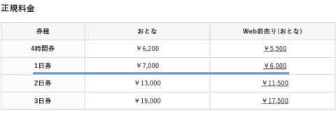
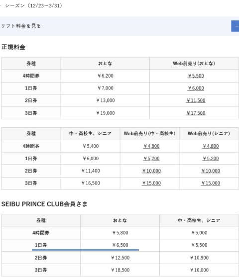
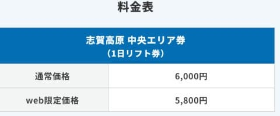
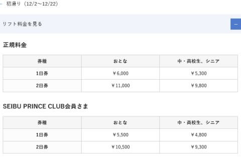
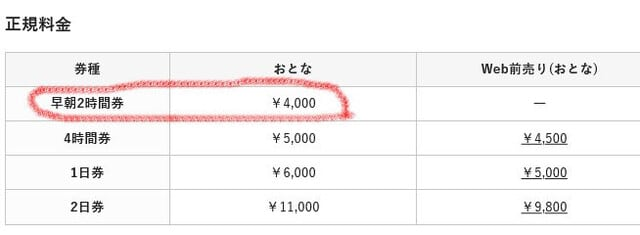
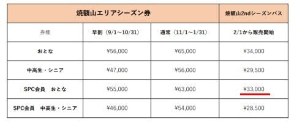

# 2024シーズンの焼額山エリア限定券の価格が公開されたけど，Web前売りが一番お得みたい

📅 投稿日時: 2023-10-09 04:45:53

ということで．

[志賀高原全山共通リフト券のお値段](e8ab05b4b2eeef2355e715fd38e53956a.md)は

すでに公開されて，記事にしましたが．

今回，焼額山スキー場のエリア限定券の

お値段が出てたので．

ちょっと見てみました…

昨シーズンは，

トップシーズンの1日券が，

通常料金大人6000円，

事前のWeb購入またはプリンス会員が5500円…

という感じだったのが．

今シーズンは

トップシーズンの1日券が，

通常料金大人7000円！！！

事前のWeb購入では6000円

となっており．

なんと，窓口とWebの事前購入では

1000円もの値段差がつきます…！！

（[焼額山スキー場ホームページ　リフト券情報ページ](https://www.princehotels.co.jp/ski/shiga/winter/lift/)より，以下同）

ちなみに，プリンスクラブ会員でも

一日券6500円なので…

プリンスクラブ会員でも，事前Web購入が

圧倒的に安くなりますね…

しかし，エリア限定券で正規料金7000円って…

全山共通券のWeb価格の7000円と

ヤケビ限定券の窓口価格が同じ値段

になっちゃいましたね…

（全山一日券も窓口価格なら7500円ですが）

Web割引なら1000円引きになり，

6000円ですが．

これは，

チケットは事前でWebで買ってこい

という，窓口業務を減らしてコストダウン

するための強いメッセージですね…

しかし．

焼額のトップシーズンの一日券．

Web割引でも6000円と考えると…

通常価格で6000円，Web割引なら5800円の，

中央エリアの限定券より高いんですね．

（中央エリア限定券は，初すべり・春スキー料金はなし）

（[志賀高原中央エリアホームページ](https://shigakogen.co.jp/winter/)より）

ただ，トップシーズンじゃない

初すべり期間・春スキー期間を見ると．

初すべり期間の1日券，

通常料金大人6000円

プリンスクラブ会員で5500円

と，ちょっと安くなります…

初すべり期間は，事前Webでの販売は

ないみたいですね．

そして．

春スキー期間の1日券，

通常料金大人6000円

プリンスクラブ会員で5500円

Web前売り5000円

と，こちらは初すべりと違って1000円の

Web割引があるようです…

ただ．

春スキー期間の早朝料金はWeb割引も，

プリンスクラブ会員割引もなく…

6時から8時までの早朝営業2時間で

4000円！！！

うはーーー！！！

早朝，めちゃくちゃ値上がりですね…（涙）

これ，あと1000円足せばWeb前売り1日券が

買えちゃうんですが…

うーーーーん．

早朝は一切割引がなく，わずか2時間で

4000円か…

でも，4月を過ぎると，やっぱり早朝の

時間帯がいいんだよな…

このお値段を考えると．

早朝に9回以上参加するなら．

焼額の2ndシーズン券を，プリンス会員価格の

33000円で買った方が安くつきますね．

2月中のナイターにも使えることを考えると，

2ndシーズン券，かなりお得なのかも…

（[焼額山スキー場　シーズン券情報ページ](https://www.princehotels.co.jp/file.jsp?id=421313)より）

うーん．

早朝が4000円になった今シーズン，

昨シーズンのようにGW前にヤバくなる

積雪量じゃなく，ちゃんとGWまで

滑れそうなほど雪が積もってくれたなら．

また2ndシーズン券を買ってしまいそうな

自分がいることに気づいた，

Skier_Sだったのでした…
