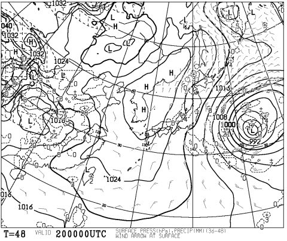
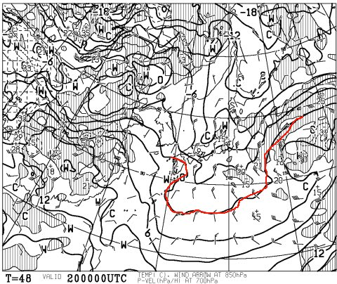
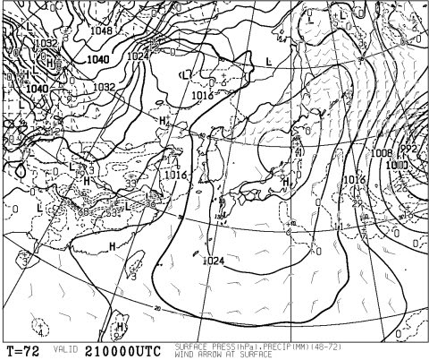
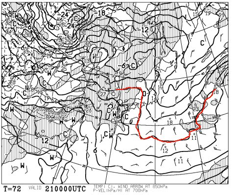
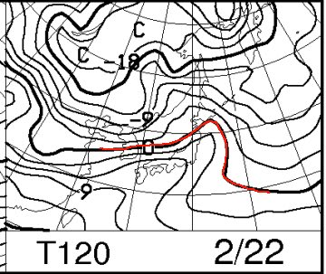
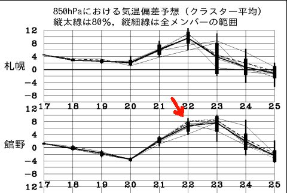
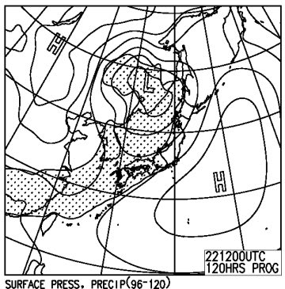

# 恒例！この週末の志賀高原の天気は…土日とも天気は良さげだけど…日曜は気温が上がるよ

📅 投稿日時: 2015-02-19 00:31:06

🏷️ カテゴリ: [スキー天気予想](c6554f5c3c106093b511a8daae23757e8.md)

えー．

定番の，この週末の志賀高原の天気予想ですが．

うーむ．

週末の前日，20日の金曜日ですが．

こんな感じで，日本の東に低気圧があり…

志賀高原は，縦縞の等圧線がかかった，冬型っぽい

気圧配置になりますね～．

で．850hpa図を見てみると…

赤く印した0℃線は，本州のかなり南まで下がってますので．

…前日金曜日は，そこそこ冷えた雪が降って，

ゲレンデ状況は良くなりそうですね～．

んで．

肝心の，土曜日ですが．

朝9時の地上天気図は，こんな感じですっぽり

高気圧に覆われてますね～．

でも，朝のうちは，志賀には北風が入るので．

朝のうちは雲が多くて，雪もちらつくかな～．

そして，土曜朝9時の850hpa図は…

うーむ．

西から，高温の空気が迫ってますが．

まだ，志賀高原は-3℃線がかかってますかね…

ってことで．

朝はマイナス5度レベルかな．

…でも，昼に向かって，0℃くらいまで気温が上がるかも…

まぁ．

でも．

昼は天気も良く．

日差しの中，暖かい気持ちよいスキー日和になるかな．

で．

問題の，日曜ですが．

うーむ．

850hpaの0℃線は，やっぱり北海道付近まで北上しちゃって，

志賀高原もプラス6℃線がかかるという，

2月としては，異常なほど気温が上がりそうな気配…

そしてやっぱり，気温は平年比6-8度ほど高くなっちゃいそう…（涙）．

だけど．

せめてもの救いは，夜9時の地上天気図はこんな感じで．

ぎりぎり，高気圧のカバーエリアに入るので．

昼間は太陽が射し続けて，天気は良さそう，

ってことですかね～．

ってことで．

まとめると．

土曜：朝は雪がちらつく．山頂の気温は-5度程度と，例年より高め．

　朝イチは，柔らかめ圧雪にうっすら新雪．

　昼までには，雲も消えて，気温も上がり，晴天の暖かいゲレンデに．

　…午後は，気温が0℃以上に上がり，日が当たるゲレンデは

　雪がダマダマな感じになっていくかも…

　日が当たる斜面は雪が緩むけど，致命的なほど解けることはなく，

　そこそこの雪質で，日差しの中快適に滑れる午後になるでしょう．

日曜：朝から晴れ！朝イチは，かなりしっかり締まった圧雪．

　ガンガン気温が上がり，昼間は日差しでかなり雪が緩むかも…

　南～東斜面はちょっと危険．午後は春の雪っぽい，ちょいと

　重めの雪になる可能性も．　

　午後から夕方に向けて，ちょっと雲が増えていく．

　昼間に日が当たったバーンは，日が陰るとカリカリした硬い感じになるかな…

　基本的に，気温が高めの，3月下旬くらいの感じの一日になりそう…

　

って感じかな～．

2月というのに，日曜はガンガン気温が上がって．

あったかい週末になりそうですね…．

まぁ，でも．

先週の吹雪に比べると，日が射す分ましかな？？

＃…しかし，先週の冷え冷えと今週末のポカポカ陽気，

＃あまりにも両極端すぎないかい？？
