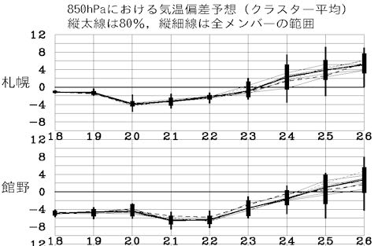
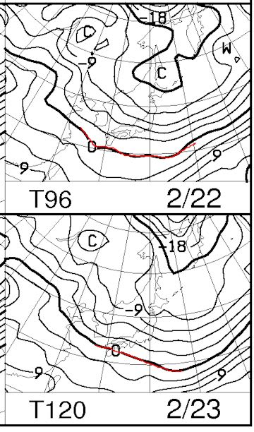
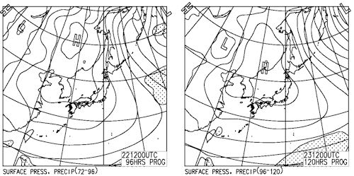
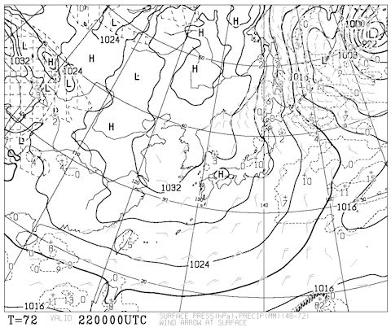

# 恒例！今週末の志賀高原の天気は…うむ．結構な好コンディションっぽい

📅 投稿日時: 2014-02-20 00:27:05

…つーことで．

今日・明日と，また，関東で雪を降らせるかも…

…って危惧されていた低気圧は，予想よりかなり南を通り．

関東はまったく雪の危険がなくなった今週．

本日無事，関越も上信越も全線開通したことだし．

…今週こそ．

今週こそ，

普通にスキーに行けそうですね…（感謝）

果たして．

今週の，志賀高原の天気やいかに…？

まず．

気温の変化を見ると…

ふむ．

今週末の22，23日に向けて．

気温が平年より4－6度低い，冷え冷えな感じですな．

予想ばらつきもなく，確実に冷えます．

間違いなく冷えます．

んで．

22日，23日ともに，こんな感じで…

850hpaの0度線ははるか南．

志賀高原には-6度線がかかっているので．

昼間も冷え冷え，朝はマイナス10度以下まで冷えそうで．

そして…

地上天気図もこんな感じで．

2日間，高気圧に覆われてますっ！

まぁ，22日土曜の朝は，こんな感じでちょいと冬型が残るので．

うーん．昼近くまで雪が残るかな～．

夕方には雲も消え，その後は日曜まで晴天が続きそうっ！！

2日間とも，風も穏やかな感じ．

…これは．

先週の悲惨さを取り戻すかのような．

よさそうな週末ではないか？？

ってことで．

この週末．

土曜：朝，冷え冷えのいい雪が10㎝～20㎝ほど積もっているかな？

　　　朝のうちは雪がちらつく．コースは冷えた積もりたての雪が圧雪され，

　　　その上にうっすら新雪の柔らかいコンディション．

　　　昼ごろには雪が上がり，午後には日が差す．

　　　雪が柔らかいので，午後に向かって凸凹になっていくパターン．

　　　でも，冷え冷えでいいコンディション．

日曜：朝から晴れ！

　　　朝は冷え冷えの圧雪快適バーンだ！

　　　終日晴れ．でも冷えていて雪はよい．

　　　日曜のいつものパターンとして午後はがらがらだろうから，

　　　かなり楽しめそうな一日…

って感じで．

これから何かびっくりサプライズ現象でも起きなければ．

先週の借りを返すには最高の週末になりそうな予感っ！！！
