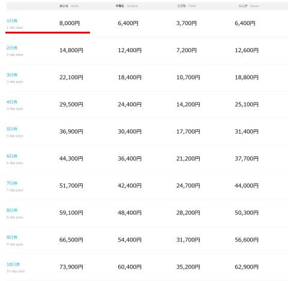

# 2025シーズンの志賀高原全山共通リフト券価格の情報が出たよ！来シーズンも1日券500円値上がりしてついに8000円へ…

📅 投稿日時: 2024-08-27 05:13:37

えー．

本日，志賀高原索道協会のホームページを

見に行くと…

2025シーズンのリフト券の価格情報が出てました！

…いつもなら9月になってから発表になる気が

するんだけど，今シーズンはちょっと早いなぁ…

とりあえず，いくらになったのか見てみよう…

まずは，窓口販売の日数券から…

さて，いくらだ！？？

（[志賀高原索道協会ホームページ](https://www.shigakogen-ski.or.jp/winter/ticket/online.html#sub-contents-a)より，以下同）

うげげげげ…

窓口料金だと，1日券8000円！！！

昨シーズン1000円値上がりしたばかり

なのに，さらに500円上がったよ…（涙）

で．

昨シーズンは1日券から1日増えるごとに

7000円ずつアップしていく感じでしたが…

来シーズンは，

2日券が1日券+6800円，

3日券が2日券+7300円

となっていて．

その後，4日券以降は1日ごとに7400円ずつ

増えていく

感じで．2日券が結構お得な値段になってますね…

そして．

子供，中高生は値上がりせず，お値段据え置きです！

そのため，これまで小学生は大人の半額だったのが，

半額以下にまで下がってますね…！

ちなみに，2日券以降は連続した日でなくても

使うことができるのは昨シーズンと同じ．

例えば2日券なら，土日とかの2日連続じゃなくて

OKで，今週と来週の日曜日に滑る…といった

分割利用が可能です！！

ってな感じの窓口販売価格だったのですが．

Web購入だとどんな値段になるのか見てみましょう…

えい！！

まぁ，昨年と同じでWebで買えば1日券は

窓口価格から500円引き．

また，

2日券が1日券+6700円，

3日券が2日券+7000円

と，2，3日券がちょっとお得めになっているのは

窓口券と同じで．

その後，4日券以降は1日ごとに7100円ずつ

増えていく

パターンですね…

こちらは子供券は値上がりしているものの…

1日100円程度の値上げに抑えてますね．

で．

次は4時間券ですが…

こちらはWeb販売はなく，窓口販売のみで，

6500円．

4時間券は昨シーズンと同じ料金

ですね…

…なんで？？

ちなみに，こちらも窓口販売のみの

12月7日～12月20日までの初すべり期間，

3月31日～5月6日までの春スキー期間の

リフト券も，

1日券，2日券もそれぞれ6500円，12400円と．

昨シーズンと同じお値段

これも，なんで…？？

あとは，こちらはWeb販売のみの，

食事券付きリフト券ってのがあって．

1日あたり1000円の食事券がつく

リフト券はこんな感じで…

うーん．1日券だと，100円しかお得に

ならない感じか…

3日券だと900円お得になりますか．

…まぁ，お昼ご飯を食べたない私のような

人には関係ないリフト券だな←それ以前にシーズン券だから，どっちにしろいらないでしょ？

さらに，Web販売限定で．

親子2人分のリフト券がセットになっている，

大人・子供パックと大人・中高生パックが

売ってますが…

昨シーズンは1日券10100円，

2日券19600円，

3日券29100円だったので…

これは，昨シーズンより値下がりしてるよ！！

窓口では売ってませんが，親子2人なら

これが圧倒的にお得ですね…！

ってなことで．

トップシーズンは値上げ，

4時間券とシーズンイン・春スキーは据え置き，

子供券は据え置きから微増，

親子券は値下げ…

と，戦略的値付けとなった来シーズン．

子供向けの券を安めにして，

親子連れを狙おうという戦略っぽいですが…

果たしてその狙い通りに親子連れが

増えるのか？？

乞うご期待…！

## 💬 コメント一覧

### 💬 コメント by (サザビーワン)
**タイトル**: 値上げ厳しい
**投稿日**: 2024-08-27 15:14:26

いつも棚惜しく拝見させて頂いております。

もう私には気軽に志賀高原に滑りに行ける価格ではなくってしまいましたね。

外国人観光客に人気のスキー場は基本価格を大幅に値上げし、

日本人には何かの値引きが適応できて、今までと同様な価格になる等の方法は出来ないもんでしょうか？

これではどんどんスキー人口減ってしまうような気がします。

### 💬 コメント by (湯本)
**タイトル**: Unknown
**投稿日**: 2024-08-28 20:03:46

外国価格😭そろそろスキー引退勧告をくらったようだ。志賀高原はアクセスが良いわけでもなく道路もリスキー🤔カグラで頑張ります。

### 💬 コメント by (Skier_S)
**タイトル**: 物価の上がり方が激しい…
**投稿日**: 2024-08-29 01:15:04

＞サザビーワンさま

シーズン券をもっている人ならまだしも，1日券を買う人はそうそう簡単に行ける

金額じゃなくなってきましたね（涙）

何か，同じシーズンの翌週以降に行くとリピーター割引とか，

そんな感じで繰り返し行くと安くなるとかの割引があるといいんですけどね…

＞湯本さま

かぐら＆苗場もリフト券が高くなりましたよね…（涙）

ただ，アクセス道路はたしかに志賀高原よりいいかも！

