# 娘を海水浴に連れて行ってみた

📅 投稿日時: 2013-08-09 01:15:32

🏷️ カテゴリ: [登山・旅行](c1d637a11a25b457ac978d197adbdafc5.md)

えー．

なんだか暑い日が続くので．

先週末．

娘を海に連れて行ってみたんですね…．

それも．

先週，横須賀の自衛隊＆基地を見に行ったついでに．

そう．

横須賀と言えば，東京湾唯一の自然島，「猿島」．

横須賀から船で5分ちょいの，目と鼻の先にある

この猿島に行ってみました．

で．

往復1200円払って，こんな船に乗っていくわけですが．

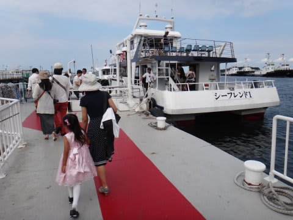

猿島は，港からすぐ目の前に見えます…

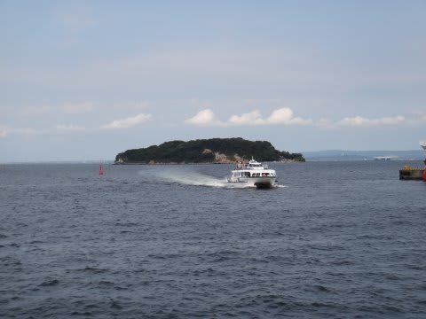

5分ほど乗船すると，すぐ到着．

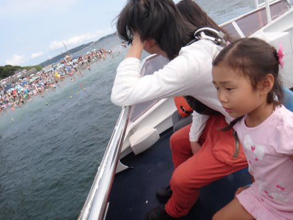

…だけど…

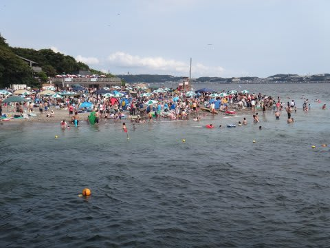

なんだ，この人口密度は！！？？

海も…

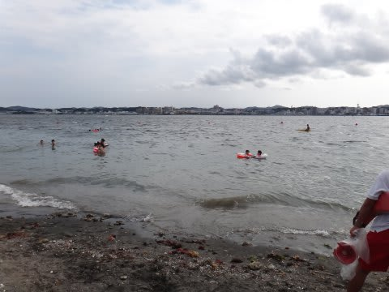

当然，慶良間の海とはえらく違いますね(笑）．

早速泳ごうとした娘ですが…

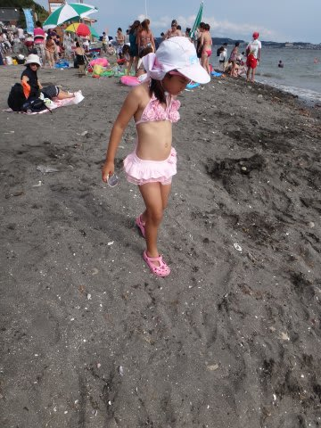

ちょっと海に入ってみたものの…

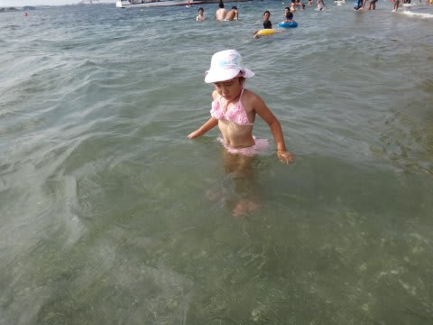

海にあった海草がどうやら怖いらしく．

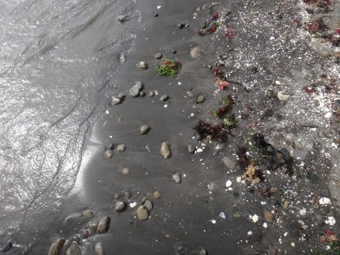

「なんか変なのが浮いてる～怖い～(涙目)」

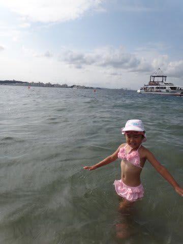

と，引きつった顔になってしまい．

早々に海水浴，リタイヤ…

む，娘～っ！

お前は，シュノーケリング，すごく上手くできるというのに！

か，海草が怖いのかっ！！！！

そんなことでは，本州で海水浴，できないぞっ！

…ということで．

我が娘．

ゼイタクに育ちすぎたのか．

普通の海水浴場で泳げない体になってしまったようです…(涙)．

海水浴できなかったけど．

猿島は，明治時代から東京湾防衛の要所．

弾薬庫とか…

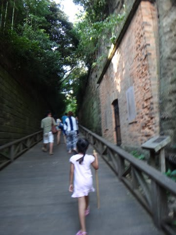

砲台跡が残っていて，観光ポイントもあるので．

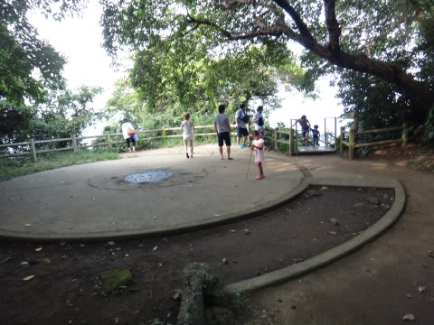

そーゆーところを見て，かえって来ました．

…しかし．

首都圏の海水浴場で泳げるように．

娘を鍛えないといかんなぁ…

## 💬 コメント一覧

### 💬 コメント by (ゆうこ)
**タイトル**: 贅沢～
**投稿日**: 2013-08-09 10:15:52

娘さん、贅沢すぎて笑っちゃいました。

キレイな海に慣れすぎて、首都圏の海が怖いなんて！

私は、太平洋沿いの街に生まれて、海のすぐ近くで育ったので、首都圏の海みたいな海を普通だと思って生きてきました。それが、沖縄の海を見たときは本当に感動しました。

贅沢にも、娘さんの普通の海は沖縄の海なんですね。

羨ましいです。

### 💬 コメント by (Skier_S)
**タイトル**: ゆうこさま
**投稿日**: 2013-08-10 05:35:56

うーん．

困ったことに，超ゼイタクに育ってしまったようで…

根性を入れなおさないとダメですね(笑）．

実は，うちも海から近いんですよ～．

でも，人工的な海岸で，泳げるような

環境じゃないです…．

娘にとって泳ぐ「海」は，家のそばの「海」とは

完全別物のようで…

ちょっとゼイタクに育てすぎた気がします…（反省）

