# 12月31日の志賀高原は…曇りのち晴れ．そして正月3連休の天気は？

📅 投稿日時: 2013-12-31 20:50:49

🏷️ カテゴリ: [2014スキー滑走日記](c992167609b6415052179ee69ea1ea7d8.md)

えー．

この正月3が日の志賀高原の天気ですが．

うーむ．

元日は，今のところ，志賀では初日の出が拝めそうな天気ですね～．

＃日本海側は雪ですけど…

午後からは崩れて，元日の夜から2日の午前中にかけて，

雪が降りそうです…．

でも，その後．2日の午後から3日にかけては

晴れるかな．時々曇って雪がちらつく可能性もありますが…

気温は平年並みですね．

引き続き，いい雪質の日々が続きそうです．

…ということで．

3が日は，どっさりパウダーはなさそうな気配…

まぁ，天気は比較的よさそうで，荒れあれには

ならないから，良いかな．

って，天気予想をしたところで．

では，本日の志賀高原のレポートを…

本日は…

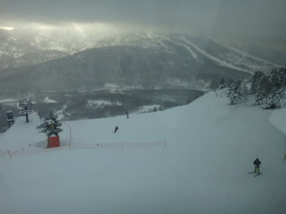

朝は曇ってましたねー．

でも，山頂でマイナス10度と相変わらず冷え冷えっ！

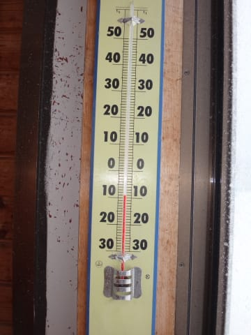

んで，今日も朝はシマシマバーンがお出迎えっ！

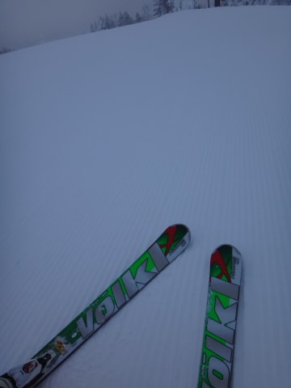

なんだけど…

山頂付近は朝のうちは軽くガスっていて．

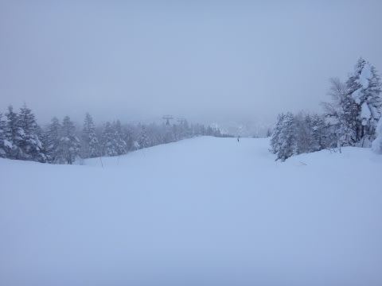

うーむ．

昨日までの快感と比べるとちと快感度が低いな…

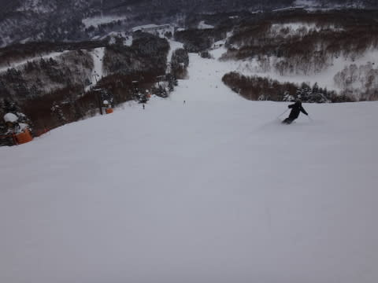

そして．

相変わらず10時になると…

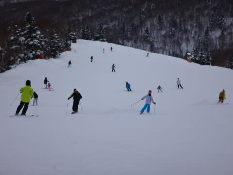

ゲレンデの人がちと増えてきますね～(悲)

でも．今日は大晦日で，さらに天気もそれほどよくなかったからか．

焼額第1ゴンドラは，駅舎の外に人が並ぶほど混まず．

最大3分待ち程度で．

11時過ぎになると待ち時間は0．

リフト・ゴンドラ待ちがそれほどなかったのが救いかな～．

で．

昼前には薄日も射し始め…

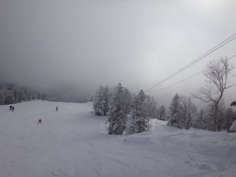

午後からは，冷え冷え晴天のいい感じに！

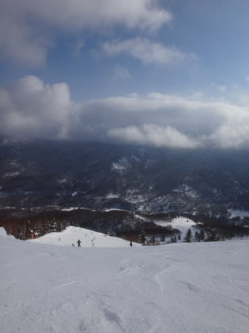

なぜか，焼額が生息地のはずの私が，今日は

寺子屋まで出張しましたが…

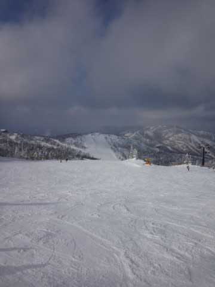

雪質もよく．

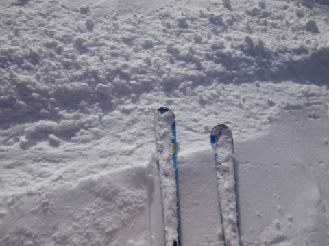

景色もよく．

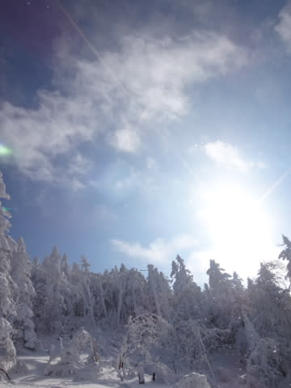

リフトは1-2分待ったけど．

…いかにも真冬～っ！

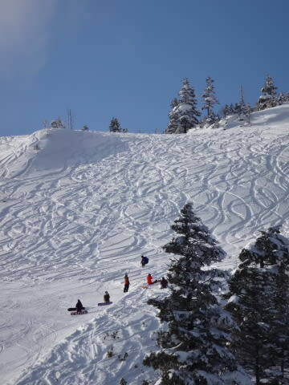

って感じになってきましたな～．

午後は，いつもどおり凸凹のちょっと荒れ気味になってきて…．

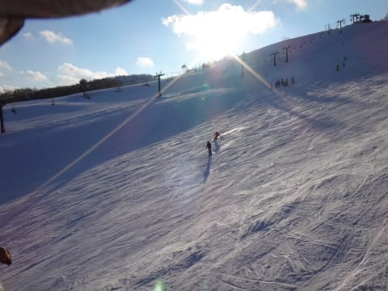

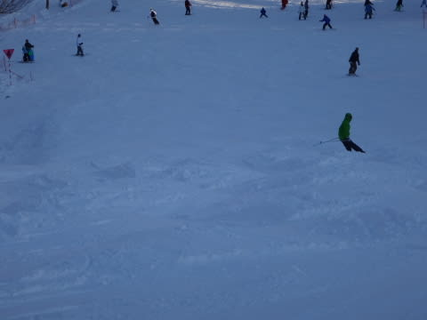

さらに．

この3日ほど，

あまり積雪がないので．

人工降雪コースは，夕方になると，下地にちょっと硬いものが

出てくるところも…．

うーむ．

そろそろ，もう一降り欲しいかな？

…まぁ．

とはいえ．

今日も，午後は天気が回復してくれて．

雪質も，午後にちょっと硬い部分があったとはいえ．

相変わらず冷え冷えでかなりよく．

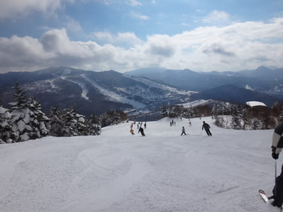

2013年の年末3日間は．

Goodコンディションで終わりました．

ということで．

本年もありがとうございました．

また来年も，よろしく～っ！

## 💬 コメント一覧

### 💬 コメント by (komu)
**タイトル**: 今年もよろしくです
**投稿日**: 2014-01-01 05:15:20

今年もよろしくお願いします。

鹿沢で年末年始を過ごして今日から富士見パノラマに戻ります。

年々スキー滑らないと死んでしまう病が悪化してる気がしますがお互い頑張りましょう。

### 💬 コメント by (ゆうこ)
**タイトル**: あけましておめでとうございます
**投稿日**: 2014-01-01 11:31:46

昨年はお世話になりました。

今年もよろしくお願いします。

このブログを読んでいたら、スキー場に行きたくて仕方なくなり予定外に旦那の帰省先の関西でスキーしてしまいました。

兵庫県の小さいスキー場でしたが先週末の大雪でコンディションはよかったです。

これからもブログ期待してます。

### 💬 コメント by (Skier_S)
**タイトル**: あけましておめでとうございます
**投稿日**: 2014-01-02 00:23:07

>komuさま

ぜひ，志賀高原にもお越しください～

年々私も病気が重篤化していって困っています．

今年も，スキー滑らないと死んじゃう病の

対症療法にいそしみましょう！

> ゆうこさま

こちらこそ，今年もよろしくお願いします～．

兵庫県…神鍋ですか？？

帰省先にスキー＆ボード道具もって行っていたんですね(笑)

これからも，このBlogご愛読のほどよろしくです．

### 💬 コメント by (ゆうこ)
**タイトル**: Unknown
**投稿日**: 2014-01-02 12:08:46

先日行ったスキー場は、ばんしゅう戸倉スノーパークというマイナーかつ小さなスキー場です。リフト券の安さで決めました。

次回は氷ノ山国際スキー場とか行ってみようかと思います。

旦那の実家は、岡山なんですがまっすぐ東京に戻るのも面白くないので、シャルマン火打と関温泉スキー場に寄り道しながら帰ろうと思って道具を持ってました。

始めてのスキー場なので、楽しみです。

### 💬 コメント by (Skier_S)
**タイトル**: ゆうこさま
**投稿日**: 2014-01-02 16:47:25

うわ～

わたしも知らないスキー場ですね…

しかし、岡山から新潟経由で東京って…

けっこうありえないパターンのような気が(笑)

楽しんできてください！

