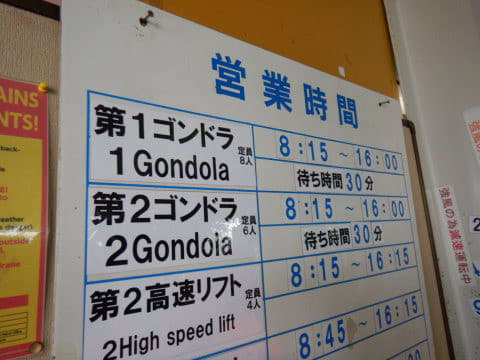

# 2020/3/20(金・祝)，3連休初日の志賀高原は…冷え冷え！予想はずれて終日雪降りだったけど，午後は冷え冷え雪が積もって良かったよ！

📅 投稿日時: 2020-03-21 01:23:49

えー．

水曜夜の予想で．

強風で朝はゴンドラ動かないかも…

と，書きましたが．

今日は終日，焼額，奥志賀とも，

ゴンドラは普通に動きました～！！

…ゴンドラ動かないかも，という予想は

外してしまいましたが．

まぁ，いい方に外れたということで，

良かったということにしておきましょう←ポジティブシンキングで予想が外れたことをごまかす

…ただ，ゴンドラが動いていたというのに，

奥志賀第2，第3ペアは強風で終日止まっていた

ようですね…

まぁ，予想は一部あたりでしょうか…←強引に当たったことにしてないか？

そして．

水曜の予想では，終日曇り．

昨日の修正予想では，もしかしたら晴れ間も…

と書きましたが．

…全然晴れ間はなく．

終日雪が降ったりやんだりでした…

ここも惜しい感じで外してますが．

まぁ，気温が冷え冷えであるところとか，

朝の積雪が5cmであるところとか．

ゴンドラが止まるほどではなかったけど，

風が強く一部リフトも止まったというところとか．

予想を当てているところも

多かったので．

完全に外したわけじゃない

と，力説しておきたいところ…

うーむ．

でも．

最近，予言といえる精度で当てていたので．

ちょっと残念…

ってなことで．

本日の志賀高原のレポートですが．

予想通り，明け方に雪が積もったようで…

スキー場近辺の道路は真っ白になってます．

そして．

いつもの朝イチ焼額にやってきますが．

３連休初日ということもあり．

並んでいる人はそこそこ多め…

ってなことで．

営業開始の8:15のゴンドラに乗り，

山頂に向かいますが…

山頂の気温は-7℃！

-5℃の予想より冷え込んでいて，

結構な冷え冷え！

そして，山頂の天気は，風が

結構強く，雪降りですね…

コース上は，予想通り，

5cmほどの冷え冷え雪が

乗ってます！

ただ．

風が強いので，

奥志賀は第2，第3高速ペアが

止まってるようです…（涙）

…リフトが止まってるのに，ゴンドラが

動いているのね…

ってなことで．

あさイチのバーンに飛び出すと…

うひょーー！

がっちり硬いシマシマの上に，軽い雪が

乗っていて…

結構スピードが出るバーンだよ！！

下地はけっこうガリガリでスピードが

出るけど，上に柔らかい雪が乗っていて，

適度に柔らかい感じ！

…でも．

コースの下の方に降りていくと…

あんまり新雪が乗ってない感じ…

標高の高い山頂付近に集中的に

降ったのかな？

ってな感じで．

2本ほど，硬めのバーンを気持ちよくかっ飛ばして

ましたが…

じきに，硬めの斜面は硬いところがボロボロ崩れて．

殺人コロコロ

が大量に発生し．

残念ながら，あまり楽しくない状態に…（涙）

視界もそんなに良くないし．

雪も結構激しく降ってきて，

バーン状況が見にくく…

気持ちよく飛ばすのは，ちょっと

難しい状況に…(泣)

そして，その上さらに．

4人乗車制限が今週も続いている，第1ゴンドラ．

輸送力低下が効いて，今日も朝9時半には　

一気に並びだし…

そして，10時前には，

ゴンドラ30分待ちの案内が…（かなり涙）

ってなことで．

今週もわがホームゲレンデの焼額を脱出し，

一の瀬方面へ，ちょっとだけ様子を見に行ってみますが…

一の瀬は，リフト待ちこそ

それほどなかったものの．

視界が悪く，風が強く…

バーンも結構硬めで，

正面バーンは，ところどころ

ガチガチに凍ったシマシマが

下地に出てきて，

ツルツルになっていて．

結構手ごわい…（涙）

だもんで．

昼頃に焼額に戻ってくると．

昼には，第1ゴンドラもガラガラに！

当然，リフトも待ち時間0です！

…が．

ただ，コースの視界が悪く．

時折強い風が吹くのは，

昼間になっても相変わらず…

ただ．

午後になっていくと．

時折強く降る，この雪がゲレンデにつもって…

硬い下地が隠れていき．

雪が良くなってきましたよ！

そして，午後になると雪も止んできて．

視界も良くなってきましたよ！

…だんだん午後遅くなるにつれ．

ゲレンデコンディションが良くなって

行く感じで．

午後の方が楽しいのですが…！

冷え冷え雪がコース上全面を覆い．

いや…

午後になると．

これ，結構いいよ！

午後2時以降，またゴンドラがゲートの

外にまで並ぶようになり．

2-3分の待ちは発生したものの…

夕方に向かい，ゲレンデには

うっすら日も射すようになり．

今日の午後遅くは，結構楽しい

ゲレンデコンディションになっていきました！

ってな感じで．

昼頃まではカリカリコロコロで，

視界も悪く，風も強く，

ちょっと残念な感じだったのが．

午後は結構いい雪が積もり，

ゲレンデコンディションが一気に改善．

そこそこ楽しい一日となり．

今日も日が暮れる，16:15の営業終了まで，

たっぷり滑ったのでした…

…いやー．

良かった．

今日は結局ゴンドラも止まらなかったし．

午後は雪も冷え冷えトップシーズンの

雪になっていったし．

良かった…

…

…となれば．

3連休で，一の瀬ダイヤナイターが営業する

今晩．

ナイターに行かずばなるまい！

ということで．

久しぶりの，ダイヤナイター参戦！

見事なシマシマバーン！

…ですが．

意外とコロコロがいっぱい出てきて．

ちょいとスピードを出すには厳しい

バーン状況だったのが，ちと

残念でした…

けど．

今日もラストリフトまで，

たっぷり滑って来たのでした…

まぁ．

今日はいい雪も積もったし．

明日は晴れそうなので．

明日は朝からいい感じの一日になりそう！！

…ただ．

気温が高めなので，午後に雪が

緩みそうですが…（ちょい涙）

## 💬 コメント一覧

### 💬 コメント by (かず)
**タイトル**: Unknown
**投稿日**: 2020-03-21 06:55:39

ゴンドラ動いてまだ良かったのではないでしょうか…レインボーさん出勤するだけでもさすがです  本日一部貸し切りもあるみたいですね…本日板つかみでそう  怪我には気をつけて下さい！

### 💬 コメント by (ゆーき)
**タイトル**: Unknown
**投稿日**: 2020-03-21 07:27:58

私も10時くらいで第3高速に逃げ、昼を挟んで、西館に逃げました。西館下部は、意外と滑りやすくて、よかったです。

### 💬 コメント by (レインボー)
**タイトル**: Unknown
**投稿日**: 2020-03-21 10:34:48

待ち時間に耐えきれず、レインボー隊２名、討ち死にしました。

今日は楽しかったです。昨日の強風を含めた６悪から解き放たれ、混雑の１悪だけでしたね。

先ほど珍しい板を履いておられるご夫婦とご一緒しました。

志賀では焼額山だけでしか公認されていないという、フィートスキーです。全長50cmくらい。アルミのサイドエッジがついていました。後ろを滑らせてもらったのですが、まだ3日目というのに、スイスイすべっておられました。流行るかなあ？

### 💬 コメント by (いちと)
**タイトル**: Unknown
**投稿日**: 2020-03-21 12:34:34

昨日、こちらはゆっくりリフトのジャイアントがメインでしたが、3時半から晴れで4時半まで楽しめました

### 💬 コメント by (みほ)
**タイトル**: Unknown
**投稿日**: 2020-03-21 15:45:26

今年の奥志賀は過去最悪ですね。

整備不良でリフト動かせないのを

強風のせいにするには無理があるでしょ

バレバレですよ

ゴンドラに一人で乗せてる時点で無能ですよ

他のスキー場はお一人様レーンを作って

少しでも待ち時間を短くしてるのに

無能経営！外資系に売却されたけど

どう変わるか？

老害を駆除して再建！

### 💬 コメント by (あつし)
**タイトル**: Unknown
**投稿日**: 2020-03-21 21:57:47

昨日から一人で志賀に来てます。今日は一ノ瀬のリフトからS様によく似た方をお見かけしました。夕方、宿に帰り宿の指定の駐車場に車を停めましたが、なんとS様のお車の隣。たまたまですよ。そこしか空いてなかったので。ストーカーではありません(笑)同じ宿だったのですね。といっても私は素泊まりなので夕朝食会場でお会いすることはありませんが。明日は今季初の熊の湯〜横手山、渋峠に行こうかと。ほんで昼からヤケビに行くと思います。

### 💬 コメント by (あつし)
**タイトル**: Unknown
**投稿日**: 2020-03-21 22:02:19

ウェザーニュースだと明日の志賀高原は雨予報になってます。曇りで耐えてほしいですね！

### 💬 コメント by (Skier_S)
**タイトル**: コメント回答遅れてごめんなさい
**投稿日**: 2020-03-23 00:58:31

＞かずさま

連休中日，意外と雪は良かったですよ！

気温は上がったものの，ごく一部を除いて，板は最後まで滑りました…

結構楽しめた中日でした．

＞レインボーさま

フィートスキーですか？？

昔，ビッグフットとかいう足の形をした板がありましたが…

それじゃないですよね．

超ショートスキーみたいな感じでしょうか？？

＞いちとさま

ジャイアントののろいリフトを乗り続けられるとは…

気が短い私には，あのジャイアントで何本も滑るなんて，我慢できません(笑)．

…ジャイアント，また高速リフトにかけ替えてほしいです…

＞みほさま

うーん．

今シーズンは奥志賀に行くことが割とありますが，普段はそんなにしょっちゅう行ってないので，

残念ながら，例年と比べてそこまでひどいとは分からないのですが…

ゴンドラは1人乗りレーンを作った方がいいよなぁ…

とは思ってます．

すごく混雑しても，3-4人でしか乗ってないのが

勿体ないですよね…

＞あつしさま

連休中日に，私と似た人を見てらっしゃるなら…

その日は午前10時から午後2時くらいまで

ひたすら一の瀬滑ってたので，私の可能性が高いです…

で，同じ宿だったのですね！

全く気付きませんでした…

食事会場で会わなければ分かりませんよね(笑)．

しかし，残念ながら日曜の志賀，雨になりましたね（涙）

### 💬 コメント by (ちゅんけ♂)
**タイトル**: Unknown
**投稿日**: 2020-03-23 13:28:05

＞Skier_Sさま

はじめまして。

三連休の中日にレインボーさまからこちらのブログをご紹介頂き拝見しております。

一年中、精力的に活動され、しかもブログもガッツリ書かれていて感服です。ご苦労も多いかと思いますが是非継続して下さい。

記録的な少雪の中、関越道方面・中央道方面に比べれば志賀高原はまだまだ雪は潤沢な方で、ゲレンデトップからゲレンデボトムまで滑れただけでも幸せな一日でした。 (3月21日 土 焼額にて)

＞レインボーさま

その節は短い時間でしたけど楽しいひと時をありがとうございました。(短い板を履いていた♂の方です)

-----------

私達夫婦が履いていたのは「スノーフィート」というミニスキーです。ブーツとほぼ同じ位の長さです。

ここ1,2年の間で極一部に普及し始めた感じですね。

ジャンプや後向き滑走などのフリースタイルスキー的な滑りに振った板なのですが、私の場合は元が生粋のスキーヤーなので、敢えて不向きと思われる基礎スキー的な滑りに挑戦しています。

ただ、この板で急斜面やコブ斜面を滑るのは極めて難しく、スキーを滑れる方はフラストレーションが溜まるかと思われます。ですので流行るかどうかはビミョーです(^^;;

私達の本業(趣味)は登山です。

雪山登山の下山時に使おうと思い立って今月頭からこのスノーフィートを導入したのですが、20年振りのスキー再開がことのほか楽しく、今月は山にも登らずもっぱらスノーフィートばかり滑っています。

### 💬 コメント by (Skier_S)
**タイトル**: ＞ちゅんけ♂さま
**投稿日**: 2020-03-24 00:18:57

はじめまして～！

コメントありがとうございます．

なんとか毎日更新を続けてます…

で．

スノーフィートですか．

えらくみじかい板なんですね…

登山下り用だったのが，ゲレンデで滑るようになっちゃったんですね．

しかし，そんな短い板で基礎的な滑りができるんですね！？？

私はショートスキーすら履いたことが無いので，どんな感じか全く

分かりませんが…

普通のスキーが上手くなったらボードとか他のスノースポーツも

やってみたいと思いながら，スキーが上手くならないので

いつまでたっても卒業できません(笑)．

### 💬 コメント by (レインボー)
**タイトル**: Unknown
**投稿日**: 2020-03-27 18:21:53

ちゅんけさま、気付かすごめんなさい。その節はありがとうございました。またご来志賀の際は、ここへご連絡下さいね。その頃にはスイスイ滑れるようになっているかも。

