# ほぼ日本全国のスキー場が終了…全国緊急事態宣言だけにやむなし(泣)なれど，月山や横手山は再開予定あり！

📅 投稿日時: 2020-04-18 04:25:16

えー．

本日の記事も，志賀高原

特派員レポートから始めるわけですが．

本日の志賀高原は，

朝はすっきり晴れ！

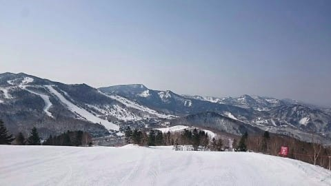

晴天の放射冷却のおかげで，

あさイチの気温は-2℃と，

一応氷点下まで冷えてくれたので…

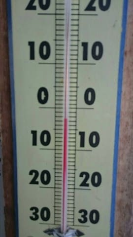

朝イチバーンは冷えて固まった，

ガリガリシマシマバーンだったようです．

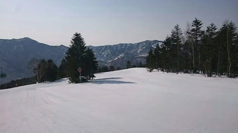

ただ，晴天で日差しも強く．

1時間経たないうちに，雪は

緩んで行ったようですが…

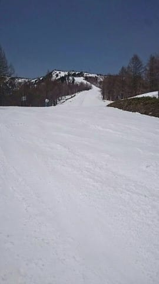

午前中は，それでも比較的

滑りがいいコンディションだった

ようですね～！

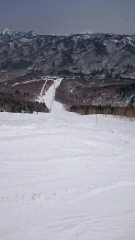

が，午後になると気温が+10℃近くまで

上がったので，ちょっと滑りが悪く

なってきたみたいですが…

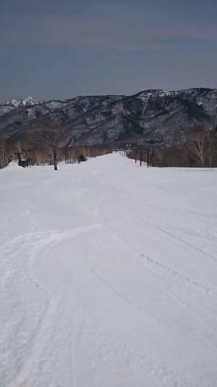

でも，どこもガラガラで．

人が少なかったので．

場所によっては，午後なっても

シマシマが残っていて．

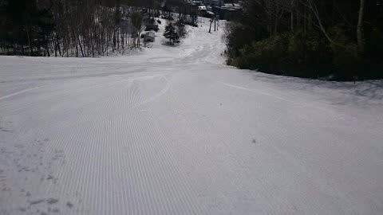

ザクザク雪ながらも，

それなりに楽しめたようです…！

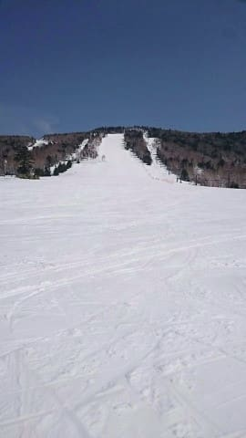

…が．

やっぱり，焼額も今週末での営業終了が

案内されちゃったみたいですね…（涙）

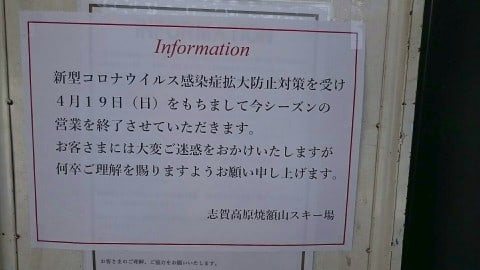

…ってなことで．

私の予想と比べてみると…

　朝の気温は-2℃程度かな？　←大正解，ぴったり賞！！

　朝は晴れ．雪は朝イチは表面がカリカリに

　固まった感じだけど，　　←概ね当たり

　すぐに緩んで朝からしっとり重い雪に．　←当たり！

　昼間の気温は+5℃を上回り，日差しも

　相まって暑いくらいに感じるかも．　　←10℃近くまで上がったみたいだけど…暑く感じるくらいってところは当たり

という感じで．

ふぅ…

今日も大体予想を当てたようだぜ…←いや，最高気温大きく外してるから

…って，自己満足の後は，本題へ．

昨日，緊急事態宣言の全国への拡大が

宣言され，対応の早いスキー場が

対応を表明しましたが．

今日はさらに多くのスキー場が

対応を宣言しましたね…

まず，

わがホームゲレンデの焼額から，正式に

今週末での営業終了が案内されましたし…

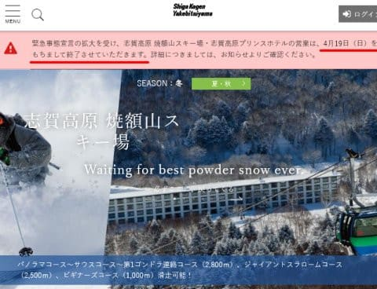

（[焼額山スキー場ホームページ](http://)より）

熊の湯も今週末で営業終了ですか…（涙）

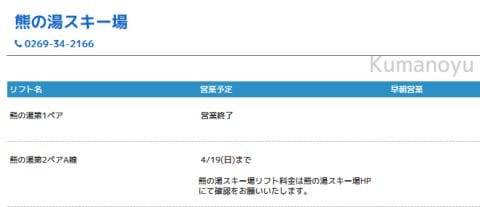

（[志賀高原索道協会ホームページ](https://www.shigakogen-ski.com/spring-early-morning-2019-2020)より）

横手も今週末で終了ですが…

ただ，赤線の部分．

緊急事態宣言期間以降の復活の

含みをもたせた表現になってます！

ちょっと希望がもてますね…！！！

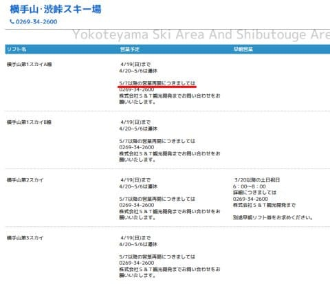

（[志賀高原索道協会ホームページ](https://www.shigakogen-ski.com/spring-early-morning-2019-2020)より）

ただ．

かぐらスキー場は，週末を待たずに

本日17日（金）で営業を終えてしまったようです…（泣）

GW以降の復活も予定されていません（涙）

かぐらスタッフの皆様，お疲れ様でした…

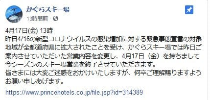

（[かぐらスキー場Facebook](https://www.facebook.com/snowkagura/posts/2705238226270147?__tn__=-R)より）

おんたけ2240も19日（日）で終了みたいですが．

18日は強風予想のため営業しないことを宣言しているので．

残るは19日のみ．

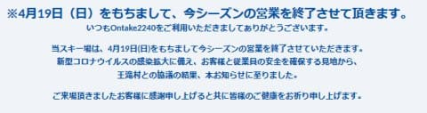

（[おんたけ2240スキー場ホームページ](https://ontake2240.jp/)より）

天元台も24日で終了．

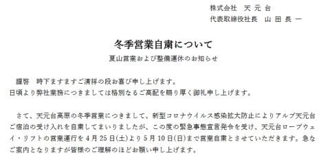

（[天元台ホームページ](http://www.tengendai.jp/)より）

ただ，感染者が出ていない岩手県の

安比と夏油は，「県外からの来訪禁止」という

条件で営業するみたいですね…

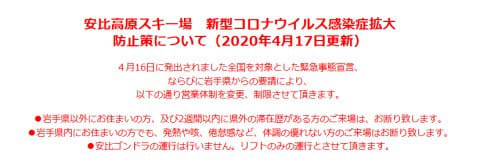

（[安比高原スキー場ホームページ](https://www.appi.co.jp/)より）

そして．

肝心な月山も，今週末19日で一旦閉鎖するみたいですが．

…でも，5月11日から復活の予定！！！

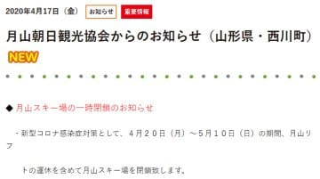

（[月山朝日観光協会ホームページ](https://www.gassan-info.com/)より）

…ってなことで．

全国緊急事態宣言を受けて，

県外来訪者を禁止している岩手県を除いて，

ほぼ全国すべてのスキー場が閉鎖を決めた

わけですが．

…でも，今のところ．

横手山と月山は，GW以降の復活を予定している

ようなので．

まだまだ今シーズン，

緊急事態宣言終結後，

滑れる可能性が残ってますね！！←その可能性は限りなく低い気がするけど…

スキーヤーとしては．

この感染拡大の危機が早々に収束し，

GW後に再び滑れるようになる可能性にかけるのだ！！

## 💬 コメント一覧

### 💬 コメント by (いちと)
**タイトル**: Unknown
**投稿日**: 2020-04-18 20:00:13

本当にさみしいですよね

一説には、終息するには２年かかるのと話もあります

最近、子供が上手くなり、これから私も頑張ろうと思ってきたばっかりでしたが、このままでは、本当に永遠の二級です

### 💬 コメント by (オバチャンスキーヤー)
**タイトル**: Unknown
**投稿日**: 2020-04-18 21:33:25

毎日 家事の合間に 適当なステップで 冷え冷え踊りを踊っていたのに むなしいシーズン終了です。先週 5月の連休に志賀高原に行く予約をした宿泊場所から 電話が ありました。「こんな事態ですが 来られますか？」と。そりゃあ 行きたいけど 行けないし。でも 予約があるだけで 楽しくなれる毎日だったのに。

年末の志賀高原は 行けるように 希望を持ってます。

まだ夏もこれからなのに・・・コロナめ！

### 💬 コメント by (オヤジスキーヤー)
**タイトル**: Unknown
**投稿日**: 2020-04-18 22:30:56

小雪そして、コロナ…散々なシーズンになってしまいました。とはいえ、今はスキーヤーもそうでない人も我慢の時ですね。来シーズンはみんなが笑顔で最高のシーズンになる事祈ってます！

徒然スキーヤーさんのブログ、スキーに行ったつもりで楽しませて頂いてます。ありがとうございます！

### 💬 コメント by (Skier_S)
**タイトル**: 明日が志賀ラストデー
**投稿日**: 2020-04-19 04:16:02

＞いちとさま

寂しいです(涙)

一体，いつになったら収まるのか…

来シーズンまで続くようなら，スキー場云々ってよりも

経済的にスキーに行けない状況になる人が続出で，

スキー場はヤバいかもしれません…（泣）

＞オバチャンスキーヤーさま

冷え冷え踊り，お疲れ様です(笑)．

むなしい踊りになってしまいましたね…

おそらく，冷え冷え踊りが効いて4月が冷えてくれたのかと…

とりあえず，コロナウイルスを恨みましょう！

＞オヤジスキーヤーさま

もう，今は我慢の時期です．

こんな長い時間家にいることは，人生初めてです…（涙）

とりあえず，私もこのBlogを書いて，スキーに行った気に

なっているので，少しでもスキーヤーの心の癒しに

なっていればいいなあ…と思ってます．

お互い頑張りましょう！

