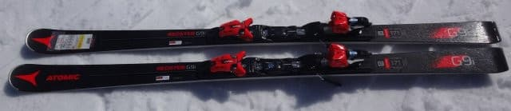
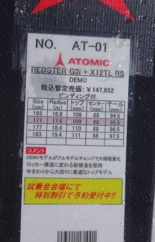
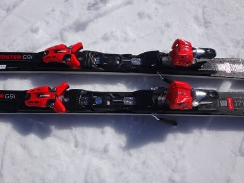
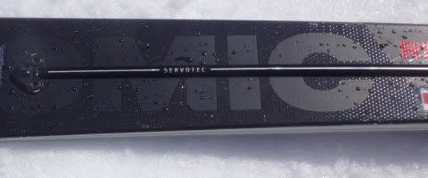

# 2018シーズンモデル，スキー試乗レポート第3回…ATOMIC編その2

📅 投稿日時: 2017-04-12 02:24:11

🏷️ カテゴリ: [スキー板試乗](c0bd8048615710cee890e403a36cc9a2b.md)

えー．

なんだか，12，13日は．

志賀高原はかなり冷え込んで，雪が

ぱらつきそうな感じになってきてる今日この頃．

皆様，いかがお過ごしでしょうか．

＃そんなに積もるほどは降らないけど

とりあえず．

今日は無事，夜のうちに帰宅できたSkier_Sです．

…いやーーーー．

昨日は死ぬかと思った…

とりあえず，今日は通常更新，復活！

スキー板の試乗レポート続き，アトミック編です．

では，どうぞ～！

ーーー

○ATOMIC Redster G9i 171cm

基礎大回り用

前回の小回り用の基礎板，S9iに引き続き．

今度は大回り用ベースの基礎板，G9iです．

うーむ．

Bluester LXの後継機，という位置づけでしょうか…

ただ，この板も．

LXと違って，ビンディングはTLビンディングしか選べませんね～．

履いてみたところ．

S9iと同じ軽量ウッドコアのおかげで．

この板も，これまでのATOMICに比べると

かなり軽め．

だもんで，やっぱり結構動かしやすい板ですが，

SALOMONのX-MAXほどは軽いわけではありません…

R17.6というのもあり，トップが引っかかったり

ターン後半切れ上がりすぎたりせず，比較的素直に

縦目に落ちて行ける板ですが，

ATOMICらしからぬ，しっとりとした乗り味．

パリパリした張りは感じず，比較的優しくたわみ，

たわみに粘りがある感じ．

たわませていくと，エッジに乗ったまま中回りくらいまで全然OK．

板が軽いので，ズラシに入れるのも簡単．

ズラシに入れれば，軽いので比較的簡単に小回りにも持っていけます．

高速安定性は，S9iより長いってのもあり，

S9iよりはかなり安定性が高い感じ．

かなり軽い板ですが，スピードを出していっても

S9iほど板が叩かれることはなく，しっとりと

たわんで，エッジに乗って回っていきます．

スピードを出していくと，比較的たわみやすい板

というのもあり，中回りっぽくなっていきますが…

板の返りはそれほど強くなく，ゆっくりと

優しく返ってきます．

比較的たわみやすいけど，ペタペタにたわみきって

しまう感じの板ではなく，たわんでいくと

途中からちょっとたわみ止まりが出てきて，

心もち踏み応え（？）が増す感じ．

これがSERVOTECの効果なのかな…？

板の荷重ポイントは，S9iと同様，これまでのATOMICの

かなりのテール目荷重に比べると，心持ちトップよりに

なった感じ…．

X-RACE SWなんかのように，ガッツリグリップの

強さを感じる板ではなく，

板の軽さもあり，比較的乗りやすい大回りベースの

オールラウンド板だと思いました．
