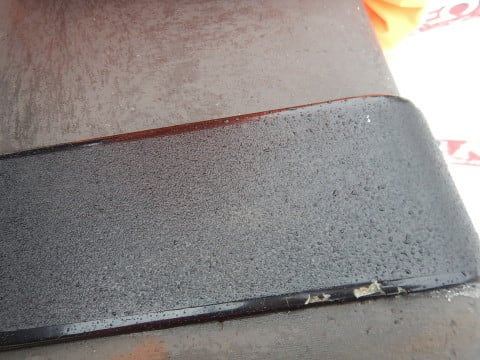

# 2019/4/14(日)の志賀高原スキー場，速報モード！…早朝は晴れ，昼間は曇り，そして午後2時ごろから小雨～雪．雪はイマイチ（涙）

📅 投稿日時: 2019-04-15 00:32:50

🏷️ カテゴリ: [2019スキー滑走日記](c3e4496fc0fb7f9c17ff21214a35b1ace.md)

ということで．

今日もしっかりラストゴンドラまで

滑ってきて．帰宅は夜遅く…

だもんで．

本日の志賀高原の状況を，

日曜深夜恒例の速報モードにて！

土曜の夜．

ナイターも飲み会もなく．

非常に久しぶりに，健全な時間に

床に就き．

準備万端で早朝営業に臨んだ本日．

今日も早朝は晴れてシマシマっ！

…と，思って喜んでゲレンデに

飛び込んだら…

夜中に気温がそれほど冷えなかったので．

表面が中途半端に固まり，

ボロボロ崩れていく，

ちょいと滑りにくいバーン…（涙）

でも．

早朝ならではの，まだ荒れてない

人の少ないゲレンデをかっ飛ばし．

…そして，通常営業開始時に．

早朝営業中はオープンしていない

パノラマコースに飛び込んで，

いい感じのシマシマをたらふく

いただいたわけですが…

いや．

この日曜日．

ゲレンデの人は，かなり少なかったですね…

当然，リフトもゴンドラも，まったく

待ちなしで飛び乗れて．

ガラガラだったんですが…

気温がぐんぐん上がったので，10時半ごろには

もうゲレンデの雪は緩みきって

しまい（涙）

昼近くには，気温がかなり上がり．

さらにうっすら曇っているながらも．

日が射しているので．

高温＆日差しで雪がやられて，

板の滑りもかなり悪くなって

しまいました…（泣）

だもんで．

一の瀬へ行ってみたものの．

一の瀬ファミリーのゲレンデも…

うーーーん．

雪は完全に，春の雪ですね…（涙）

そして．

午後2時を過ぎると…

えええ？？

なに？

これは，雨？？

ポツポツながら，降ったりやんだりの

雨が空から落ちてきてしまいました（涙）

ただ，焼額の山頂付近では．

雨ではなく，雪になっていましたが…

ってなことで．

夕方は，麓ではみぞれ，山頂では雪の，

微妙なものがパラパラと降ったり

やんだりの天気でしたが．

残念ながら，板の滑りが良くなるほどの

湿り気を雪に与えてくれるほどの

雨ではなく．

ラストまで，滑りはあまり良くないまま（泣）．

…まぁ，4月中旬としては標準的な

雪のコンデションで終わった一日

だったのでした…

ってことで．

土曜の午前中までは良すぎるほどの，

いい感でしたが．

日曜はちょいと残念な感じの一日でした…

これから一週間は．

明日15日（月）朝までに多少積雪があるものの．

それ以降は平年並みの気温の日が続き．

ごくありふれた，雪が解けていく

一週間になりそうです…

まぁ，週末は今のところ天気が

良さそうなので．

暖かい春スキーを楽しめる週末に

なりそうかな！

また明日，日曜の詳細レポート

やります～！←今日のレポートでも十分詳細だけど

明日をお楽しみに！←この時期にスキー場レポートを楽しみに待っている人がどれだけいるのやら…

## 💬 コメント一覧

### 💬 コメント by (musi)
**タイトル**: Unknown
**投稿日**: 2019-04-15 06:38:01

お疲れ様です。Sさんの予報見て、土曜は滑りに行きたかったのですが、子供が野球モードになってしまい、付き合ってくれず、泣く泣く見送ったら、やはり最高だったのですね。日曜も東京からブログを覗いている立場では、羨ましい限りです。私はクルマの屋根に猿の落し物が載っていた事や、上林の辺りで夜中に鹿に道を塞がれた事は、あるのですが、乗せたまま発進はないなあ。

### 💬 コメント by (ミーツ)
**タイトル**: Unknown
**投稿日**: 2019-04-15 08:54:19

志賀を愛して60余年…。東京からはそう繁々行くこと叶わず。ずーっと徒然スキーを読みながら頭の中でコースをたどりと……本当に毎度楽しく愉しく読んでます。シマシマうらやましい‼️といつも思います。

### 💬 コメント by (Hide)
**タイトル**: シーズンアップ・・・
**投稿日**: 2019-04-15 10:53:30

S 様

いや～うらやましい。土曜はホント行きたかった。

土曜は某S玉県で所用があり行けませんでしたー。

この先の週末も予定が色々と立て込んでおり、どうやらこのまま4/6のヤケビがラストのまま今シーズン終了になりそうです。

お声がけも頂き大変ありがとうございました。

あの車のあのナンバー、ヤケビ1ゴン駐車場では、ほぼほぼ私だけと思いますので発見したらぜひお声がけ下さい。

また来シーズンもぜひよろしくお願いします。

### 💬 コメント by (わたナベ)
**タイトル**: Unknown
**投稿日**: 2019-04-15 11:15:25

初めまして。

土曜日の終わりにいきなりでしたが声かけさせて頂いた者です。

毎日楽しみに拝見させて頂いております。

昨シーズンより焼額でお見かけさせて頂いて、いつかお声を掛けさせて頂きたいと思っていたのですが、このままではまた一年後になってしまうと思っていました。

100%当たる局地的な天気予報を頼りに、一念発起して土曜日早朝から頑張り、目標の20000mを達成出来たので、お声を掛けさせて頂きました。

凸でで、しかも一ノ瀬への瞬間移動直前に大変恐縮でしたが、頂いたステッカーを早速ヘルメットに貼らせて頂きました。

私は埼玉ですが、今週末も志賀高原に向かおうと思いますので、またよろしくお願いします。

瞬間移動の現場も拝見できて、ダブルで嬉しかったです！

### 💬 コメント by (わたナベ)
**タイトル**: Unknown
**投稿日**: 2019-04-15 11:53:05

凸でで→突然で の入力ミスでした。

後、先程今週末の試乗会に申し込みをしようとしたところ、既に土曜日は満員とのことでした。

私は日曜日に申し込みましたが、Sさんは土曜日ですかね。

### 💬 コメント by (かず)
**タイトル**: Unknown
**投稿日**: 2019-04-15 20:43:10

午後2ゴン側でアイテム確認してました　今まで使ってた方が全然走りました…残念　かなり走りましたけど1ゴンに向かう緩斜面後半からはガッツリつかまれますね　これから条件が悪くなる一方なので今週行こうかな？ゴールデンウィークってやっぱ混みます？

### 💬 コメント by (ほっぽ)
**タイトル**: ４／１４　志賀高原
**投稿日**: 2019-04-15 22:42:42

Ｓさん

昨日の滑走日記をアップしました。

昨日は結局営業終了１０分前まで滑っていたので、

ほぼラストまで居たのと同じでした。(^^;

午後の寺小屋がいい感じにスキーが走って快適でしたが、

雪が降ってきて４月なのに寒くて耐えられなかったです。

戻ってヤケビで誰もいないＧＳコースを疾走するＳさんを見届け

奥志賀で第三を回してラストはダウンヒルで終了でした。

今週末はＦＳＷに行くためスキーはお休み、

ＧＷ前半から復帰する予定です。

また、お会い出来たらよろしくお願いします。

http://www2.tokai.or.jp/nana_hoppo/

### 💬 コメント by (m&t)
**タイトル**: 朝礼に参加してました
**投稿日**: 2019-04-15 23:27:48

14日日曜日。5時半過ぎに1ゴン駐車場に到着し、H夫妻の次にスキーを置いて早朝スキーに並んでいたところ、朝礼が始まってしまい、いつの間にか参加してしまいました。

Hさんの奥様にはご挨拶しましたが、アサマ2000ホームのm＆tです。（Sさんにはご挨拶できず失礼しました。）

アサマはまだまだ雪があるのに先週でシーズンが終了。

もうひと滑りしようと、Gokuさんのブログで拝見した早朝+午前券で参戦しました。

H夫妻の後を追い朝イチシマシマのオリンピックを滑走。

1ゴンに着くと、すぐ後ろにGSを降りてきたNaoちゃんとお父さんを発見。噂には聞いていましたが、恐ろしいスピードです！

ジャガイモ畑になってしまったので、通常営業とともに唐松コースにシマシマを求めて行くと、集団滑走中の皆さんと遭遇。

２高を降りたところで、皆さんと同じタイミングになりましたが、皆さんについていけるか自信がなかったのでパスしてしまいました。

11時半頃Sさんとくにーさん(？)以外の皆さんが帰るなか、もう２本滑りましたが、妖怪板つかみに足を引っ張られ、さすがに限界を感じ、銀嶺でそばと高天が原ホテルでピザを楽しみ、今シーズンを終了しました。

では、また来シーズン初めのアサマか志賀でお会いできれば思います。（Sさんのシーズンはまだまだですが…。）

上がる前に1ゴン下で最後にご挨拶と思い待っていましたが、一ノ瀬に行かれていたようでご挨拶できず、残念でした。シーズン終了後も毎日ブログを楽しみにしています。、今後もよろしくお願いします。

ところで、お猿さんはその後どうしたのでしょうか？

### 💬 コメント by (Skier_S)
**タイトル**: 今週末は典型的な春スキー
**投稿日**: 2019-04-16 03:15:02

＞musiさま

この土曜日，午前中まではすごく良かったですよ～！

日曜はイマイチでしたが（涙）

お猿さんは，発進した瞬間に車から飛び降りてました…

＞ミーツさま

志賀，60年ですか！！

それはすごいですね…

東京からでも，最近は道路がいいので昔より

かなり楽になりましたし．

また志賀高原にお越しください～！！

私も滑ってますので，お会いできるかも…

＞Hideさま

土曜は4月と思えない最高コンディションでしたよ～！

しかし，もう今シーズンは終了ですか…

まだGWまで雪はたっぷりありますから，

まだまだいけますよ～！

…楽しいかどうかは微妙ですが(笑)

また来シーズン，志賀でお会いしましょう！

＞わたナベさま

20000m達成おめでとうございます！

KonSukeさんに申請して，ゴールドステッカー

受け取ってきました～！

今週末お渡しします．

私は土日とも試乗会参加予定です．

土日とも，朝は焼額スタートで，9時過ぎに

一の瀬へ移動パターンだと思います…

日曜は，試乗は昼前後の2-3時間だけかもしれません．

試乗以外は，ホームゲレンデの焼額に戻る予定です．

また今週末お会いしましょう！

お会いしたら，ゴールドステッカー授与式（？）開催です(笑)．

＞かずさま

今年はGWちょっと混むかもしれませんが…

いつもなら5連休とかの4連休とかの前半2-3日が混むだけで，

それ以外はそれほど混みませんが．

今年は10連休なので，どうなるか全く読めません…

たぶん，前半，それも28，29日あたりがピークではないでしょうか．

＞ほっぽさま

あの日曜日，ほぼラストまで滑ってらしたんですね(笑)．

すごいですね…←人のことは言えない気がするけど

次はGWにお会いしましょう！

＞m&tさま

朝礼に巻き込んでいたのに，まったく気づいてませんでした…

すみません．

日曜はいつもの朝礼メンバーがあまり揃わず，

ちょっと寂しい感じの朝礼でしたが…

でも，naoちゃんもすごかったでしょ(笑)．

しかし，今シーズン終了ですか！

まだまだ志賀は滑れますし．

かぐらも行けますよ…

とりあえず，来シーズンの11月のアサマ2000か

志賀高原でお会いしましょう～！

…ちなみに，お猿さんは，車を動かした瞬間に飛び降りていきました．

