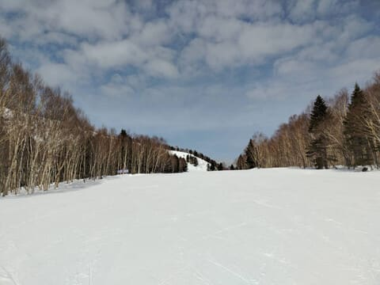
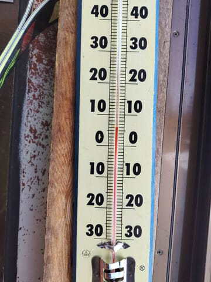
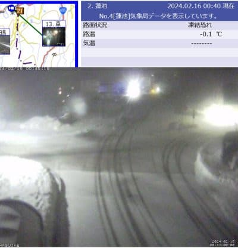
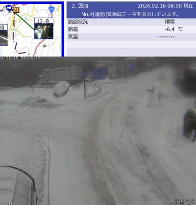

# 2月17，18日の週末の志賀高原スキー場の天気は…2日とも晴れ．気温は上がり気味．日曜は春スキー並みの高温に(涙)

📅 投稿日時: 2024-02-16 08:31:36

🏷️ カテゴリ: [日記](cc4b5682fb7b8b144980957a978653fb0.md)

えー．

ちょっと仕事の状況がクリティカルです(涙)

何とか週末はスキーに行けるよう，

頑張っているので…

Blog更新時間が取れない(泣)

でも，2日連続更新無しはヤバいので

何とか更新！

で．

昨日木曜の志賀高原ですが．

天気は良かったみたいですが…

その代わり，気温が無茶苦茶上がって．

え？2月の焼額山山頂で+6℃！？？

気温と日差しで雪は一気に緩み，

一ノ瀬も焼額も，妖怪板つかみが

発生する，かなり滑りが悪い残念な

雪になったようです…(涙)

あぁ…2月というのに…

で．

さらに．

昨日の夜，10時ごろから雨になったようです(泣)

でも，雨は2時間ほどで雪になり…

深夜0時には気温もマイナスになって，

雪が積もり始め．

今朝は蓮池でも-6℃まで冷え，雪が

10cmほど積もったようです！！

この雪で，昨日の高温＆雨にやられた雪が

隠れてくれるといいんですが…

で，この土日の志賀高原ですが．

土曜：晴れ．朝は-8℃くらい，

　昼間は0℃近くまで上がるか？

　朝はそこそこいい感じのシマシマ．

　しかし，じきに急斜面は雪が荒れて

　下地の硬いのが出てくるか…

日曜：この日も終日晴れ．

　朝は-3℃程度だろうけど，

　あっという間にぐんぐん気温が上がる．

　昼間は+5℃くらいまで上がるか？

　強い日差しで雪が緩み，日差しが強い

　南斜面は4月並みの春スキーのような

　ざぶざぶに．

　西～北斜面はしばらくはいい雪で

　キープしてくれるかもだけど，

　午後はやっぱり緩む．

という感じでしょうか…

土曜はまだマシそうだけど，

日曜は晴天の春スキーになりそう…

まぁ，雨よりマシかな

（と，自分を慰める）

ただ．

来週はさらにすごい天気が

待ってるかも…

今の天気図だと，20～22日までの

3日間，「梅雨か？」と思う

天気図で，高温の雨が降り続けそう…

とても2月の天気と思えない…

なぜ，3連休直前に…(泣)

でも．

3連休がちょうど終わった2月25日以降は，

高温期間が終わってちょっと冷えそうなので．

雪さえ降ってくれれば，3月のほうが

コンディションよくなるかも…？？？

そこに期待！！

## 💬 コメント一覧

### 💬 コメント by (レインボー76)
**タイトル**: Unknown
**投稿日**: 2024-02-16 13:59:23

金曜日の志賀高原情報

朝の上林-2℃　蓮池-7℃。深夜の雨と雪からの冷え込みで、カッチカチのアイスに重い新雪が数センチ。

軽いペラペラの板を持っていったからたまらない。軽いストップもあって、ここしばらくでは最も楽しくない。

日体大の検定のため、ニゴンが8時00分スタートしてくれたけど、つまんないから超早あがり。

それにしても、毎年思うけど、日体大の生徒も先生も最高すぎる！あんなきちんと統率のとれた集団が他にあるだろうかと、もはや感動の域。ゴンドラは意識的に空いた時を狙って乗ってくれるし、一般の人の動きへの配慮が常に感じられ、あれだけの多人数が滑っていてもストレスを感じない。どこかのスキー学校にも見習って欲しいと思うのは、私だけではないはずでしょう。

### 💬 コメント by (Skier_S)
**タイトル**: ＞レインボー76さま
**投稿日**: 2024-02-17 00:23:18

ガチガチですか…（涙）

2月なのに…

日体大さんはマナーいいんですね．さすがスポーツマンの学校…！

