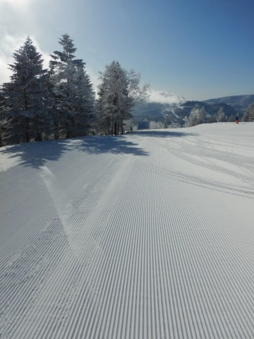
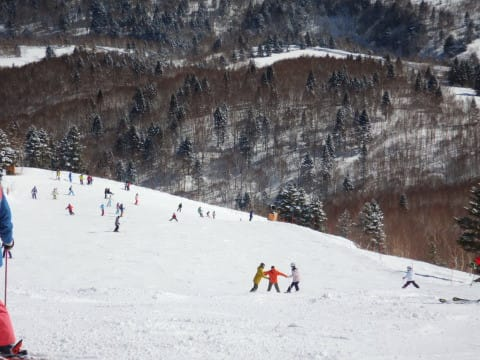

# 2020/2/24(月・祝)，3連休最終日の志賀高原スキー場，速報レポート！…すっきり晴天の一日！朝は雪も最高，午前はちょっと混んだけど，絶好のスキー日和！

📅 投稿日時: 2020-02-25 02:30:19

🏷️ カテゴリ: [2020スキー滑走日記](c282e9230de179e245c7334eabeb0a3b3.md)

ということで．

本日もラストリフトまで滑ってきて．

さらに3連休だったので，帰りの道路も

渋滞して．

帰宅は日付変更線後…（涙）

だもんで．

帰宅日定番，いつもの速報モードにて

本日の志賀高原レポートです！

えー．

まず．

本日は朝からすっきり晴天！

そして，朝は放射冷却で結構冷え込み．

昨日積もった雪がきれいに圧雪された，

今シーズン1－2を争う，トップシーズン

冷え冷え最高激烈快楽シマシマバーン！！！

うひょーーーーー！！

極上っ！！

極楽…！！

…と，シマシマを楽しんでいたら．

さすが3連休の晴天の日，朝から

人口密度は結構高めで．

午前10時ごろには，ゴンドラ待ちが

かなり伸びてしまいました…（涙）

しかし．

3連休も最終日なので．

昼ごろには帰っちゃう人が

多かったようで．

昼になると，ゲレンデはガラガラ！！

ゴンドラも，ほぼ飛び乗り状態！！

いや～．

[3連休初日](ef318c3f831e6e3291b2747f4566ea065.md)の，

高温，春の雪，雨，強風でゴンドラ運休，ナイター中止…

っていう5重苦と比べると．

3連休最終日は

晴天，そこそこ冷え冷え，トップシーズンの雪，そしてガラガラ…

と，最高のコンディション！！

天国と地獄の両方を味わった，

この3連休だったなぁ…

午後になっても，雪は結構良くて．

バーンもフラットだったけど．

日が当たる南斜面，ごく一部だけ

雪が重くなったところも…

でも．

ほとんどのバーンは，夕方になっても

冷えたいい雪で．

ゲレンデも多少の凸凹はあったものの．

人も少なく，好き勝手に大回りしたい放題の，

ゴキゲンバーン！！

さすがに営業終了のころには，

急斜面の一部はコブっぽくなった

ところもあったけど…

ラストまでいい天気が続き，

志賀高原のトップシーズンの

一日を満喫できたのでした…

この3連休．

初日雨，2日目雪降り，最終日晴天と，

初日は悲惨だったけど．

だんだんコンディションが良くなり，

終わりよければすべて良しの

3連休でした～！

詳細レポートは，また明日！

PS.そしてまた本日，新たな伝説＆20000m達成者が誕生したのだった…

## 💬 コメント一覧

### 💬 コメント by (Hide)
**タイトル**: やっぱり・・・
**投稿日**: 2020-02-25 12:10:43

S 様

日曜日の朝一ゴンドラ内から、いつものようにデジカメで撮影しながらスタートするお姿をお見かけしましたが、終日タイミングが合わずでした。

が、帰路の際に高天が原手前で一の瀬方面にお戻りになるS様の車とすれ違いましたので、まさかナイターへ？？と思っていたのですが、やはり行かれたのですね（笑）

ブログ更新時間なども見ると、やはりサイボーグ化してます・・・・

やっぱり向こう側の世界の人だったんですね（笑）

あの日も帰りは上林までノロノロで、私も帰宅は24:00頃になりました。

やはり3連休は混みますね。

でもスキー場に人が戻ってくるのは良い事です。

### 💬 コメント by (Kyoko)
**タイトル**: ありがとうございました☆彡
**投稿日**: 2020-02-25 12:42:22

昨朝は近年稀に見る

超絶昇天レベルのコンディションで、

First Truckをご一緒させていただき、

ありがとうございました!!!!

朝一のしましまバーンは

最高でした( ^)o(^ )

Sさんの2本のくっきりエッジ跡の

後を滑らせていただき、

自分の板の性能の劣りが

明確になったため、

来シーズンは板を新調します!!!

今度は子どももヤケビキッズに

ご一緒させていただける機会を

楽しみにしています('◇')ゞ

今後ともよろしくお願いしまーす(^_-)-☆

### 💬 コメント by (まーくん)
**タイトル**: Unknown
**投稿日**: 2020-02-25 13:02:50

最終日は良い天気だったようで羨ましいです！私は仕事でした。

今週末の土日は友人を連れて焼額山で滑る予定なので宜しくお願いします！

### 💬 コメント by (takaaturyou)
**タイトル**: Unknown
**投稿日**: 2020-02-25 14:51:07

S様

突然、声を掛けさせて頂き、失礼しました。

お会いできて良かったです。

頂いたお札、早速ヘルメットに貼りました！

次回、S様の滑りの極意をご教授下さい。

### 💬 コメント by (Skier_S)
**タイトル**: 明日から降る！冷え冷え雪が降るっ！！
**投稿日**: 2020-02-25 21:17:07

＞Hideさま

あら．見られてましたか（笑）．

日曜夜は，ナイターまで滑ったあとの飲み会2連荘で

死ぬかと思いました．

月曜朝，良く起きられたものだ…と思いました（笑）．

でも，私はサイボーグではなく，赤い血が流れている人間ですから！

＞Kyokoさま

月曜は半日お付き合いいただき，ありがとうございました～！

あまりにもコンディションが良すぎたため，なんの手加減もなく

滑ってしまったので，ペース配分に配慮せずすみませんでした．

また今後とも，一緒に滑る機会があるかと思いますので

その際はこちらこそよろしくお願いします～！！

＞まーくんさま

月曜は最高でした…

今週の土日は，土曜は焼額で滑ってます～！

日曜はちょっと遠征に行くかも．

朝礼メンバーがいっぱいいると思うので，また一緒に滑ってくれると思いますよ！

＞takaaturyouさま

月曜は声をかけていただき，ありがとうございました．

一緒に滑れなくて残念でしたが，今度はぜひご一緒に滑りましょう！

では，また志賀高原でお会いしましょう～！

