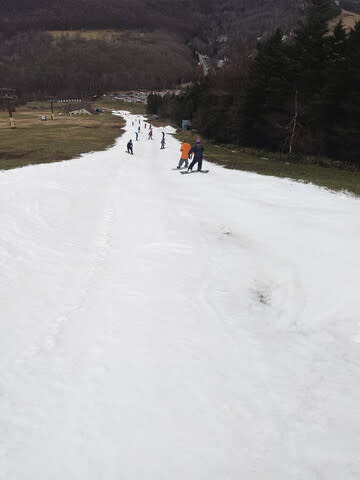

# 11月22日，菅平スキー場オープンの特派員レポート！…ゲレンデは狭く，午前リフト待ちあり．そして現在志賀では雪！23日土曜は一日降り続けるよ！

📅 投稿日時: 2024-11-23 02:54:36

🏷️ カテゴリ: [日記](cc4b5682fb7b8b144980957a978653fb0.md)

ということで．

22日夜から冷えて雪が降る…と

予告しましたが．

予想通り，志賀高原でも雪が降りはじめ

ました～！！

（[北信建設事務道路気象状況カメラ](http://hokushin.pref-nagano-roadcamera.jp/)より）

残念ながら降り始めが金曜の夜から

なので．

さすがに土曜のオープンには間に合わず…

横手山はまだオープンの通知が出てませんし．

熊の湯も，土曜のオープンをあきらめたという

案内が流れてました（泣）

（[熊の湯スキー場ホームページ](https://www.kumanoyu.co.jp/lift/)より)

そして…

かぐらのライブカメラを見ても，23日土曜

午前2時現在，かなり雪が降ってるように

見えますが…

やはりまだオープンには足りず，23日の

営業オープンは遅れるようですね…(涙)

（[かぐらスキー場Facebook](https://www.facebook.com/snowkagura/posts/pfbid02PWCPrQKe4iBAPDiEjk1DxDBoJupagjsoieaFfxfTGkAoyhRhF4oy8rKWbjfNiQXvl)より）

ただ…

今降っている雪は，土日の2日間降り続けます！

志賀高原で10～20cmくらい積もって

くれるかな…

だもんで．

運が良ければ熊の湯・横手も日曜に

オープンの可能性もあります！

月曜にはかなり高い確率でオープンすると

思います…

ってなことで．

雪の降り始めがわずかに遅く，今週末には

間に合わなかった感じですが．

そんな中でも，菅平が予定通りオープンして．

志賀常連の特派員が滑ってきたようで，

写真を送ってもらいました～！！

昨日のスキー場からの案内にある通り，

コースの下からリフト乗り場までは

雪がないですね…

滑り終わったら，コース下から

こんな感じのところをリフトまで歩いて．

リフト乗り場でまた板を履いてから

リフトに乗るようです…

うーん．

コース幅はやっぱり狭いですね…

あさイチはかなりのツルツルカチカチ

バーンだったようなので，この狭さだと

ちょっと怖いかも．

雪の厚みもそこまで厚くなかったようで…

じきにコース上に穴が開き始めたようです…（涙）

で．

オープン日はリフト代が無料だったこともあり．

午前中は結構人も多く，ピークではリフト

乗り場から雪のある所まで人が並んだことも

あったようですが…

そこまで並んだのは1回だけで，

あとは11時くらいまでは4-5分待ち．

その後は，お昼くらいまでゲート内待ち，

それ以降はほぼ待ちが無くなったようです…！

午前中は人が多く，コースの人口密度も

高かったようですが．

午後は比較的人も減って，コースもクリアに

なってきているように見えますが．

ただ，やはりコースがせまく，かつ斜度も

結構あるのでコースが荒れるのは早く…

コースは馬の背状に掘れていき，

午前・午後の1回ずつパトロールから

デラ掛け要請があったという報告が

ありました．

それでも，やはり最後には結構荒れて，

穴が開いたところも多数あったようです…

うーん．

1か月半の造雪でやっとコースが作れるほどの

常設能力しかない菅平．

これだけ荒れたゲレンデを，明日までに復活

させられるのかちょっと心配ですが．

菅平も今は雪が降ってるようなので，

アイスクラッシュ＆人工降雪＆天然雪で

何とかなるかな…？？

ってなことで．

まだオープンするスキー場がほとんどない

今週末．

私はまた明日，イエティで滑ってます～！

…でも．

もう午前3時じゃないか…

あと3時間後に出発…

やっぱり今日も3時間寝られない…（泣）
