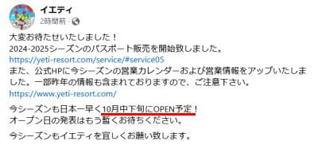
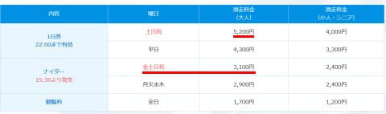

# イエティは今シーズン平日も休日も9時オープン！休日リフト1日券200円値上げ，ナイターも金土日祝料金が設定され200円アップ…11月は月・火ナイター無し

📅 投稿日時: 2024-10-06 00:16:19

えー．

秋真っ盛りのはずの10月ですが．

なぜ，30℃近い気温が続くんだ…（泣）

なんだか冬はまだまだという感が強いですが．

もうそろそろスキーシーズンですからね～！！

忘れないように！！

ってなことで，スキーシーズンが近づいて

来ている感を高めるため，このBlogも

スキーBlogにはふさわしくない（？）真夏の

ダイビング日記の間に，スキー情報を

挟むわけですが．

本日，今シーズンのイエティの情報がいくつか

出てきました～！！

で．

当然オープン日が一番気になるわけですが．

相変わらず，スキー場オープン日はまだ未定の

ようですね…

10月中下旬にOPEN予定

という微妙な表記です．

…まぁ，中旬じゃなく下旬でしょう．

（[イエティFacebook](https://www.facebook.com/YetiSnowtown/)より）

そして，Yetiのホームページも2025シーズンの

情報に変わっているようなので，詳細を見ると…

ふむ．

カレンダーを見ると，昨シーズンの平日10時

オープンから変わって，今シーズンは平日も休日も

朝9時オープンになったようです！

営業終了は昨シーズンと変わらず22時ですね．

（[イエティホームページ](https://www.yeti-resort.com/service/#)より）

そして，今シーズンもオールナイト営業はなく，

11月は月・火はナイター営業がないようです…

あとはシーズン券情報も出てきましたが．

10月20日までに購入すれば，シーズン券が

34,500円で購入できるようです…！

そして今シーズンから，中学から大学生までの

学割もできたようで，こちらは10月20日までなら

28,500円のようです…

（[イエティホームページ，シーズンパスポートページ](https://www.yeti-resort.com/service/season_pass.html)より）

あとはナイターシーズン券ですが．

こちらも10月20日までなら19,500円．

ただ，ナイターシーズン券．これまでは

15時半から使えたはずですが…

見出しには17時以降入場滑走FREEと

書かれているので…使える時間が短くなった

のかな？

（[イエティホームページ，ナイターパスポートページ](https://www.yeti-resort.com/service/night_pass.html)より）

ただ，上の表の中のナイターパスポートの

説明には「オープン期間中の15:30より

ご利用になれるパスポート」と書かれていて…

どっちが正しいんだろう？？

続いては1日券とナイター券の値段ですが…

こちらは土日祝の1日券が昨シーズンより

200円値上がりして，5200円．

あとは，ナイター券が曜日によってお値段が

変わるようになり，金土日祝が従来より

200円アップの3100円となるようです…

（[イエティホームページ](https://www.yeti-resort.com/service/#)より）

こちらのナイター券は，これまでと同様

15:30から利用可能なようです．

ちなみに，昨シーズンの料金を見ると．

大人の土休日1日券と大人の木金土日ナイター券

以外は，昨シーズンからお値段据え置きですね…

ってなことで．

肝心なオープン日以外は，2025シーズンの

情報が出てきたイエティ．

最近の高温の日々からは信じられないですが．

あと3週間待たずしてオープンですよ～！！

そろそろシーズンインの準備をしておきま

しょうね～！←という自分が仕事のせいで全然準備できてない
