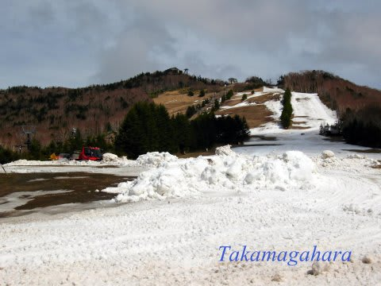

# 今週末も1泊2日志賀高原！…明日，一の瀬も高天ヶ原も山頂から滑れるみたい…

📅 投稿日時: 2016-04-23 00:50:07

ということで．

驚くことに．

[志賀高原リゾート開発のFacebook](https://www.facebook.com/297506993698844/photos/a.303419283107615.72613.297506993698844/948380828611454/?type=1&theater)を見ると．

「今週末は一の瀬ファミリー（天狗コース、正面）・高天ヶ原マンモスともクワッドリフト営業予定です」

…と，書かれてますね～

まだ明日，正面バーン滑れるんだ…

高天ヶ原NHKバーンはこんな状況で．

（志賀高原リゾート開発Facebookより）

必死に雪出しをして，コースをもたせるみたいですが．

一の瀬正面バーンはどんな状況なのか…

とりあえず，土日と滑って，

いろいろスキーを試乗してきます～．←この状況で板の性能が分かるのか？？

＃しかし．今日も日付が変わってから帰宅した気がするんだが…

＃あと3時間半後に出発なので．

＃3時間寝られない気がするのだが…（涙）．

## 💬 コメント一覧

### 💬 コメント by (komu)
**タイトル**: なんだか…
**投稿日**: 2016-04-23 16:12:39

あのコンディションでは板の違いはわからなかったですね～

高天ヶ原もなんだかで横手山に行ったのですが、多少ましな程度でしたよ

20000クラブシールありがとうございました。

新しい板来たら貼ります。

### 💬 コメント by (Skier_S)
**タイトル**: komuさま
**投稿日**: 2016-04-23 20:09:17

お久しぶりでした～！

あの一の瀬，ちょっとすごかったですよね…

横手山もダメですか…（涙）

熊の湯もにたようなもんでしょうかね～

…新しい板来たら貼ります，って…

また買うんですね（笑）

