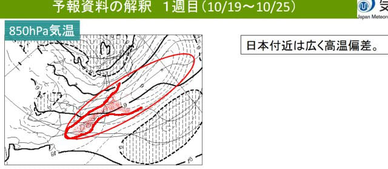

# イエティのオープン日が出たよ！予想通り10月25日(金)オープン！…でも，1か月予報を見ると11月中旬まで高温傾向が続く…(涙)

📅 投稿日時: 2024-10-18 02:10:22

えー．

昨日は，Blogを書く前に，倒れたように

寝てしまい（ホントに気を失うような

感じで，気づいたら寝てた），Blogが

更新できませんでした…

更新を楽しみにしていた方，すみません←楽しみにしてる人なんているのか？

ってなことで，いきなり本日の本題ですが．

イエティのオープン日が，ついに公表され

ました～！

予想通り，10月25日（金）のオープンです！！

（[イエティホームページ](https://www.yeti-resort.com/)より）

そして，あと1週間後のイエティオープン日．

例年通り，オープニングセレモニーの日は，

朝10時までに仮装して入場すれば，

タダで1日券がもらえるようです…！

（[イエティホームページ](https://www.yeti-resort.com/event/2024/10/post-115.html)より）

しかし…

イエティのライブカメラを見ると，

まだまだ全然造雪が進んでいない感じで…

この状態からあと1週間でオープンできる，

イエティの造雪能力のすごさよ…

（[WNIライブカメラ](http://webcam.wni.co.jp/KAC24326/loop.html)より）

…カメラの前に，人工降雪機が置いてあって，

その前にうっすら雪が積もってるようにも

見えるけど．

まさか，人工降雪機が動かせるほど冷えて

ないと思うんだけどなぁ…

とりあえず．

本日木曜は気象庁の1か月予報が出る日でも

あるので．

これからイエティがオープンして，シーズン

突入後となる11月15日までの予報を見て

みましょう…！！

…

…

…

ふぎゃーーーー！！

ダメだ．

ダメじゃん．

これからイエティオープンまでの1週目は，

気温が高い確率が80％．

イエティオープン後の1週間となる2週目も，

気温が高い確率が80％．

さらにその後の3-4週目も，ちょっとマシになる

とはいえ，気温が高い確率が50％と．

全く希望が持てない予報です…（涙）

なんてったって，第1週となる10/19-10/25の

1週間の平均の850hPa気温を見ると．

赤く塗った平年比+3℃のエリアが本州を

覆っているし…

さらにイエティオープン後になる，10/26-11/1

の850hPa気温図を見ても，赤く塗った平年比

+3℃エリアが関東に近く．

イエティ付近も平年比+3℃近くまで上がりそう…

3か月予報では，平年並みに戻るはずの11月も．

状中の11/2-11/15では，水色の平年比+1℃

高いエリアに関東は入っちゃってるので，

平年より高い気温で推移しそう…（泣）

あぁ…ダメだ．

ダメだよ…

まぁ，11月に入れば10月までよりもマシに

なりそうな予報ではあるものの．

それでも，平年よりは高いままの気温が

続きそうだし…

そもそもこれからオープンまでの1週間，

さらにオープン後の1週間は，平年比+3℃の

異常高温が続きそうなので…

イエティ，雪がもつのか！？？？

あと，11月15日まで高温が続くとなると…

横手や熊の湯も，オープンが遅れる

可能性が高そう…（涙）

とりあえず．

イエティのオープン日は決まったけど．

高温のおかげで，オープン時のコース幅はいつにも

増して狭くなりそうだし．

オープン後も，すぐにはそれほどコース幅が

広がらなさそう…（泣）

高温は仕方がないとあきらめるとして．

せめて雨が降らなければ，造雪した雪への

ダメージが少なくて済むんだけど…

ここはやはり．

このBlog読者の皆様は．これから冷えるように，

ひたすら願い，ひたすら冷え冷え踊りを踊り，

ひたすら寒気の歌を歌い続けるしかないです…！

無事，イエティが予定通りオープンして，

その後にひどい高温と雨で再クローズという，

[昨年のような悲劇](e3270aae6f81c24a15b59f75aa61d05f0.md)が繰り返し起きませんように…！！

## 💬 コメント一覧

### 💬 コメント by (metabo-joker)
**タイトル**: Unknown
**投稿日**: 2024-10-18 12:50:23

更新は楽しみにしてます‼️

### 💬 コメント by (Skier_S)
**タイトル**: ＞metabo-jokerさま
**投稿日**: 2024-10-19 01:16:59

ありがとうございます~！！

その一言が励みになります！！

### 💬 コメント by (ねも)
**タイトル**: Unknown
**投稿日**: 2024-10-23 00:03:03

Ｓさん　お久しぶり！

今年は夏がしつこい(苦笑)

25日って、もう明後日⁉️　ホントにオープンできるの??　到底信じられませんが……(プール開きなら信じられます、笑)

### 💬 コメント by (Skier_S)
**タイトル**: ＞ねもさま
**投稿日**: 2024-10-23 00:32:58

イエティのライブカメラを見ると，ぎりぎり何とか雪はできてそうです…

でも，これからまだしばらく高温が続き，秋雨が続くので，ゲレンデはかなり厳しい状態に

なりそうな予感…（涙）

