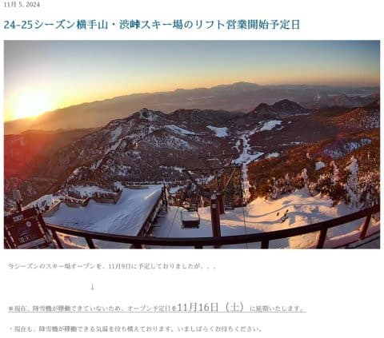
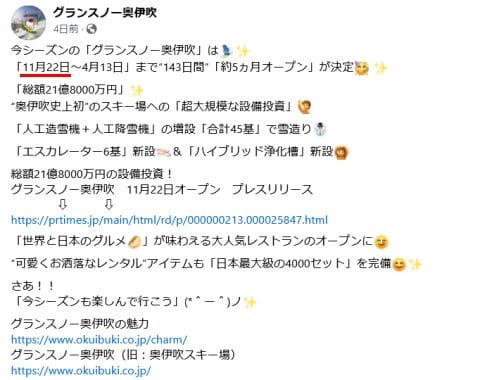
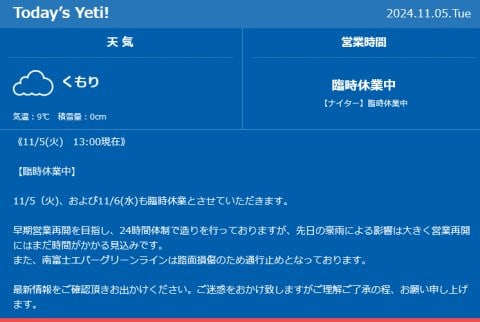
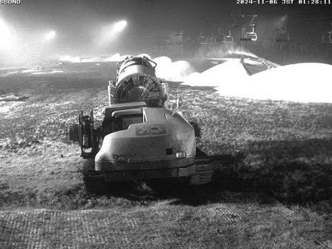
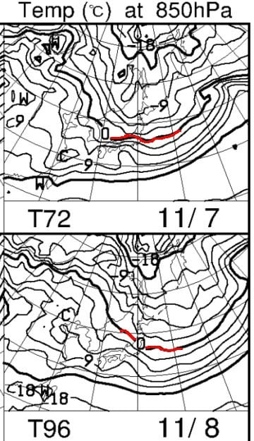
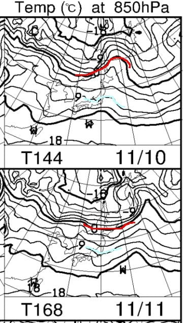

# 横手山スキー場，オープン予定を11/9から11/16に延期したけど厳しそう…イエティは6日も営業見合わせ．7日にオープンするかも？

📅 投稿日時: 2024-11-06 03:47:15

ということで．

今日もちょっといろいろ切羽詰まっているので，

手短に更新…

えー．

横手山，当初の予定では，今週末の11月9日に

オープンというかなりアグレッシブな

計画でしたが…

やはりさすがにこの高温＆雨続きでは

無理だと思っていたところ．

予想通り，営業予定日を延期しました（泣）

横手山の新しいオープン予定日，熊の湯と同じ

11月16日です！！

…でも，今1mmも雪ができてない状態なので，

1週間後の11月16日オープンもかなり厳しいと

思うんだけどなぁ…

（[横手山スキー場ホームページ](https://yokoteyama2307.com/2024/11/05/%e3%82%b9%e3%82%ad%e3%83%bc%e5%a0%b4%e3%82%aa%e3%83%bc%e3%83%97%e3%83%b3%e4%ba%88%e5%ae%9a%e6%97%a5/)より）

そして．

今シーズンに向けて巨大投資をして，

アイスクラッシュを大量導入した奥伊吹．

オープン日が公表されてました～！

奥伊吹のオープン日は11月22日です！！

意外と遅いなぁ…

今週末11/9にオープン予定のホワイトピア

高鷲の人出緩和にはならさそう…

（[グランスノー奥伊吹Facebook](https://www.facebook.com/okuibuki/posts/pfbid02mT2mS63buLW7aWucaHZJ3wzJFVSXphqdxXfFUGptAg3VQcTVwifxkkknmtZqoeUpl?ref=embed_page)より）

ちなみに，菅平のオープン日はいまだに公表されて

ません…

かなり早い，10月上旬から雪を作り始めてましたが，

また12月近くになってのオープンになるのかも…

で．

いつものイエティ情報ですが．

予想通り，日付が変わって本日になる

6日（水）も営業中止が決まりました…

うん．予想通りですね…

（[イエティホームページ](https://www.yeti-resort.com/)より）

ライブカメラを見ると…

そろそろ雪山もつながってきたので．

明日1日造雪すれば，昨日の予想通り，

ぎりぎり木曜にオープン可能かな～．

（[WNIライブカメラ](http://webcam.wni.co.jp/KAC24326/loop.html)より）

ってなことで．

当初予想よりは冷え込みが弱まったとはいえ．

引き続き7，8日は平均気温を下回り，

赤い0℃線も本州まで下がって，

志賀高原では天然雪＆人工降雪が打てる，

この秋一番の冷え込みになりそうです…！！

…ただ．

冷え込むのは6日夜から8日午前まで．

それ以降はまた気温が上がり…

また週末の土日は平年比+3℃の高温に

戻りそう（涙）

10，11日，850hPa図を見ると．

水色の+9℃線が本州にかかってますが…

11月としては高めの気温ですね（泣）

当然，赤い0℃線は遠い北に去ってしまい，

このあとしばらく志賀高原でも人工降雪機は

動かせなさそう．

うーん…

現時点での天気図をどう読んでも，

11月16日の横手．熊の湯のオープンは

不可能という判断になりますね…（激泣）

7，8日以降，16日まで，

志賀高原でも人工降雪機を動かせる

レベルの低温になることは一度もなさそう

です（強烈な涙）

…たぶん，横手山でも，運が良くて11月23日

ごろにオープンできればラッキー，という

感じ（激泣）

うーん…

まさかラニーニャ＆負のインド洋ダイポール

モードが観測されている今年．

11月がここまで高温になるとは思わなかった…

きっと．

これはきっと．

今，無駄に放出しないように冷え冷えエネルギーを

一生懸命溜めていて．

12月になったら，一気に冷え冷えエネルギーが解放

されて，激冷えになるに違いない…！！

…と．

何の科学的根拠もない適当な期待をもって，

12月の志賀高原オープンをまとう…

と，自分を慰めるしかない，Skier_Sだったの

でした…

（そして，全然手短な更新じゃなかった）
