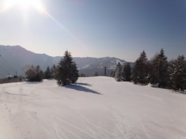
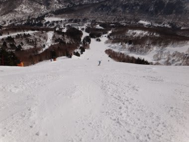
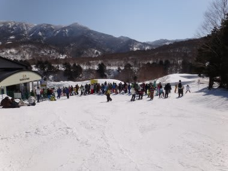
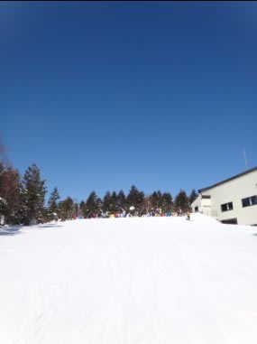
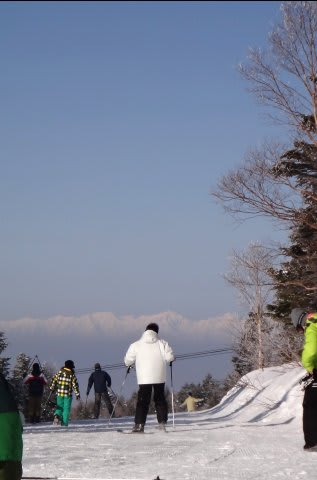

# 3月4日の志賀高原の状況は？

📅 投稿日時: 2012-03-05 00:13:04

🏷️ カテゴリ: [2012スキー滑走日記](cca3a0e9524e0203150f790b1fc3c71ad.md)

で．

日曜です．

金曜の段階では，WNIでは曇りのち雪になってましたが…

結局，終日快晴でした．

それも結構暖かい一日．

[私の天気予想](e24121ed090bd52e4e095b322e1c2d251.md)は…

日曜は．

朝から晴れ．

…いや，午前中，ちょっと薄い雲が出るかも．

しかし，基本的に日曜は日が射すと思います．

＃WNIのスキー・スノボチャネルの予想では雪になってますが…

んで，気温は土曜よりは結構上がりますね…

日が当たるところ，雪はちょっと緩んじゃうかも．

＃WNIでは，気温が低い予報ですが…

…ということだったので．

結果的に．

WNIとの天気予想対決は，私の勝ちですな．

ふはははっ！

＃しかし，何の役にも立たない才能だなぁ…

という感じで．

日曜の志賀高原，焼額ですが．

朝はマイナス10度近くと冷え込みましたね～

天気はスカッと快晴です！

朝イチは，結構固く締まった圧雪．

アイスバーンってほどではないけど，固め．

スピードが出る雪ですな～．

しかし．

昼前には，日が当たる斜面は雪が緩み，クリーミーな感じの

重い雪になってきました…

うーむ．

とりあえず，日曜の雪質は，朝のうちはいい感じ．

昼ごろには緩んできて，日の当たるところはちょっと

重くなる感じですかね．

ってのも当たりましたね…

＃これでお金を稼げるならまだしも，ホントに何の役にも立たない…

壊滅的にドボドボになるわけではなく，表面がちょっと溶けて重い層が

できている感じの雪質なんですけど…

＃その下はところどころアイスバーン

で．

ゴンドラ待ちは．

第1ゴンドラは10時過ぎから混みだして．

11時にはピークで5分待ち．

11時半には，2分待ちくらいに減り．

12時には待ちほぼ0に．

ということで．

まぁ，ぼちぼちの混み具合でしょうか．

奥志賀ゴンドラが強風で昼前まで止まっていたので，

焼額に人が集まったかな…

午後には人がほとんどいなくなり．

雪がちょっと重めなのをのぞけば，

晴天で気持ちよく滑れましたね～．

あー．

でも，

夕方4時ごろには．

溶けた雪がそのまま固まりだし，

ちょっと微妙に危険なバーンになってましたけど…

とりあえず．

最高気温は0度からわずかにプラスに振れたくらいだったけど．

2月に比べて気温も上がり．

雪も緩むようになり．

あー，春が来たなぁ…

という感じの一日でした．

