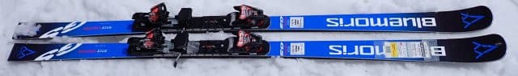
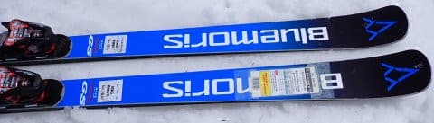
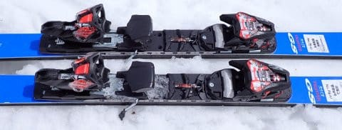
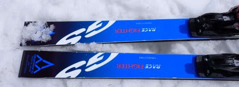
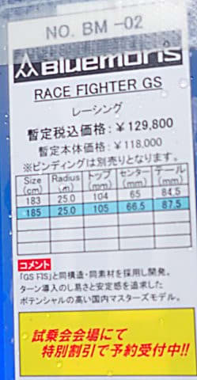

# 2025シーズンモデルのスキー板，試乗レポートその34…BLUEMORIS FIGTER GS

📅 投稿日時: 2024-07-24 02:11:46

🏷️ カテゴリ: [スキー板試乗](c0bd8048615710cee890e403a36cc9a2b.md)

ってなことで．

いつも通り，今週も全般的に睡眠不足

なんですが（涙）

昼間の会議中に完全に熟睡をかましてしまい，

Garminさんに

「夜中より昼寝のほうが睡眠が深い」

と判断されてました…（笑）

昼間の会議中に，椅子に座って知らぬ間に

落ちていた時の睡眠の方が，布団で

寝るより深い眠りに入れているようです…

うーん．

今後，夜も椅子に座って寝たほうが

いいのかも？？

ってなことで，本題へ．

残り少なくなってきた，2025シーズンモデルの

スキー板の試乗レポート．

本日はブルーモリス編です！

〇BLUEMORIS FIGTER GS WC PC INTERFACE + Marker Race12　185cm

FIS非準拠GS競技用

FIS規定に準拠しない，R=25のGS板です．

ビンディングとプレートは自由に選べますが，

この板は，SL板同様ピストンプレートと

MarkerのRACE12のビンディングがセット

されていました…

本来，硬い雪面で滑るべきGS板ですが．

今回はかなりザブザブな4月の雪で試乗

したので…

最初は板をたわませられず，かなりまっすぐ

走るな…と思いましたが．

スピードが出てくるとよくたわんで，

R=25らしい旋回性が出てきます．

大回り板っぽく，グリングリン回るわけで

ないのに，しっかりエッジグリップして

エッジに沿ってきれいに大回りができる，

王道の感じのGS板．

ちょっと硬めの雪だと，しっかりグリップして

たわみが出せるので，板をしっかりたわませて

結構小さめの半径で回ることもできます．

ただ…

ザブザブ4月の柔らかい雪だと，比較的まっすぐ

走りますね（涙）

サイドカーブで曲がる板じゃなく，たわみで

回っていく板です．

たわみを出すためには，スピードとある程度の

斜面の硬さが必要になってきます…

ピストンプレートのせいもあるのか，GS板と

しては返りも早く強めで，板がたわませられる

ようになると，反応が早くなりR=25というより

鋭く回っていくことができます．

スピードが出て，斜面の硬さがあれば

キュッキュッキュッと，気持ちよく回って

行く感じ．

スピードが出ていけば，荒れた春の斜面でも

そこそこの安定感で滑っていけます．

荷重ポイントは踵の下．

真上からしっかり踏んでいけばよく，

トップをたわませるとかそんな操作はいらず，

センターをしっかり踏んでいけば余計な

操作なしで安定感高くきれいに回ってくので．

脚力は必要なものの，シンプルな操作で

滑れる，基本的な良くできたサンドイッチ

板だな…という感じ．

当たり前ですが，スピードが出ない領域とか，

ザブザブの荒れ荒れ斜面で滑る板じゃなくて．

スピードが出せる整地で本領を発揮する板で．

それもかなりシンプルかつ基本的な，

玄人好みの大回り板だな…と思いました．

うん．

この板，春のザブ雪でもここまで滑れるんだから…

もう少しバーンコンディションのいいところで

履いてみたかった．
