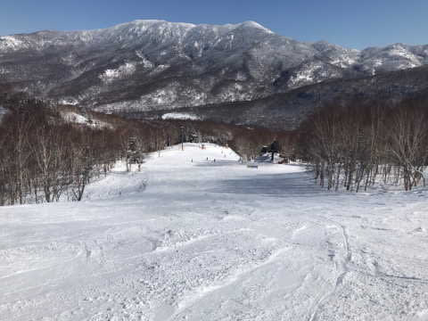
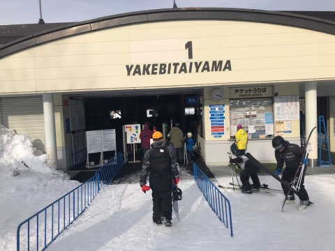

# 2月11日(土)の志賀高原スキー場，特派員レポート！…晴れで気温高め，ちょっと混雑した一日

📅 投稿日時: 2023-02-12 05:47:24

🏷️ カテゴリ: [日記](cc4b5682fb7b8b144980957a978653fb0.md)

そういえば，今週は今年初めての仕事の

飲み会があったのですが…

冷静に考えると．

今年初めてお酒を飲みましたね

…いや．

振り返ってみると，自宅にいるときは

仕事に追われ酒を飲む余裕が精神的にも

時間的にもなかったので，2月になるまで

全くお酒を飲んでませんでした…

しかし．

今年初めてお酒を飲んだわけですが．

今回は〇×さんに◇▼と言わせる

という泣きたくなるようなミッションを

負った，かなり政治的な辛い飲み会（？）

だったので，全然飲んだ気がしません（泣）

そもそも酔ってたらミッションコンプリートは

危ういので，2時間半の飲み会でビール2杯

しか飲んでない…

皆さん．

お酒は楽しく飲みましょう（力説）

ということで．

まだ今年，ビール2杯しか酒を飲んでない

Skier_Sですが．

今週もスキーに行けてません．

行ってません．

幽体離脱もしてません（涙）

だもんで．

今日の志賀高原も，特派員情報だのみです…

さて．今日の志賀高原．

槍やミサイルが降っているかな…？

と，写真を見ると．

早朝まで雪が降り，

あさイチは多少雲もあったみたいですが…

リフト営業後しばらくすると．

雲も引いていき…

なんだか，すごい晴天の写真が送られて

来たんですけど（泣）

うーん．

ミサイルの雨は降らなかったか…（涙）

あさイチの気温は-7℃と，予想より2度ほど

低めでしたが．

昼間は日差しも強く，気温も上がったので，

雪は緩んだ感じになったみたいですね…

ちなみに，最高気温は予想より上がって，

＋2℃くらいまで行っちゃったようなので．

雪はちょっとダマダマになってますね…

ちなみに，昨日からヤケビウォールもオープン

してますが．

新雪は全く無かったみたいです…

そして，土曜だけど祭日というのもあり，

これまでの週末に比べれば結構混んだみたい．

でも，ゴンドラ待ちのピークがこのくらいなら

そこまでひどくないかな？

お昼は下の写真みたいに，ゴンドラ待ちは

ゲート内に収まり，空いてたみたいですけど．

午後はまたゲート外に伸びるほどに

並んだみたいです…

ちなみに，リフトはそこまで混んでなかった

みたいなので，人が多くてもリフト待ちは

それほどひどくなかったみたいです…

とはいえ，ゲレンデの人も多めで．

雪も緩んだのもあり．

この写真を見ると，午後は結構荒れ荒れ

バーンになっちゃってますね…

夕方は，昼間に緩んだバーンが硬くなり，

凸凹＆固まったバーンでちょっと手ごわい

ところもあったみたいですが．

でも，昼間は晴れていいスキー日和

だったみたいですね…

うーん．

終日ミサイルは降らなかったか…

ちなみに，今日はナイターまで繰り出した

特派員がいたみたいですが．

昼間に緩んだ雪が夜の冷え込みで冷えたので．

硬く締まった，かなりスピードが乗る

シマシマだったみたいです…！

うーん．

うらやましい…

自分が滑っていないゲレンデ状況の写真は，

実態よりすごく良く感じるのか…

なんだか良さそうな一日だったみたいですね．

ってなことで．

私は残念ながら，明日もスキーに行く余裕は

ないですし．

幽体離脱もありません（涙）

あぁ…

トップシーズンの2月の週末に，緊急事態宣言も

出てないのにスキーに行かなかったって…

これまでなかったんじゃなかろうか（泣）

とりあえず．

私の行けない明日の志賀高原は，

防風のち豪雨．

時折激しいSkier_Sの怨念が降るでしょう．

…と，予想しておきます．

## 💬 コメント一覧

### 💬 コメント by (ヒータロゥ)
**タイトル**: Unknown
**投稿日**: 2023-02-12 10:14:21

Sさん同様に私も所要で今週は参戦できませんでした。

朝、晴れ渡った空を恨めしそうに眺めておりました。

…志賀方面も天気良さげで…ミサイルどころか雨も降りそうもなく…

来週は参戦できそうですが再来週は自己研鑚という名の強制研修を会社から突っ込まれて行けそうもなく、ベストシーズンに行けない悲しさを私も感じたくないのに感じてます(泣)。

来週以降参戦できることをお祈り申し上げます。

### 💬 コメント by (富山県民)
**タイトル**: Unknown
**投稿日**: 2023-02-12 23:09:25

２月１１日の志賀高原は晴れたのですね。

私はその日は午前中に飯綱リゾート、午後に木島平に行きました。

飯綱リゾートは雪で時より晴れ間も出る感じでした。

雪質はフカフカの新雪でしたが水分をたくさん含んだかなり重い雪でした。

木島平は天気は晴れでした。

パイオニアコースを滑走しましたが雪質は飯綱リゾートよりは良く重めのパウダーでした。

１月１２日は八方尾根に行きました。

天気は快晴→晴れで雪質はトップは重めのパウダーでしたが下半分はかなり緩んで春のような湿雪でした。

### 💬 コメント by (Skier_S)
**タイトル**: コメント回答遅れました…
**投稿日**: 2023-02-14 03:02:09

＞ヒータロゥさま

今週だけじゃなく，再来週も行けないんですか！！

私だったら死んじゃいますね…

スキーシーズンの週末に研修入れるな！！と言いたいですよね…

ちなみに私は部下の結婚式に招待されたけど，スキーシーズンだったので

断ったというとんでもない過去があります（笑）

＞富山県民さま

2月11日は晴れたようです（伝聞形）

12日は標高2000mの志賀でも春の雪だったので，

八方はかなり重い雪になったのでしょうね…

今週は冷えるのですが，週末はまた気温が上がりそうな気配…

