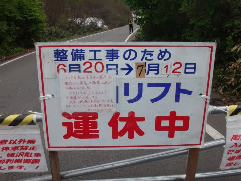
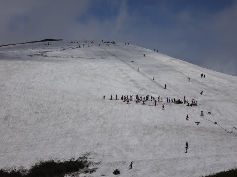
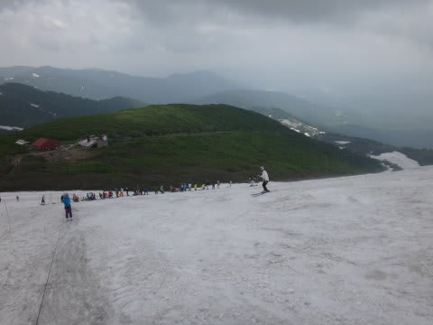
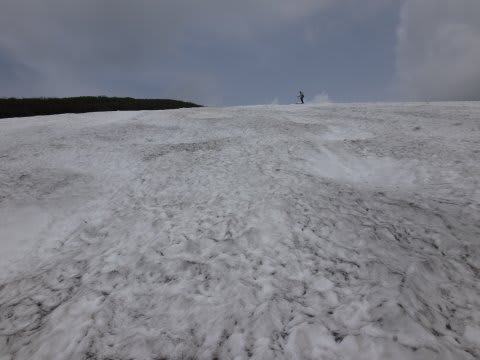
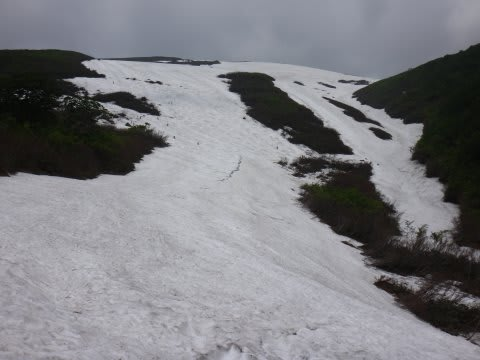

# 6月21日，月山は…

📅 投稿日時: 2014-06-22 09:13:52

🏷️ カテゴリ: [2014スキー滑走日記](c992167609b6415052179ee69ea1ea7d8.md)

えー．

昨日，土曜日ですが．

予定通り，月山のふもとまで行ってきました．

…ふもとまで行ってきたんですが．

やはり，リフトは工事で営業中止…

ってことで．

どうしようかなぁ…

歩いて登るなんて，根性がある（終わった）人間じゃ

ないしなぁ…

と思っている間に．

何か，物理を超越した現象が起きて，

瞬間移動をしてしまったらしく．

気づいたら山頂に！

ど，どうしたことだっ！

ってことで．

リフトが動いてないわりに，

かなりの人がいます．

Tバーは10分以上待ちでしょうか…

大斜面を降りると．

こちらを滑る人はほとんどおらず．

雪はかなり荒れてて．

コブは消えかけてました…

でも，まだ雪はたっぷり！

ってことですので．

瞬間移動という芸を持った人は，まだ滑れる

月山でした～

詳細は，明日にっ！

## 💬 コメント一覧

### 💬 コメント by (ひろちゃん)
**タイトル**: 素晴らしい
**投稿日**: 2014-06-22 10:49:54

エス様は、やはり鳥人だったんですね、白い粉の、幻覚に、とりつかれ、極楽の世界で、おめでとうございます。

### 💬 コメント by (Skier_S)
**タイトル**: ひろちゃんさま
**投稿日**: 2014-06-23 01:24:13

いや．なんだか．

もう，白い粉で幻覚を見てきたみたいです（笑）．

かなりリアルな幻覚だった気が…

…否定しません．

もう，終わってますから．

私は…

