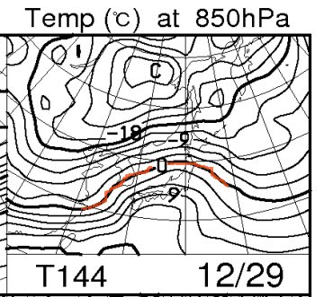

# 12月24日，3連休最終日の焼額は…パウダーっ！

📅 投稿日時: 2012-12-25 00:23:52

🏷️ カテゴリ: [2013スキー滑走日記](c91dbe557f9a69230b1600e48622fdd61.md)

12月24日．

3連休最後の日の，志賀高原は焼額山の状況ですが．

あー．

世間的にはクリスマス・イブでしょうか．

さてさて．

昨日は，天気予想を見事に外したけど．

今日は…

23日の夜から24日にかけても積もりそうなので，

24日も続けてパウダー祭りかな～．

って予想が見事に当たり．

志賀高原は，パウダー祭りでしたっ！

前日夜からの積雪が，30cmくらいかな．

朝の気温は－10度以下．

昼間も，山頂は－10度を超えず．寒かったよ～っ！

んで，ゲレンデに出ると…

圧雪の上に，10cmほどの軽－－－－－－いパウダーが乗ってます

これは，非圧雪バーンへ行かずばなるまい！

荒らされる前に，い，急いで行かないとっ！

…って感じでやってきた，オリンピックコース．

うひょーーー．

ひざパフだっ！

今シーズン初のパウダー！

すごい軽いパウダーで，下地の圧雪にスキーがついたまま，

ひざまでのパウダーを蹴散らし降りていける，滑りやすいコンディション．

足が底に届かないような浮遊感パウダーではなかったけど…

でも，最高っ！

でも，4本程滑ると，さすがに荒らされてしまい，雪溜り＆固い圧雪が

まだらになった難しいバーンになってしまいました…残念．

でも，朝のうちは，圧雪バーンも最高！

昼間もひたすら雪が降り続けたので．

コースサイドは，午後までずっとぱふぱふエリアが残ってましたね～．

昼間だけでも，20cm以上積もったんじゃないかな？

まぁ，3連休ということで．

タイミングが悪いと，人口密度がちょっと高かったけど…

リフト待ちは完全に0．

ゴンドラ待ちはほぼ0．最大待っても搬器4－5台分，って感じで．

ほとんど待たずにゴンドラぐるぐるできました…

午後になると，雪がやわらかかったので圧雪バーンもかなり

凸凹しちゃったけど．

でも．

今日のしっかりした積雪で，下地のアイスバーンは隠れてくれましたね～．

とりあえず，雪もよく，ゴンドラ待ちも無く．

パウダー祭りも楽しめて．

満足な一日だったのでした…

これから数日雪が積もりそうなので．

ゲレンデは良くなりそうかな…

と．思いきや．

なんだこれは？？

な，なんなんだ，これはっ！？

…29日，また雨になりそうですけど…

なぜ，週末を狙って雨？？
