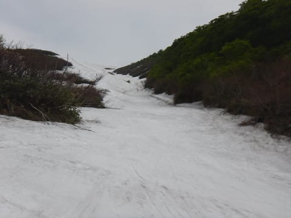
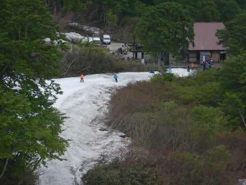

# 6月18日（日）月山レポート続き…沢コースも楽しいよ！午後の状況など写真たっぷりで

📅 投稿日時: 2017-06-21 02:03:41

🏷️ カテゴリ: [2017スキー滑走日記](c7d777cecfc91bdf0fa464ad62c6d49ab.md)

ということで．

あまりにも写真が大量にあるため．

2日に渡ってお送りすることになった，

先週日曜のご無体日帰り月山のレポート．

本日は後半戦です…

ってことで．

今度は沢コースを滑ってみるわけですが．

えーっと．

知らない人のために，あえて説明を

書いておくと…

この写真の右側．

オレンジのラインに沿ったところが

沢コースになります．

沢コースのとりつき部分はこんな感じで．

うむ．

ちょっとブッシュエリアが出てきてますが．

まだまだ全然問題なしですね～．

この日は曇り気味だったので．

結構板が走る雪で，気持ちよく飛ばせます！

沢コース．

その名の通り，こんなU字の沢状のコースなので，

ターン幅はそんなに取れませんが…

でも，この日は終日比較的フラットで，

かなり気持ちよく飛ばせて…

いやーー！

沢コース，イイねぇ…

と，一日ほどんと沢コースばっかり滑ってました．

いやいや，この時期としては恵まれたロングコースが

滑れるので…

私は大斜面よりこっちが好きかも？

ただ，沢コースの最後の部分．

そろそろ左右から藪が迫ってきて，

ヤバい部分があって…

一番ヤバいところは，ここ．

幅2mってところか…

ぎりぎりもって，あと1週間かな．

もしかすると，来週はここ1か所だけ

板を脱いで乗り越えないといけないかも…

ってことで．

結構気持ちよくハイスピードでロングコースが

滑れる，沢コースを中心に滑っていたわけですけど．

朝9時半までは，ほとんど待ちがなかったリフト．

9時半を過ぎると…

うむ？

ちょっと列が伸びてきたぞ…？？

そして，10時を過ぎると…

ぐはぁ！

かなり列が伸びたよ…

でもまぁ，この日のリフト待ちの最大は8分程度．

昼近くにはこの程度の待ちに減ったし．

午後には，またほぼ待ちが0になったので．

いろいろネットで出ている

先週までの混雑に比べれば．

かなりのすき具合だったんでしょうね～．

ちなみに，私は滑ってませんが．

Tバーは10時過ぎ～昼前のピークでこのくらいの

待ちでしたね…

午後になると，人はかなり減ってましたか…．

ってことで．

沢コースをグルグルしていた，午前11時ごろ…

ありゃ？

にわかに掻き曇って，山頂が見えなく

なっちゃったんですが…！？？

うぎゃー！

コースも見えなくなってきたんですが…！（涙）

でも，麓付近はガスが下りてこないし…

まだ視界があるから助かった…

しかし．

ガスっていたのは30分程度．

じきにガスが上がりはじめ…

今度は，うっすら青空が覗き始めてきました！

いやー．

このあとずっとガス山と化すのかと

心配してたけど…よかった…

そして，

午後の大斜面は．

人も多いので，コブがだんだん深くなって

きてますよ…！

しかし．

大斜面．

見事に，ラインコブがつながってますね…

全面コブ斜面ではなく，

ラインが何本か流れてる感じ．

この写真を見て分かるように，

まだ大斜面の一番下から沢コース側へ

滑りこめます…

ってな感じで．

日帰りというのに．

朝8時から滑っているというのに．

ひたすらリフトストップまで滑った，この日．

また夕方4時過ぎのラストリフトで，

山頂付近，ちょっとガスが出たけど…

（リフト降り場からゲレンデに出るコースは，

　夕方は結構やばい感じ．あと2-3日で

　ここは切れるでしょう…）

日が傾く，午後4時15分のラストリフトまで

しっかり滑って．

たっぷり一日滑りつくしたのでした…

最後は，リフト乗り場の下を滑って…

まだ，ここまで滑って来れます．

やっぱり例年より，雪は多いですよ～！

いやー．

6月下旬とすれば，恵まれた週末だったかな…

3週間ぶりの楽しいスキーで，生き返ったなっ！！！

しかし．

この後の帰り道に，休憩含めて7時間以上かかり．

帰宅後にまた死んだ，Skier_Sだったのでした…

## 💬 コメント一覧

### 💬 コメント by (yama)
**タイトル**: やはり月に行く人は
**投稿日**: 2017-06-21 18:37:13

お久しぶり(^-^*)/てす。庭の柚子は今年も順調です。何時もより花がたくさん咲き、実もたくさんなっています。また、秋に取りに来て下さい。５月21日に行ったチャオで一足早くシーズンオフになりました。やはり月まで行くだけの気力は出ません。次にゲレンデで会うのは１０月のイエティでしょう。寝不足で事故を起こさないように祈っています。

### 💬 コメント by (Skier_S)
**タイトル**: yamaさま
**投稿日**: 2017-06-22 03:11:05

お久しぶりです～．

柚子，順調ですか！

娘連れて，また秋に取りに伺います～！

今年の月山は雪が多くていいですよ．

では，また10月のYetiでお会いしましょう！

…てか，その前に20000mクラブのオフ会を

やりたいなぁ…

