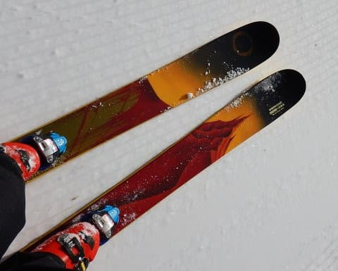
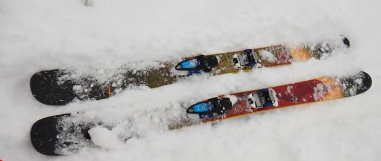
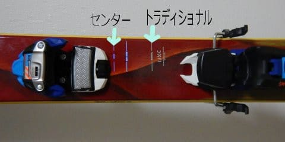
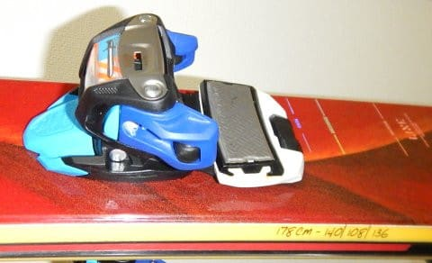

# LINEのファットスキー，Sir Fransis Baconのインプレッション

📅 投稿日時: 2018-02-21 04:59:35

今週日曜日，25日の夜．

首都圏でも雪になっちゃう可能性がありそうな

天気図で．

スキー帰りの交通に影響がないか心配になっている，

Skier_Sです．

…でも．

やっぱり今週末まで，

冷え冷えなれども，志賀高原には

積雪はなさそう…（涙）．

気温自体は平年より低い日が続く予想なのに．

なぜ，雪が降らないのか…（泣）．

そろそろ降ってくれないと，春営業がヤバいかも…

ってことで．

本題へ．

…みなさんご存知のように．

[第7回物欲選手権](e38b4d4ca6ea3af24cebf3838ab8c791d.md)での歴史的大敗により．

LINEのファットスキー，

[LINE Sir Fransis Bacon
を購入してしまった](e56c11ebadfa98e86c1f0cbe36198f076.md)わけですが．

この板も，今シーズン何度か履いてみたので．

とりあえず，どんな感じかレポートしてみましょうか…

このモデル．

新雪用というより，パークやジブアイテムで遊ぶ用の

板らしいのですが．

私が購入したのは2シーズン前のモデルなので，

最新のモデルと多少スペックが違うようですね…

とりあえず，私が購入した，2016モデルは．

長さ178cm，

トップ幅140，センター108，テール136mm．

我が車に積んでいるルーフボックスに，

183cmより長い板が入らないため．

ちょい短めの板…と探して，この板にしたわけですが．

短めでも，センターは110近くあり．

まぁ，太板初心者にはとっつきやすいかな…

この板．

ブーツセンターのポジションが，パークなどで遊ぶ前より（センター），

そして普通のゲレンデでの板に近い後ろ寄り（トラディショナル）

など選べます．

私は後ろよりの，トラディショナルにしました…

ビンディングとして，かなり軽いMarkerのモデルを

着けたので．

太い分，重いのかな…と思いますが．

すごい軽いです．

ATOMICのSXに比べると，圧倒的に軽い．

履いてみても軽く感じ，すごく操作性は高いです…

新雪を滑ってみると…

太板って，やっぱり浮力が違う…

板が潜ってしまわない分，重めの

パウダーの時の操作性が全然楽！

軽めのパウダーでも，細い板だと底付きしちゃうところが，

太い板だと新雪の上を舐めるように滑っていけるので…

快感度が上がりますね～！

そして．

普通の板と一番違いを感じるのは．

深めの新雪が蹴散らされて，

踏まれたところと新雪が入り乱れた

ような，荒れたコンディションになった時．

細い板だと新雪に突っ込んだりした時，

板を取られてバランスをとるのが難しい条件だけど．

太い板だと，踏まれたところから新雪に

突っ込んだ時にも板を取られる感覚がなく．

すごい楽に荒れ荒れ斜面を大回りして行けます…

…これは，楽な板だわ！！

さらに．

この板のすごいところは．

圧雪バーンでも，柔らかめの雪であれば．

結構カービングっぽく攻められること．

サイドカーブもきつく，フルキャンバーの板なので，

ハイスピードでかなり傾きの深いターンを

刻んでいけます！

太板を履いて滑っていた私を目撃者した人曰く

「太い板を履いて，あれだけ傾いている人は見たことない」

というコメントが出るほどの，←「板の使い方を間違えている」と言われているのでは？

ガッツリ傾いたカービングができます．

だもんで．

柔らかめのゲレンデで，柔らかい雪がところどころに

溜まって凸凹してきたようなコンディションでも．

カービングしながら，雪だまりを蹴散らして

滑っていけるので，結構楽しいですね～！

…もっと太い板だと，新雪でさらに浮力を感じて，

もっとスピードが出せるのかもしれないけど…

自分にとっては，このくらいの浮力があれば十分．

それより，柔らかめの雪なら，圧雪でも結構滑れちゃうのが

いいですね～．

…しいて欠点を言うと．

焼額第1ゴンドラのスキーラックに板が入らず．

中に持ち込まなきゃいけないところでしょうか…

って感じで．

これまで太い板を履いたことなく．

買ってみてはずれだったら嫌だなぁ…

という思いから，しばらく買わずにいた太板ですが．

結論としては．

もっと早くに買っておけばよかった

と，思わずにいられないSkier_Sなのでした…

## 💬 コメント一覧

### 💬 コメント by (れお)
**タイトル**: 激しく同意!!
**投稿日**: 2018-02-21 14:20:07

太板のインプレッションも結論も激しく同意です～

加えて、太板で荒れたゲレンデを滑った後に、SXで圧雪したてのナイター滑るのも良いんですよね～(^▽^)

### 💬 コメント by (Skier_S)
**タイトル**: れおさま
**投稿日**: 2018-02-22 06:45:02

ついつい同じ板を買ってしまいましたが．

そこそこの荒れた斜面でもかっ飛ばせるので，

かなり気に入ってます．

でも，今シーズンは12月に結構出番があったのに，

最近全く出番がなくて悲しい感じです…

