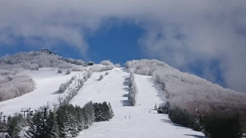
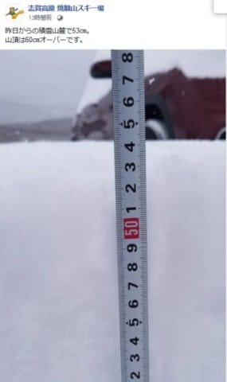
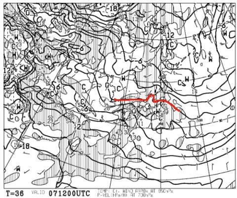
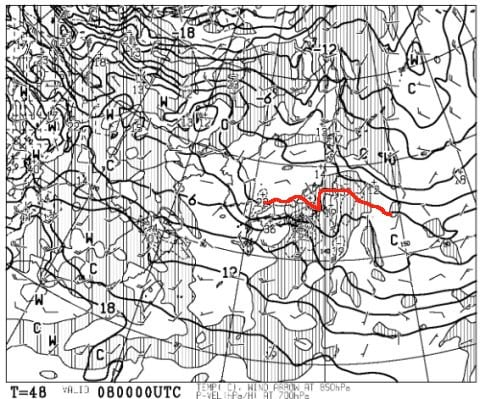
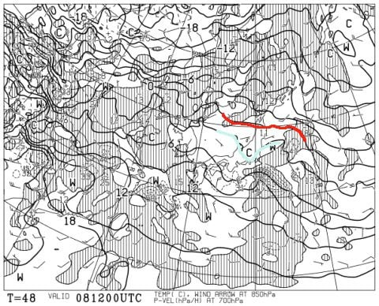
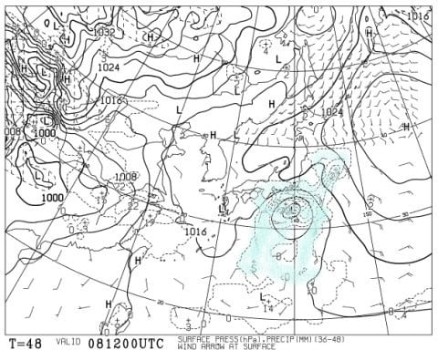

# 今週末も志賀高原で滑ってます～！土曜は晴天でいい感じ！日曜は…相変わらず微妙．でも，ほとんど降らないかも？？

📅 投稿日時: 2020-03-07 00:59:58

🏷️ カテゴリ: [日記](cc4b5682fb7b8b144980957a978653fb0.md)

ということで．

いつも通り，今週も土日は志賀高原に

行くわけですが．

…今日の朝は，かなりパフパフだったようですね…

特派員からのレポートなどによると．

あさは-10℃を下回る気温の雪降りで，

朝イチは脛パフの新雪！

…そして，昼過ぎからすっきり晴れ始め．

午後は冷え冷えのいい雪で，青空のもと

滑れたようですね…

（すいません．某特派員の方，写真使わせてもらいます）

ってなことで．

6日（金）：朝は-10℃近い，冷え冷えの朝．

　前日から降り続けた雪が，朝は10cm以上

　積もり，非圧雪バーンはブーツ～脛パフか？

　朝は雪が降ってそうだけど．

　じきに止んで，昼に向かって青空が

　広がっていきそう．

　（略）

　昼からは晴れそうなので，最高の

　一日になりそう…！

という予想．

今日も予言レベルで当てたようです…！←無理やり自分で自分を誉めてないか？？

ってことで．

昨日今日と，かなりの冷え冷え雪が積もったわけですが．

（[焼額山Facebook](https://ja-jp.facebook.com/yakebitaiyama/photos/a.533933973368620/2749723218456340/?type=3&theater)より）

この積もった冷え冷え雪が，明日の朝は

きれいに圧雪されて．

そして，明日は朝から終日晴れそうなので．

明日も朝イチは最高でしょう！！！

…ただ．

明日の土曜．朝イチは最高シマシマだけど．

850hpaの0℃線が志賀高原に近づいているので．

昼間は0℃をちょいと上回るくらいまで

気温が上がりそう…

焼額は，日差しで昼間は雪が緩みそうな感じです（涙）

で，問題は．

8日の日曜日，だ．

この日の朝9時の850hpa気温図を見ると．

うーーーむ．

この日は朝から，ｍ0℃線はギリギリ

志賀高原にかかるかどうかなので．

…これだと，志賀高原はギリギリ雪の気温．

ただ，午後に向かって0℃線が北上

していき．

この日の午後9時の850hpa気温図だと…

赤い0℃線は東北まで上がってしまい，

志賀高原には+3℃線が…（涙）

これだと，降れば確実に液体（泣）

だもんで，この日は昼のどこかの時点で，

降れば液体の気温になってしまうこと

確実（涙）

でも．

8日の最新の天気図を見てみると…

をををををを！！！

志賀高原に，水色の降水域がかかってません！！

これなら，8日は，液体が降らずに済みます…！！

素晴らしい…

素晴らしいよ！！

やはり，私が必死に踊り続けたおかげか…！？？←違うから．何度でも言うけど，違うから

ってなことで．

7日土曜：朝は-5℃程度の放射冷却が入った冷え冷え！

　そして，雪は最高の圧雪．

　あさイチは快楽シマシマバーン！

　天気は終日晴れそう．

　ただ，昼間は山頂はギリギリ0℃くらい，

　麓だと完全にプラス気温まで上がりそうなので．

　日が当たる東～南斜面は，昼ごろには雪が

　緩む．

　西～北斜面はそれほど緩まず，いい雪質をキープ！

　午後はちょっとゲレンデが荒れぎみになりそうだけど，

　終日晴天で，絶好のスキー日和！！

8日日曜：朝から-2～3℃と，比較的気温が高め．

　基本的に曇りの一日．

　もしかすると，朝は雪がわずかにぱらついているかも．

　この日も，曇り空で気温は高めながら朝イチは

　まだ冷え込んでいるので，締まり気味の

　いい感じの圧雪！

　でも，朝から気温は上がり，昼間は

　山頂でもプラス気温に．

　最大+3℃くらいまで上がるか？

　午後は雪質もしっとりした重めの雪に

　なっていき，人の多いコースは

　荒れていく．

　でも，終日雨は降らずに済みそう！

…ってな感じでしょうか．

うむ．

この週末も，日曜に気温が上がるものの．

日曜に液体が降らない予想になったので．

意外と楽しめそうな感じ…！

ということで．

…もう1時か…

今日早めの，朝2時半に出発せねばならないので．

これから1時間半後に出発です．

…って，今日はもう寝ない方がいいかも…（涙）

## 💬 コメント一覧

### 💬 コメント by (ノーザンレインボー)
**タイトル**: Unknown
**投稿日**: 2020-03-07 18:55:54

s様

今日は帰り支度中に、突然お声がけさせて頂きありがとうございました。まさかあんなところにいらっしゃるとは思わなかったので驚きました。これもこのブログを読んで、またしてもホームでズン券有りの白馬を裏切って志賀高原へとやって来たご利益かと…今日も予言レベルの天気予報の精度で、お蔭様で1日中楽しく過ごせました。今シーズン、また志賀高原来てしまいそうです。

### 💬 コメント by (Northfox)
**タイトル**: やはりゴンドラ混んでましたね
**投稿日**: 2020-03-07 23:29:06

今日は焼額のゴンドラの混雑回避で大半を奥志賀で滑っていました。

割と空いていたし雪も良かったので正解でした。明日も奥志賀メインにしようかと思います。

その奥志賀のリフトで20000mゴールド保持の女性と乗り合わせました。

穏やかで品の良さそうな語り口からゴールド保持であるといわれ驚愕しました。なんとなく達成しちゃったそうです。

20000mチャレンジは「健康を害さぬ程度で楽しまれたらよろしいかと」と仰っていました。

### 💬 コメント by (Skier_S)
**タイトル**: 今日はいい感じの一日だったよ
**投稿日**: 2020-03-08 01:11:08

＞ノーザンレインボーさま

私も，奥志賀にいることを誰にも言ってないのに

いきなり発見されてびっくりしました…

今後も白馬を裏切り，志賀にやってきてください(笑)．

＞Northfoxさま

私も今日はかなり奥志賀に滞在しました…

が．

20000達成者と乗り合わせましたか．

いや．その方，なかなかすごい人ですよ(笑)

20000m，狙ったというより，ナイター込みで

達成しちゃった…

って感じですから．

いろいろ伝説を残してらっしゃる方です…

（そして，おそらくこのコメントも読んでらっしゃるかと）

