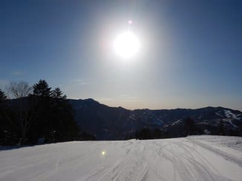
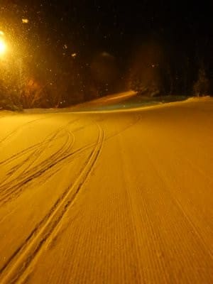
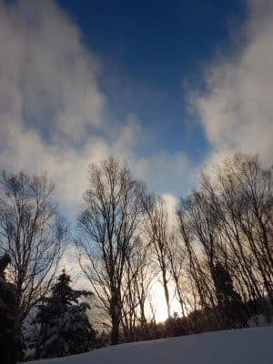
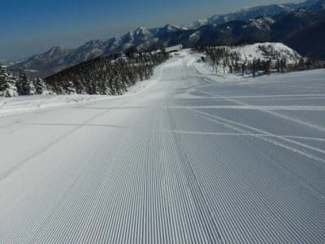
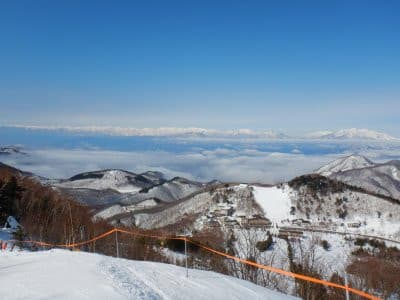
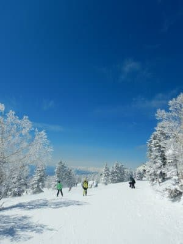

# 2021シーズンを総括してみる

📅 投稿日時: 2021-08-08 02:58:41

ということで．

もう8月もお盆時期に突入している

というのに．

季節感を全く無視して．

今シーズンはまだやっていなかった，

例年のスキーシーズン終了時の定番．

シーズンの総括をやってみましょうか…

○シーズン滑走日数　46日

やっぱり今年も，コロナのせいで

滑走日数がムチャ減りました…（激涙）

2017シーズンは70日

2018シーズンは69日

2019シーズンは68日

と，大体70日近く滑っていたのに．

コロナにやられてから

2020シーズンは52日

2021シーズンは46日

と，例年より20日ほど少ないシーズンが

2シーズン続きました…（泣）

ってか．コロナ初年度の昨シーズンより

さらに日数が減ってたんですね（泣）

コロナウイルスが憎い…

早くいつも通りに戻ってほしい…

○行ったスキー場

志賀　36日

Yeti　6日

かぐら　2日

月山　2日

もう，今シーズンもいつも通り．

志賀高原以外には，

志賀オープン前のYeti，

志賀終了後のかぐら，

シーズンラストの月山．

この3か所しか行ってませんね…

まぁ，シーズン券を持っている人間の

宿命です．

他のスキー場に行ったら，リフト券代

取られますから…

○ナイター滑走日数　10日

2019シーズン…18日

2020シーズン…14日

2021シーズン…10日

だったので．

今シーズン，激減してます…（泣）

それも，

イエティ…6日

焼額…4日

なので，志賀のナイターは4日しか

滑れてない！！

2019シーズンは3月いっぱいまで

一の瀬ダイヤモンドとサンバレーの

ナイターが営業してたのに．

2020シーズンからは営業しなくなったので，

2月いっぱいのヤケビナイターしか

滑れなくなり（ファミリーもナイター

やってるけど，ペアリフトだけに

ナイター料金2300円は払えない…）

それだけでも日数が減り悲しんでいたのに．

今シーズンは，焼額ナイターが営業してる

1，2月がコロナでまともに滑れなかった

ので．

ナイターに行けたのは，正月前後のみ

でした（涙）

あぁ…ダイヤとサンバレーのナイター，

復活してほしい…

○早朝滑走日数　11日

2019シーズン…14日

2020シーズン…1日

2021シーズン…11日

なので，これは昨シーズンよりは

増えてますね！！

昨シーズンは早朝をやっている

4，5月がコロナで滑れなかったので

やむなしでしたが．

今シーズンは結構早朝を滑りましたね～…

ってか．

早朝営業が始まってから．

雨が降った日以外では，

早朝を滑った日：11日

早朝滑らなかった日：3日

と，圧倒的な早朝参加率ですね．

ってか．

1，2月にまともに滑れず．

その怒り（？）を4月に入ってから

早朝にぶつけた感じでしょうか．

今シーズンは早朝のコンディションが

良い日が多くて，まぁ良かったかな…

○トータル滑走標高差　420,700m

ぐはぁ…っ！！

減った．

激烈に減りましたっ！！

2017シーズン…795km

2018シーズン…752km

2019シーズン…742km

2020シーズン…522km

2021シーズン…420km

なので．

コロナ前より減ったのは当然と

しても．

同じコロナにやられた昨年より

さらに減りました…

2017シーズンの半分強しか滑って

無いじゃないですか！！（激涙）

去年もコロナで滑走日数は少なかった

ものの．

ゴンドラ乗車定員制限がなく，ゴンドラ

が激混みになることはなかったん

ですが．

今シーズンはゴンドラの乗車定員

制限のためにすごい待ち時間になり．

標高差を稼ぎにくいリフトに乗る

ことが多かったし．

そもそも緊急事態宣言解除後の3月以降は，

GW前まで，半分近い確率で雨や

強風でゴンドラ運休となったため．

ペアリフトで一日滑ることもあったりして．

そもそも滑走量が稼げませんでした…

こうやって数字で見ると．

全然量を滑れてないシーズンですね（涙）

残念だ…

残念なシーズンだ…

○一日滑走標高差20000m突破回数　0回

いや．

いつも言いますが，狙ってるわけじゃない

ですが．

2019シーズンまでは，知らぬ間に20000mを

超えることが時々あったけど．

ほとんどナイターも滑れず，

ゴンドラも激混みだった今シーズンは，

一日最高滑走標高差が16000mほどしか

行ってなかったです…（涙）

いや．

ホントに滑り足りない感じのシーズンでした．

○自動車走行距離　約14700km　

ええええ！！

昨シーズンの17000kmでも少ないと

思ったのに！！

めっちゃ少ない！！

昨シーズンと滑走日数は同じながら，

今シーズンはGWの6泊7日で滑走日数を

稼いでおり．

志賀高原への往復数が少なかったのが

効いてますか…

例年はシーズンに25000kmは走るところ

ですが…

結果的にスタッドレスが長持ちしたし．

燃料代や高速代もかからなくて，

財布には優しかったけど…

○転倒回数　1回

以前の記事で描きましたが．

人と交錯しちゃって転んだ1回っきりです．

…惜しい．

○かかったお金

やはり，滑走日数も減ってるし．

交通費と宿泊費が例年より圧倒的に

減りました…

記録的に少なかった去年よりもさらに

減ったので．これなら，

物欲選手権に負けても，スキー費用は

例年より減ってるから大丈夫

と．

ブレーキが緩んでしまい，豪快に物欲選手権に

負けてしまったのは記憶に新しいところ…

…

…でも．

これだけしか滑ってないシーズンだから．

スキー板も長持ちしてもよさそうなものの．

今シーズンも，剝離やらヘタリやらで，

板が2セットも死んでしまっているのが

不思議…

やはり私は，謎のスキー板劣化加速能力を

持ってるのか！？

ってなことで．

2021シーズンも終わりましたが…

来る2022シーズン，Yetiが10月半ばに

オープンすれば…

あと2か月ちょい！

なんと．

早くも，あと2か月半でシーズンインですよ～！

　

　

　

## 💬 コメント一覧

### 💬 コメント by (やっさん)
**タイトル**: Unknown
**投稿日**: 2021-08-08 23:59:55

あ〜〜

素敵な写真をありがとうございます。

真夏なのに雪の志賀高原が楽しみで仕方ない。

せめてクーラーをガンガンに効かせてウェアやゴーグル等一式着て楽しもうかな〜。と思いつつ、外からは蝉の鳴き声😑

### 💬 コメント by (Skier_S)
**タイトル**: Unknown
**投稿日**: 2021-08-09 00:42:31

>やっさんさま

クーラーガンガン効かせてウェア着るって…

ある意味贅沢ですね(笑)

### 💬 コメント by (アリス)
**タイトル**: 今シーズン待ち遠しいですね
**投稿日**: 2021-08-09 16:07:05

S様

あと、２ケ月半でシーズンですか♪

あっと言う間ですね。

私も白い粉の禁断症状が出てきました♪

写真のコース早く滑走したいです・・・

### 💬 コメント by (Skier_S)
**タイトル**: >アリスさま
**投稿日**: 2021-08-10 02:47:45

Yetiがいつオープンするかですが…

とりあえず，10月下旬ならあと2か月半！

私も早く滑りたいです…

