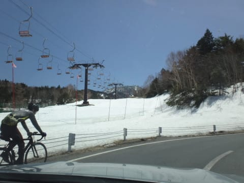
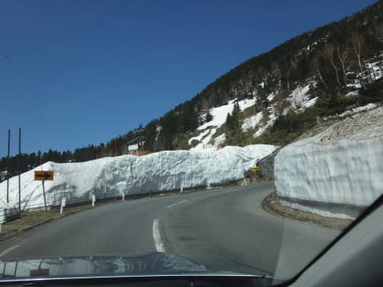
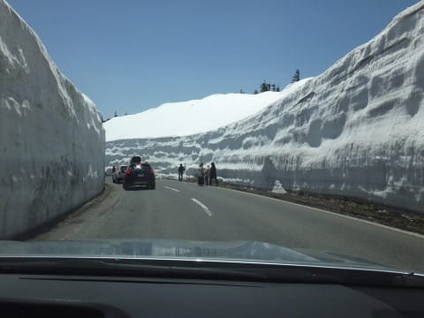

# 今週末は，明日日帰り奥志賀へ！…でも，終日雨なんですけど…（涙）

📅 投稿日時: 2017-05-12 23:04:53

🏷️ カテゴリ: [日記](cc4b5682fb7b8b144980957a978653fb0.md)

えー．

このGWスキーからの帰路．

草津越えをこえて帰ってきたときに．

いや～．

まだ，横手山はいっぱい雪もあるし．

いつもなら横手山で滑っている人が見えるこの部分．

雪の壁の上にゲレンデがあって，スキーヤーが

全く見えない状態で．

いやーーー．

今シーズン，ホントに雪が多いよ！

道路わきの雪の壁も，これまでの

最高レベルに高いですよ～！

ってことで．

今週末も，まだまだ楽しく滑れそうな感じの

志賀高原へ行くわけですが．

今回はいろいろ大人の事情があり．

土曜日帰りです．

ええ．そうです．

土曜です．

よりによって，終日雨になりそうな，

土曜に日帰りです…（涙）．

ということで．

あと5時間後に出発です～．

また戻ってきたらレポートします～！

＃いつも通り，あと4時間しか寝られない…（涙）

## 💬 コメント一覧

### 💬 コメント by (しんちゃん)
**タイトル**: 根性？
**投稿日**: 2017-05-13 00:04:27

終日雨だとわかっていても志賀に行く・・・

週末雪山に立たないと死んでしまう病なのでしょうか(笑)スゴイ！凄すぎる。根性？ストイック？

レジャースキーヤーの私にはマネできないっす。

悪雪だと思うので、お怪我されないようお祈り申し上げます。

### 💬 コメント by (Goku)
**タイトル**: Unknown
**投稿日**: 2017-05-13 07:02:17

わたしもこの雨の中、芝刈りに行ってまいります(T_T)/~~~

それにしても、１０００００％雨とわかっていても滑りに行く・・・やはり神です。

### 💬 コメント by (はなげ親分)
**タイトル**: Unknown
**投稿日**: 2017-05-13 07:19:56

私は諸般の事情で雨中の洗車を余儀なくされております（泣）

雨の日帰りスキーですか～

世間に気づかれないようになさったほうが・・・(笑）

### 💬 コメント by (Skier_S)
**タイトル**: 雨が降っても槍が降っても滑るっ！
**投稿日**: 2017-05-14 00:59:52

＞しんちゃんさま

滑らないと死ぬんです．

いや，ホントに．

次の週，半分死人みたいな感じで，

仕事にならないんですよ…

…

…で．

私も自分をレジャースキーヤーだと

思ってるんですが…

＞Gokuさま

雨＆強風の中の芝刈りはいかがでしたでしょうか…

なんだか私は，気のせいでなければ

本日，神以上の行動をとってしまったか

もしれません…（笑）

＞はなげ親分さま

雨中の洗車ですか！

私は大人の事情でどうしよもなく

本日スキーをせざるを得ず．

そして，自然の都合で

スキー場間を2時間半移動するという

悲しい目に会いました．

今日はさんざんです…（涙）

