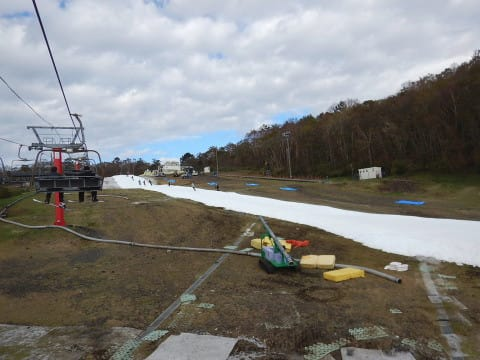

# 2018/2019シーズンスタート！10月20日，オープン翌日のYetiでスキーシーズンについに突入！…が，悲惨な一日

📅 投稿日時: 2018-10-21 00:24:34

🏷️ カテゴリ: [2019スキー滑走日記](c3e4496fc0fb7f9c17ff21214a35b1ace.md)

はいはいはいはいはい．

行ってきましたよ～．

ついに始まりましたよ～！

私の2018/2019スキーシーズンがっ！！！（感動の嵐）

そうです．

昨日の予告通り．

オープンしたてのイエティに，初滑りに

行ってきました～っ！！！

えー．

Yetiの駐車場に着いた時には．

天気が良かった本日．

朝8時のオープン直後に，

ゲレンデに繰り出しますが…

雪だ．

雪だよっ！！

もう，雪ってどんなだったか忘れるほどに

久しぶりに見た，雪だよ！←雪じゃなくアイスクラッシュの氷だよ，と冷静に突っ込むところ

もう，実に．

4か月ぶりの雪だよ！

ゲレンデに出るころは，雲が増えて．

日差しが隠れ，雪が解けなくてちょうどいい感じの

天気．

気温は+6℃程度と，この時期としては低めだったので．

あさイチは硬くもなく柔らかすぎることもない，

最高のコンディション！

そして，ゲレンデの人もかなり少なめで．

朝10時近くまで，結構クリアなコースを

滑れることも多く．

…もう，いつもシーズンインは丁寧に滑ろうと

思っているのに．

見事なクリアラップに，自制心リミッター外れまくり．

欲望の赴くままに，快楽に溺れる滑りを堪能…

あぁ…実に4か月ぶりの快感…

リフト待ちも少なく．

朝のうちはほぼ飛び乗り．

ピークでも，2-3分待ちが数回

ある程度で．

平均的に1分前後の待ちだったかな～．

朝のうちは雪も良かったけど…

昼を過ぎてくると．

硫安が効いているところとそうじゃないところで

凸凹が出始め．

そして，数か所だけですが．

雪が薄くなって茶色くなってきたところも…

茶色くなったところは，人力で穴を埋めてくれ

ましたが．

でも，午後は全体的に結構荒れたバーン

コンディションでした…

で．

天気は．

昼ごろには日が射したりすることも

ありましたが…

昼を過ぎると，時折ぽつ，ぽつと

雨が落ちてくることもあり．

…ヤバいかな…

と，思っていたら．

午後2時半ごろ…

いきなりの雨が…！（涙）

しばらく経つと，かなり激しい降りになり．

雷も鳴り始めたため，落雷の危険性から

午後3時前に，ゲレンデは一旦クローズ（泣）

さらに．3時ごろには落雷のため，

停電までする始末（激涙）

レストランもすべて電気が消えてます…

リフトも動かず，雷も鳴り続けているので．

係員「営業再開の目途は立ちません．電気が復活しても，

　リフトや設備の点検で，すぐに営業には入れません…」

と，かなり悲しい報告が…（泣）

建物に入っていても電気が無く真っ暗だし．

午後4時になっても，圧雪車でのコース整備は

始まらないし．

…非常にものすごく大変むちゃくちゃこの上ないほど

残念ですが．

いつ再開するか分からないので．

この日はもう，帰ることにしました…（すごい涙）

ただ．

停電で営業打ち切りのお詫びなのか．

退場時に，1000円クーポンをもらえました…

さらに．

停電で，駐車場の精算機も動かないので．

駐車場のゲートのバーも外してあり，

自由に出られるようになっていました…

ガラガラで結構いい感じだったので．

しっかりナイターのコース整備後も

滑るつもり満々だったのに．

2時半終了という，予定よりかなり短い

滑走時間となってしまって．

すごーーーーーく悲しいけど．

1000円のクーポンをもらって．

1000円の駐車料金も無料になったので，

予定より2000円安くついたということで．

まぁ，安くなったから，我慢して

おこう…←そうとでも言い聞かせないと，自分が納得できない

ちなみに．

午後6時には電気が復活し，営業再開していた

らしいです…

うーん．

シーズンインの日に，途中で強制終了という

おあずけ状態となってしまい，

滑りたい度合いがMAXになった，Skier_Sだったのでした…

来週は，もっといっぱい滑るぞ！！

## 💬 コメント一覧

### 💬 コメント by (もりや)
**タイトル**: おめでとうございます
**投稿日**: 2018-10-21 05:22:06

シーズンインおめでとうございます。この時期だと雷雨もあるんですね。停電も有ったとは驚きました。春スキーのような光景で、昨シーズンが、懐かしく思いました。

### 💬 コメント by (ほっぽ)
**タイトル**: 残念なラスト
**投稿日**: 2018-10-21 06:15:17

Ｓさん

昨日午後は突然の雨にビックリしていました。

麓でこんなに雨が降るのだからイエティは、と思ったら

まさかの停電で営業中断、Ｓさん、yamaさんはどうしているのかな？

きっと再開を待って待機しているんだろうなと

予想しましたが、帰宅されたんですね。

来週末、昨日の分も滑り倒してください。

私は次回、月曜ナイターの予定です。

### 💬 コメント by (Skier_S)
**タイトル**: 来週リベンジ！
**投稿日**: 2018-10-22 00:37:24

＞もりやさま

いやー．

シーズンイン，しちゃいました．

でも，Yetiで雷雨は初めてです…

停電で真っ暗なレストランでしばらく時間を

つぶしましたが，滑る気を失わせるに十分な

雷雨だったので，あきらめました…

でも，午前中はいい感じで滑れたので

シーズンインとしては良かったのかと．

こちらはもう，これから毎週末のスキーが

始まります！

＞ほっぽさま

イエティはすごかったです…

もう，雷が鳴り続けでした．

今日は娘を連れてぐりんぱに行ってきたのですが，

昨晩の落雷の影響でかなりの数のアトラクションが

故障で止まってました…（涙）．

しかし，月曜もナイターいかれるんですか…

うらやましいです…

