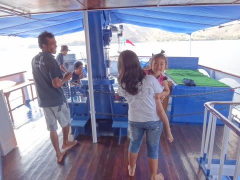
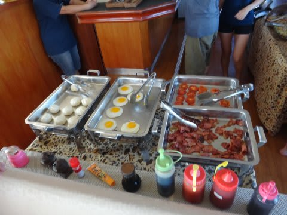
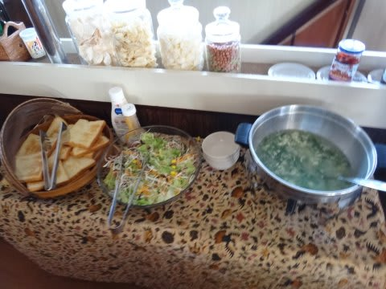
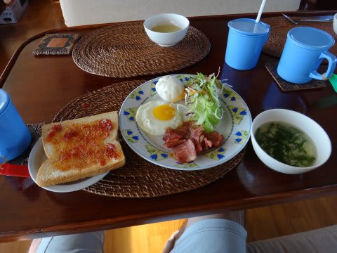
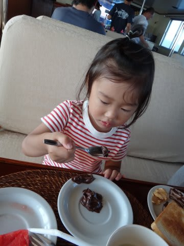
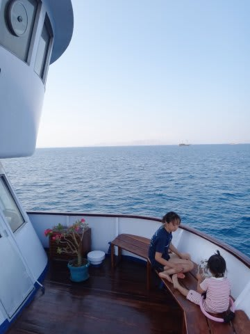
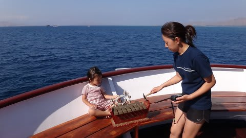
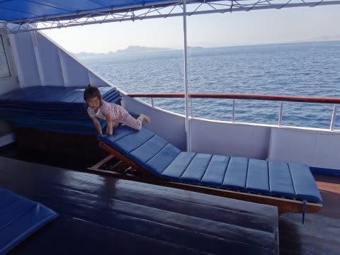

# 子連れコモドダイビングクルーズagain　その11　嬉しい予想外

📅 投稿日時: 2011-09-08 02:15:23

ダイビングから戻る途中．娘が起きているのがボートから見えて．

これは．

マズい．マズい～！

娘，絶対泣いてる～！！！！

妻はもうダイビングに行かせてもらえないか？？

と．

ボートが本船に着いたとたんに，大急ぎで本船に飛び移ると…

リンダさんに抱っこされた娘が，階段からダイビングデッキに下りてきました．

…

…

あれ？

娘．

泣いてない．

っていうか，リンダさんに抱っこされて，ニコニコ笑ってる…

私「Did she cry?」

リンダさん「A little．」

…話を聞いてみると．

われわれがダイビングに行って，それほど経たないうちに

娘は起きちゃったらしく．

最初は泣いてたけど，しばらくすると泣き止んだらしい．

泣き止んだあとは，機嫌よくリンダさんと遊んでいた様子．

私「…いい子でお留守番してた～？」

娘「うん．ボール遊びしてたの～」

よ，予想外…

…なんか，安心したってより，ちょっと気が抜けた…

去年は，日本語が通じないベビーシッターさんに

「この人言ってることがわからない」

と，全くなつかなかった娘ですが．

今年は．

3割ほどが日本語をしゃべれないという環境の幼稚園に行っているからか．

日本語がしゃべれない人もいるんだ，ということをすでに理解している娘．

日本語ができないリンダさんと楽しそうに遊んでます…

これは…予想外．

日本語がしゃべれないリンダさんにこんなになつくなんて…

でも，嬉しい予想外．

とりあえず．

一安心して．シャワーを浴びたら朝ごはんタイムです．

今日の朝ごはんはパン．

今日は，完全に洋風な朝食ですな…．

で．わが娘は．

パンに塗るチョコクリームだけ取って食べてますね…

それ，食べ方間違ってますから…

んで．

朝ごはんを食べ終わってしばらく．

娘は，K村さんと遊んでもらって…

船の中を遊びまわって…

ご機嫌です．

で．1時間ほど経ったあと．

そろそろ次のダイビングの時間になってきました．

うーむ．

ここで．

もうひとつのギャンブルをせねばならぬ．

そうです．

娘が．

われわれをダイビングに行かせてくれるのか？？？

それとも．

「ママ行かないで～（涙）」

って泣き出すのか…？？？

## 💬 コメント一覧

### 💬 コメント by (たなゆ)
**タイトル**: こんにちは
**投稿日**: 2011-09-08 23:27:11

楽しく読ませていただきました。

10月末にこのクルーズに行こうかと思っています。が、私は60本程度ですが、連れが30本程度の女性なのですがかなり厳しいダイビングになりますか？？安全停止が何とかロープ使わずにできるところといったところです＾＾；いきなりコモドよりはパラオとかのほうがいいのでしょうか？？なにかアドバイスありましたら教えてください☆

### 💬 コメント by (Skier_S)
**タイトル**: 大丈夫だと思います…
**投稿日**: 2011-09-09 00:52:40

パラオも，ブルーコーナーとかの良いポイントは結構流れが強いので，それだったらコモドクルーズの方がよいかと…

ピンクビーチやらドラゴン見物やら，盛りだくさんで楽しめますから．

レベルわけでちゃんとガイドを分けて，コース取りとかも考えてくれるので，心配ないと思いますよ！

10月末ならそんなに混まないと思うので，お2人に1人ガイドをつけてくれるかも…

しかし，あまりにもすごすぎる海を30本で見ちゃったら，これから先，他の海に潜れなくなるという心配もあります（笑）．

