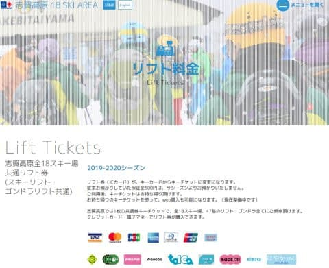
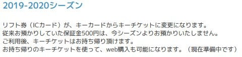
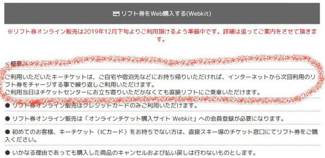
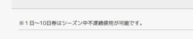
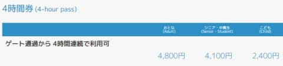
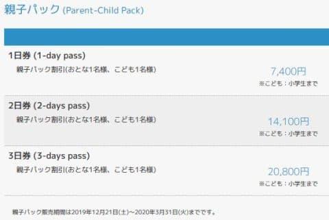
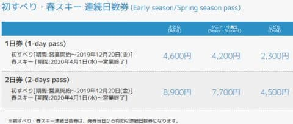
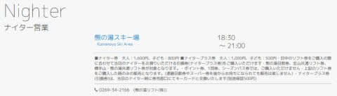
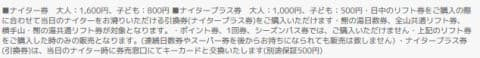

# 2020シーズン志賀高原共通リフト券の情報…保証金500円が不要に？そして持ち帰ったカードにはWebでチャージ可能に！

📅 投稿日時: 2019-10-09 03:00:56

えー．

本日，志賀高原索道協会のページを見てみると．

ようやく，2020シーズンのリフト料金に

切り替わってましたね～！

（[志賀高原索道協会HP](https://www.shigakogen-ski.com/lift-tickets)より）

ってなことで．

さっそく詳しく見てみると…

うむ？

なんだか，キーカードから

キーチケットに変わる，

と書いてありますが…

物理的に，何か形が変わるのかな？

…そして，保証金500円が不要になり，

使用後は持ち帰っていいって書いてありますが…

さらに，持ち帰ったキーチケットを使って，

Web購入可能？

どういうことだ…

と，さらに見てみると．

ふむ？持ち帰ったチケットに，

インターネットでチャージして

繰り返し使える？

…そして，インターネットでチャージ

した場合，リフト券売り場に行かなくても

そのままチケットが使えるのか！！

志賀高原のリフト券売り場，

リフト券の種類が多すぎて，

お客さんが窓口で「どのチケットにしようか？」

と悩むこともあり，待ち時間が

かかることが多かったけど．

これでちょっと便利になりそう…！

とはいえ．

シーズン券の私は，昼間のチケットを

買うことは無いので．

ナイターや早朝が，インターネット

チャージに対応してくれると

ありがたいんだけどなぁ…

さらにインターネットチャージだと，

割引になるシステムだといいんだけど…

（声を大にして言っておきたい）

で．

肝心なチケットのお値段を見てみると…

やっぱり1日券は5500円と，

500円アップ（涙）

そのあとは，1日伸びるごとに

5000円アップですか…

つまり，5000円ｘ使える日数＋500円

ということになりますね…

…でも．

よく見ると．

去年からシステムが

変わっているようで．

なんと．2日券から，不連続での利用が

可能になったようです！

（さすがに1日券の不連続使用は無理だとツッコミたい．

1日券は「購入した当日のみ有効じゃなく，後日でも使える」

って意味だと思う…）

昨年までは，2，3日券は連続使用，

不連続で使えるのは4，5，6，7，10日券で，

8，9日券というのは無かったけど…

今シーズンは，1日から10日まで．

好きな日数で，好きな時に使えるように

なるようです！！！

で．

1～10日券の他は，

4時間券が4800円ですか…

普通のスキー場の1日券の値段ですね（泣）

そして，あとは親子パック券が

今年も残るようです．

…これは，親子2枚のチケットを

別々に買うより1000円くらい

安くなりますが．

2日券，3日券は連続利用が

前提なのかな？？

あとは例年通りの初滑り・春スキー券．

GWもこのお値段なので，

これは結構お得なお値段に

感じますね…

ってな感じで．

全山共通チケットはこれだけ．

残念ながら，去年まであった

1.5日券は無くなったようです．

そして．

一の瀬やサンバレーなどの中央エリアの

ナイター券の案内は無いのに．

熊の湯のナイター券のみ，

ナイター料金が書かれていて…

詳しく見てみると…

普通に買うと1600円みたいですが，

全山共通券と同時に「ナイタープラス券」を買うと，

1000円で熊の湯のナイター券が滑れるようですね！

うーーーむ．

これはいいシステムなんだけど…

大変残念なことに．

シーズン券はナイタープラス券の対象じゃないので，

私は1000円でナイターは滑れないようです（涙）

ってな感じで．

いろいろ細かなシステムは変わりましたが．

いちいちカードを返却しなくて

済むようになり，

インターネットでチャージすれば，

リフト券売り場に並ばなくて

良くなったのは，進歩かな…

でも．

やっぱり．

値上げは痛い…（涙）

## 💬 コメント一覧

### 💬 コメント by (はなげ親分)
**タイトル**: Unknown
**投稿日**: 2019-10-09 06:45:24

あーっ❗️

昨年のナイター券やら早朝券など、手元にまだ何枚もあるんですよ～(激泣)

### 💬 コメント by (いか)
**タイトル**: Unknown
**投稿日**: 2019-10-09 19:51:20

白馬エリアと同じ紙っぽい券になるのでしょうかね、、、？中身はRFIDだったような気がします。

一回券を買っておけば並ばなくてよくなるのは便利ですよ!(シーズン券だとあまり関係ないかもですが)

白馬はこれに切り替わったときにゲートが変わったのですが、この設備投資が重たかったとか…、値上げの背景かもしれませんね。

### 💬 コメント by (Skier_S)
**タイトル**: ゲートシステムは変わらないのかな？
**投稿日**: 2019-10-10 01:06:43

＞はなげ親分さま

大丈夫です．

今シーズン中は，まだ昨シーズンのカード返却＆保証金払い戻しを

チケット売り場で受け付けてくれます！

＞いかさま

あ，白馬はもうWebでチャージできたんですね…

知りませんでした（笑）．

志賀は数年前にゲートを換えたばかりなので，

今回はゲートを変更せずにカードを換えるだけだと

思うのですが…

前回，ゲートを換える際に，費用削減のために

志賀高原で5-6本のリフトが廃止になりましたので，

それがまた繰り返されると痛いです…

＞

### 💬 コメント by (てつ)
**タイトル**: 焼額山シーズン券について
**投稿日**: 2019-10-16 16:24:24

いつも楽しく拝見しています。(特に物欲選手権)

志賀高原について教えてください。

いつも苗場・神楽で滑っていますが、たまに志賀高原に行くので、プレミアムシーズン券の購入を考えています。が、志賀高原は共通リフト券で滑りたいのです。

プリンスのシーズン券の焼額山シーズン券で追金で志賀高原共通リフト券を出してくれないですよね？そんなシステムあったら良いなと。

### 💬 コメント by (Skier_S)
**タイトル**: ＞てつさま
**投稿日**: 2019-10-17 00:58:25

ご愛読ありがとうございます～！！

プリンスのプレミアムシーズン券，行っちゃうんですね！

すごい…

残念ながら，プリンスの券を持っているから追金で共通リフト券を

出してくれるというサービスはありません（涙）

あったらすごい嬉しいんですが…

ただ，焼額シーズン券を持っているなら，全山共通券を買わなくても，

中央エリアに行くときは中央エリア券を買えば，焼額と中央エリアが

滑れるので，全山を買わずに済むかもしれません．

…ただ，中央エリア一日券，4900円もしますが（泣）．

全山共通券が，JAF会員割引なら5000円だと思うので，

あんまり差が無いからメリットないかも…

あ，あと，中央エリア券では，奥志賀や横手，熊の湯は滑れないので．

やっぱり全山共通買った方がよいのかも…

### 💬 コメント by (coco)
**タイトル**: 知恵の無い
**投稿日**: 2020-11-14 17:02:15

スキー人口の激減で苦しんでいるのに、保証金を無くすなんてなんて知恵の無い自殺行為。

日本のスキーヤーの為というより、外国人の為に働く志賀高原。保証金の返金無いなら毎年何十万人分のキーチケットをスキーデータから購入し、毎年何千万も捨てるのですか？そのお金他の為に使用してよ。補助金必要ないじゃん。俺たちせっせと志賀高原に行ってんのにみんな外国へお金が出ていくの嫌だな～。

### 💬 コメント by (Skier_S)
**タイトル**: ＞cocoさま
**投稿日**: 2020-11-16 00:46:56

うーむ．

あのペラペラカード，1枚いくらくらいなんでしょうね…

そもそも自動ゲートシステム，SkiData社じゃなく国産で作れないのかな，とか．

圧雪車とかも1台3000万~4000万円のやつ，全部輸入車ですから…

かなりの額が海外に出ているかと思います…

