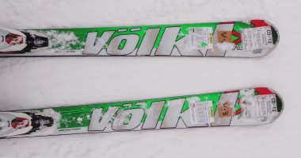
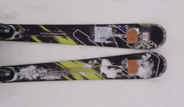

# これで一区切り・2012/2013シーズンモデルのスキー試乗レポート　Salomon&Volkl編

📅 投稿日時: 2012-04-24 00:44:12

ということで．

ながなが続いた試乗レポートですが．

…今回で4月の志賀で試乗した板のレポートは最後になります．

最後にレポートするのは，3月の八方で試乗したSALOMONのX-KARTと

VOLKLのPlatinum CDの2機種．

今回は，前回と長さが違うのを履いてみました…

--------------

○Volkl

Platinum CD　178cm

オールラウンド基礎板．

前回は171cmを履きましたが，今回は長めの178cmを履いてみました．

…やっぱいいわ，この板．

178だけど，取り回しが軽快なので170cmくらいに感じます．

ロングベースのオールラウンドなら，このくらいの長さでいいかな．

やっぱり，ロッカーはこれまでの板の感覚より，

ちょい長めの板がいいんでしょうか．

比較的良くたわみ，よく曲がります．

トップとテールがしっかり仕事している感じのグリップ．

かといってグリップが過剰なわけでなく，どうやっても動かせる

取り扱いやすさがあります．

この板のキーワードは軽快感ですかね．

重厚感はないですが，軽快な感じのロング～ミドルターン用

板がほしい人にはお勧めです．

○Salomon

X-KART 164cm 

小回りベース基礎板．

トップロッカーです．

前回は171cmを履きましたが，今回は短い164cmを履いてみました．

…164cmは短すぎたか．

もう，くるくる回ります．忙しいくらい回ります．

超小回り特化スペシャル板．

何もしなくても回ってしまいます．

超オートマチック．

新鮮な感覚です．

逆に言うと，どうしようもなく板が回ってしまう，とも言えます．

フォールラインに絡めるなど考える間もなく切れ上がっちゃいますね～．

マニュアル操作の余地がない感じ．

板のサイドカーブに乗っている分においては，安定感はあります．

…ずらそうと思うと，ちょっと難しいかな．

この板．はっきり言って171cmの方がお勧め．

171cmで，普通の板の165cmくらいの感覚．

うーん．ロッカー板って，やっぱり長めを選んだほうがいいのかな～．
