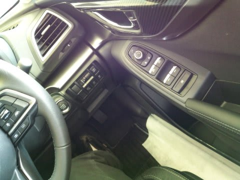

# 新型インプレッサ見に行ったよ…価格表もありました

📅 投稿日時: 2016-09-26 02:58:03

🏷️ カテゴリ: [車](cba0e8330b3f2ded7c1addfacc75d4547.md)

ということで．

この9月から事前予約が始まっているらしい，新型インプレッサ．

いろんなところで先行展示が始まってるようなので，

見に行ってきました～！

えー．

まず．

外見ですが．

もういろんなメディアでさんざん

公開されているので，

写真はいっぱい見ましたけど．

実物を見ると…

いや，かなり大きく見えます．

かなりワイドになったよね？？

…って感じ．

左右ドアミラー幅は変わってないようですが…

前のモデルではちょっとおとなしかった

テールの造形も，今回はかなりアグレッシブ．

テールライト左右が後ろに張り出し，

かなりいかつい感じ…

そして，室内は…

ふむ．

シートやステアリングは，ちょっと高級そうに

見えますね．

運転席に座ってみると…

ステアリングがスイッチだらけ

なんですけど（笑）

ナビの上のマルチファンクションディスプレイも，

横に広くなったようです．

メディアのレポートだと，

内装の高級感が増した…ということで，

期待してみてみましたが．

確かに，インパネ上部や側面はソフトパッド

仕上げになり，高級っぽくなりってますけど…

やはり，このあたりはまだプラスチッキーな

感じかな…

ドアトリムとかこのあたりは頑張ってます．

…確かに，これまでのインプレッサに比べると，

ずーーっと頑張ってて．

車格が1-2ランク上がった感じですが…

決して高級車に負けないような質感ではないので．

そのあたり，誤解無きよう．

んで．

リヤシートは…

足元空間が25mmほど広がった…ってことですが．

あら．

その数字以上に広く感じますね～！

BRレガシィほど広くないけど．

これなら十分，って広さ．

リアドアの内装も，まぁ頑張ってる感じ．

…そして，トランクは…

これは先代とあんまり変わらないのかな．

レガシィやレヴォーグと違って，

ゲート部分と床面がフラットでなく，

5cmほどの段差があるのが惜しい…

そして．

ここからはマニアックに．

床下をのぞいてみると…

なんと！！

アンダーボディー全面にカバーがついてるじゃないですか！

フロントサス，ロワアーム取り付け部分も

ごついブレースでカバーされていて，

ブレースの下面もアンダーカバーと

ほぼツライチに成型されてます．

うむ…

こんな見えない床下に，スバルのこだわりを感じる．

フロントサスの形式自体は，マクファーソンストラット．

後ろに長く伸びたL字ロワアームで，

ロワアーム後端のマウントは上下串刺し

タイプのブッシュという，先代と全く

同じ形式ですね．

リアサスも…

形式自体は変わってない感じ．

ただ，ロワアームのショック＆ダンバーマウント

位置が，先代よりかなり車輪側に近づいたかな．

レバー比をしっかり稼げる構造になってますか．

ただ，このテールパイプはいただけない（笑）

んで．

もらってきた価格表を見てみると．

お値段はこんな感じで．

グレードは3種類のみ．

1.6Lが1種類，2Lが標準とスポーティーグレードと2種類．

すべてがEyeSight標準装備なのはいいとして．

なんと，2Lにも全グレードにFFモデルが

ありますね…

スバルはAWDにその存在意義があるので

はなかったのか…？？（笑）

＃とりあえず，このインプレッサが

＃FF車初のアイサイト搭載車になりますね…

で．

ちなみに．

手元の見積書を見ると．

後方接近警告などがつく，

アドバンスドセイフティパッケージが

＋約86,400円

LグレードにLEDヘッドランプ，クリアビューパック，

アドバンストセイフティ―パッケージをセットで

つけると

+17万8200円．

ってことで．

2.0L EyeSightの4WDに，LEDヘッドライトと

アドバンスドセイフティ―パッケージを

付けると，255万円！

うーーむ．

…結構高いなぁ…

## 💬 コメント一覧

### 💬 コメント by (yama)
**タイトル**: シーズンインまで
**投稿日**: 2016-09-26 22:26:48

シーズンインまで後少しになりましたね。今日はイエティのナイターシーズン券を申し込みしました。10月3日には志賀高原のシーズン券と懐に痛いことが続きます。都合が合えばイエティは一緒できれば良いなと思います。駐車料金が4時以降で無料で、有料道路が半額です。maeさんも一度はどうですか。

### 💬 コメント by (Skier_S)
**タイトル**: yamaさま
**投稿日**: 2016-09-27 03:22:16

シーズンまで，あと1か月切りましたか…

もう，そんな時期になるんですね．

でも．

こちらは休みが取れるのかわからない状態です（涙）．

今シーズン，Yetiは21日オープンかな…

と，思っていますが．

10月22，23日はもう行けないのが

分かっていますので，

おそらく私は29日に初滑りでしょうか…

行けるようならまた連絡します～！

### 💬 コメント by (まいる)
**タイトル**: インプ見に行こう
**投稿日**: 2016-09-27 06:43:50

Sさん、新型インプレッサかなりよいかんじですねー　今週末、アウトバックのオイル交換次いでに見に行こうかなぁと思っています。

### 💬 コメント by (miya)
**タイトル**: 見てきました
**投稿日**: 2016-09-27 19:23:27

私も見てきましたよ。

なんかインパネ周りは買ったばかりの

LEVORGよりもいい感じが…

しかも後席も広い…

パナのオプションナビも8インチだし…

（LEVORGは7インチ…）

ちょっと悲しくなりましたが、

見なかったことにします（笑）

5ドアはやっぱり狭いし。

でもこのプラットフォームでLEVORGが

出たら、よくなりそうですねー

### 💬 コメント by (Skier_S)
**タイトル**: こんな時間に帰宅…とんでもない時間にコメント返し
**投稿日**: 2016-09-28 04:25:15

＞まいるさま

結構いい感じですよ…

インプベースのLEVORGが出たら，

かなり魅力的かと…

＞miyaさま

もう見てきましたか！

確かに，インパネ部分やドアトリムは，

LEVORGを超えてるかも…

後席は広いですが，トランクは狭いし．

まぁ，LEVORGの方がいいかと．

このインプベースのLEVORGは，

やはりあと2年ほど待たされるんでしょうか…

あるいは，発売4年待たず

フルモデルチェンジ？

…それは無いだろうな～．

私も，このインプベースのLEVORG，

かなり魅力です…

