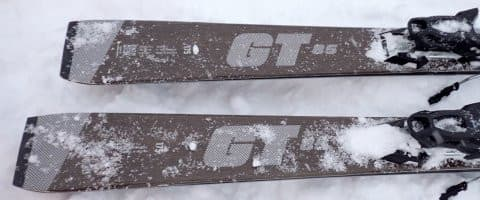

# 2025シーズンモデルのスキー板，試乗レポートその8…FISCHER The CURV GT 85 REDEFINE

📅 投稿日時: 2024-06-01 17:23:00

🏷️ カテゴリ: [スキー板試乗](c0bd8048615710cee890e403a36cc9a2b.md)

人間，食べなくてよくて寝なくてよければ

どれだけ楽か…

という危険思想に取りつかれている，Skier_Sです．

ここしばらく，本格的に週末滑り込んでる

わけじゃないのに体重が減っていく…（泣）

いつもなら，スキーシーズン終盤は運動量が

落ちるので，体重が回復していくのに…

今週はゆっくり食事をとる時間もない

感じで，体重が落ちていく…（涙）←週末無理に

月山に行ったから仕事が溜まってるんでしょ

そして．

やっぱり月山に行くと，志賀高原に行くより

片道3時間余計にかかるので．

往復6時間分，週末の睡眠時間が削られ

てるのが今週は地味に効きました…

とりあえず．

人間寝なくてもよくて，食べなくても良ければ

楽なんだけど．←一部，Skier_Sサイボーグ説が

あるけど，機械の身体を持つ一部の志賀のレジェンドたちと違って

私はごく普通の人間なので，食べて寝る必要があるんです！！

そんなわけにいかないので．

今週はどこにもいかず，たっぷり寝て

体力回復と，ゆっくり食事して体重回復に

努めます…

ってなことで，今日はのんびり週末なので，

いつもと違って夕方更新となりましたが，

本題へ．

今日も2025シーズンモデルのスキー板の

試乗レポート．

今回もフィッシャー編です！

〇FISCHER The CURV GT 85 REDEFINE　175cm

オールラウンド

来シーズンから新登場の，The CURVの

セミファットシリーズ．

この板はその名の示す通り，センター幅85mm

のモデルですが…

76mm，80mm，85mmの3種類あるらしく，

これが一番センター幅が広いモデルになります．

さらに，この85mmはノーマルのM-Track着きの

モデルと，プレートなしで軽量ビンディングが

ついているトップモデルの2種類が

ありますが…

この板はプレートなしで軽量ビンディングが

着く，税込み21万4500円という最高級モデル

になります…

持ってみたところ…

すごい軽い！！

ビンディング込みで1880gという，

中級から初級モデル並みの板の軽さ．

さらにプレートも着いてないし…

センター幅が広いこんな板だから，

まぁぼちぼちの板でしょ，と，

そこまで期待せずに乗ったら…

なんだこれ！！！！！

面白い！！！

10cmほどの新雪が蹴散らされた，

すごい荒れた斜面なのに．

全く荒れを感じさせず，がっつりグリップ

して，激烈に快感度の高いカービングが

できます！！

こんな荒れた斜面で，お尻が雪面に

着くかも！？？というくらいのカービングが

かませるとは…っ！！

そして．センター幅85mmというのもあり，

コース脇の新雪に入っていっても浮力は

そこそこあるし…

何にしろ軽いので，新雪の中で自由に

板が振り回せる！！

取り回しのしやすさはかなりハイレベル．

それでいて，圧雪でもセンター幅85mmを

思わせないがっつりカービングができるし…

プレートなしで心配した高速安定性も

かなり高いです！

谷回りで板を傾けていくだけで，

トップからテールまでの長いエッジが

しっかり効いて，板のたわみを感じられる

カービングに楽に入っていけます．

傾き量で好きな半径のカービングに

持っていけるし．

コントロール性も高く，さらに軽い板の

わりに高速安定性も申し分なく…

センター85mmもあるのに，なんだこの板は！！

という驚きを禁じ得ない板．

カービング志向がちょいと強めなので，

グイグイカービングに入っていきますが．

板が軽いので，ズラしに行こうと思えば

楽にずらせます．

…ただ，ずらしていっても楽しくない．

ガンガン切っていきたい板．

新雪が蹴散らされたバーンで，他の板では

結構板がたたかれたり，新雪モフモフに

突っ込んでつんのめったり板が流されたり

するバーンでも，まるで整地のように

ガッツリカービングで中回りしていく，

雪の荒れを感じさせないこの板．

おそらく，春のザブ雪でも，荒れを感じず

滑っていけるんじゃないですかね～…

私が春雪用として，最近絶大なる

信頼を置いているVOLKLのDEACONに

近い感じ．

DEACONよりラディウスがちょい小さめな

感じかな～．

いや．

この板，かなり面白い．

今回軽量ビンディングのREDEFINEのみが

試乗板に出ていたけど．

ノーマルのM-trackのGT85も乗ってみたい…

そっちは定価187,000円と，このREDEFINEより

2万7000円ほど安くなっています．

見た目によらず，がっちり整地でも行けるので．

これ，FISCHERの意欲作だと思います！！

## 💬 コメント一覧

### 💬 コメント by (だい)
**タイトル**: とてもいい板だと思います。値段さえ見なければ…
**投稿日**: 2024-06-01 22:57:01

お久しぶりです。だいです。

これはとてもいい板だと思います。私みたいなサイドカーブ頼りの人間にはDEACON（やPEREGRINE）より扱いやすく感じました。

エキップさんではPROTECTOR ATTACK 13ビンディングでの販売もしてくれるそうなので、デフォルトのATTACK 11ビンディングではちょっと弱くて不安という人にぴったりそうです。

### 💬 コメント by (Skier_S)
**タイトル**: ＞だいさま
**投稿日**: 2024-06-02 02:21:58

お久しぶりです～！！

いや．こいつ，結構いい板でした．

ロングベースの板に慣れているとDEACON，ショートベースの板に慣れているとThe CURV GTがいい感じかと．

エキップさんだと，ビンディング変えてくれるんですね…

でも，そうすると定価23万近い？？

うーん…高い…

