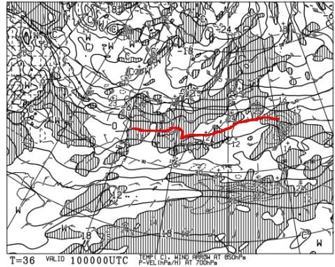

# 12月10，11日の週末の志賀高原スキー場の天気は…土曜は曇り．日曜は終日雪がぱらつく．14日はちょっと積もるかも？

📅 投稿日時: 2022-12-09 01:26:01

🏷️ カテゴリ: [スキー天気予想](c6554f5c3c106093b511a8daae23757e8.md)

ようやっと，明日…

ってか，日付が変わってもう今日ですね．

わがホームゲレンデ焼額がオープンします！！

あぁ…

先週は我が人生初めての

12月第1週の週末に焼額がオープン

しなかった週末

をすごしましたが…

ようやっとオープンです！！！

…とは言っても，動くのは第4ロマンス

リフト1本だけです…（涙）

昨シーズンは，12月第1週からゴンドラが

ガンガン滑れたのに…

今シーズンは，12月第2週でも第4ロマンス

のみか…（泣）

とりあえず．

今日の特派員情報によると．

今日の熊の湯は一日雪降りで，せいぜい

10cm程度とはいえ，天然雪が積もって，

コース幅も広がったようですし…

天気が悪かったので，ゲレンデもガラガラ．

リフト待ちもほぼ無かったみたいです！

ってなことで．

私は今週末から志賀高原通いとなるので．

今日からは，いつもの

志賀高原超特化型局所限定天気予想

をお送りします！！

えー．

まず．

9日金曜の850hpa気温図を見ると．

赤い0℃線はギリギリ志賀高原の南．

まぁ，昼間は0℃をちょっと超える

くらいですね．

で．地上天気図を見ると，わずかに

降水域が富山県付近の日本海に

かかってますが．

志賀には降水域はかかってないので，

志賀は曇り～時々晴れ，って感じかな．

そして，肝心な週末の10日土曜は．

850hpa図を見ると，これも赤い0℃線は

ギリギリ志賀高原の南…

朝の焼額山麓は-3℃程度，昼間は

0℃ちょいまで上がる感じ．

この日も地上天気図では降水域が

志賀高原にはかかってないので…

この日も曇り～時々晴れでしょうか．

で，次の日曜の850hpa図を見ると…

日曜11日も，朝は赤い0℃線はギリギリ

志賀高原にかかる程度．

ですが…地上天気図では，志賀高原にも

しっかり降水域がかかっているので…

この日は朝から降ります！

でも，朝の積雪は5cmくらいかな…

昼間もずっと降り続け，気温は朝より

昼間が低いくらい．

昼まで10cm程度積もるかも？

ってなことで．

まとめると．

9日(金)：曇り時々晴れ．

　朝は焼額山麓は-3～4℃程度．

　前日からの人工雪が圧雪された，

　締まって滑りいいバーン．

　昼間は0℃を超えるほど気温が

　上がるけど，雪が解けるほどじゃ

　ないので，いい感じのバーンを

　キープしてくれるかな？

10日(土)：朝のうち晴れるがすぐ曇る．

　朝の焼額山麓は-3℃程度．朝晴れれば

　放射冷却でもう少し冷えるかも．

　この日も前日からの人工雪が圧雪

　されて，朝イチは人工雪がかなり

　締まった感じのいいバーン．

　昼間は0℃を超えるくらいに気温が

　上がるが，晴れないのでそんなに

　雪は緩まず．

　午後になるとちょっと硬い下地が

　出てくるところもあるかも…

11日(日)：明け方から雪が降り，

　営業開始まで5-10cmほど積もる．

　志賀の登り道路はうっすら積雪．

　あさイチは人工雪の上にうっすら

　新雪の良いバーン！

　新雪はちょっと重めかな．

　昼間も雪はぱらつき続け，結構

　寒いので根性の無い人はふるい

　落とされるかも．

　営業終了までに結構いい感じの

　雪が5～10cm積もるかな．

って感じでしょうか…

まぁ，どっさり積雪は無いものの，

異常高温になることもないので，

この週末，ゲレンデに穴が開いたりは

無いと思います．

…そして，日曜は5-10cmとはいえ，

久々の天然雪の上で滑れるかも？？

で．

このあと．

12，13日はそれほど積もらなさそうですが…

14日の天気図を見ると…

うおおおお！！！

志賀高原には，水色の-9℃という強い寒気が！！

そして，地上天気図は…

見事な冬型！！！！

これなら，そこそこ積もってくれるかも…！！

…ただ．

雪が降るのは1日だけ．

15日には止んじゃいます…（涙）

でも，この冷え冷え14日にどっさり積もって，

来週末はゴンドラが滑れるように

なってほしい…(期待薄)

## 💬 コメント一覧

### 💬 コメント by (だい)
**タイトル**: Unknown
**投稿日**: 2022-12-09 02:22:49

ラニーニャに期待していたのですが、まさかこんな出だしになるとは…お久しぶりです。今シーズンも宜しくお願いします。

土日ヤケビに行くのでここしばらくライブカメラを観察してたのですが、火曜頃からサウスコースに人工降雪機見当たらなくなったので、もしや土日に唐松コース開けようとしてるのでは？と微かに期待をしています。

### 💬 コメント by (アリス)
**タイトル**: ヤケビゴンドラコース
**投稿日**: 2022-12-09 09:14:38

Skier_S様

Sさんの、志賀高原超特化型局所限定天気予想は

確率が高いですので、いつも参考にさせていただいております。

もしかして、9日(金）は休暇を取って参戦ですか？

Sさんのひいき目なしの予想で、12/19の週はヤケビゴンドラコースは滑走可能と推測しますか？

焼額山のHPの動画のシチュエーション最高ですね♬

### 💬 コメント by (レインボー改めブラボー75)
**タイトル**: Unknown
**投稿日**: 2022-12-09 15:51:02

金曜日の熊の湯情報

朝の蓮池-6℃。素晴らしい！スノーマシンがフル稼動。明日の上からの滑走？にむずむずします。(動いてください！)

今日の熊の湯は、ヤケビ解禁のおかげで、まさに飛び乗り天国。日に日に満足度が高まります。雪もかなり増えてきて、ストレスはあまり感じなくなりました。

そんな快適なのに、昼は湯田中の仲良し食堂のラーメンが食べたくて早上がり。でも、臨時休業でしたとさ。もっと滑りたかった。

帰りの蓮池は+6℃。なんと朝と11℃もの差が。

### 💬 コメント by (Skier_S)
**タイトル**: 明日から初志賀！！
**投稿日**: 2022-12-09 23:02:36

＞だいさま

ラニーニャの年も，実は12月や3月以降は暖かくなることが過去の統計上結構あるんです…（涙）

でも，今年は最低すぎますね．

ヤケビは今，唐松とパノラマで人工降雪機動かしてます！

でも，今週末はさすがに第2高速動かせないと思います…

＞アリスさま

いや…残念ながら10日の土曜から参戦です．

でも，ホントはスキーに行ってるどころじゃない仕事量なんですが…

＞ブラボー75さま

熊の湯はガラガラだったんですね！！

でも，さすがに明日は混みそう…

今日は本当は気温がかなり上がるはずが，朝だけ晴れの放射冷却で冷えた感じです．

