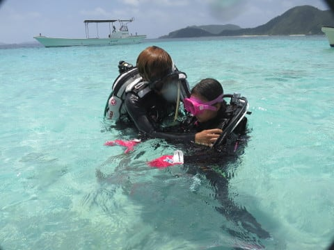

# 2017年8月，小学生の子連れで座間味でダイビングその4…1本目終了後は…ついに娘が！？？

📅 投稿日時: 2017-10-31 02:13:10

えー．

Yetiは．

無事この台風を乗り切って．

今朝のオープンはちょっと遅れたものの．

月曜から，ナイターまで営業したようですね…

雪も特に薄くなったこともなかったようで，

…台風v.s.アイスクラッシュマンの勝負は，

今回は，アイスクラッシュマンの勝利でしょうか．

もう，これで今シーズンはもうさすがに

台風は来ないだろうから．

今後は，営業中断の心配はなさそうかな～．

…いや．

これで今年もう一回台風が来たりしたら．

それはもう，歴史に残る異常気象でしょう…

同じ異常気象なら，スキー場に夏まで大量にドサドサ

最高雪質の雪が降り続けるような，そういう異常気象を

お願いしたいところ…←そうなったら氷河期で，人類が絶滅しかねないから！！

で．

台風一過の今朝は，

[水曜の記事](e334a6f17f8e49d6ebdcb67b5e69fb715.md)の一番最後に予告していたように．

いろんなスキー場で雪が積もったようですね…！

かぐらも真っ白になってますし…

（[かぐらスキー場Facebook](https://www.facebook.com/snowkagura/posts/1349406108520039)より）

[志賀高原でも結構雪が降った](https://ameblo.jp/kumakumanoyu/entry-12324067117.html)ようです…

こうやって，雪の便りが聞こえてくると．

本格的シーズンが近づいてきた実感がわいてきますね！

もう，台風の便りはいいから…

ということで．

もうダイビング日記はいいから…

という声も聞こえてきそうですが．

今日はダイビング日記へ，Go!

＃スキーネタの前フリのあとにダイビングネタの本題って，相変わらずなんと季節感の無いBlogだ…

-----

ってな感じで．

座間味での1本目…

というか．

今年の1本目のダイビングが終わったら．

時間はもう11時．

…ダイビングをした大人たちは，これから1時間

水面休憩時間になりますが…

ダイビング組が水上に上がると．

それと入れ替えに，娘がなんか準備し始めましたよ…

…そうです．

もし今回，可能だったら．

娘に体験ダイビングをさせてみたい，と

お願いしていたんですけど…

いきなり初日の1本目の直後からの

トライになったようです！

まずは．

インストラクター資格をもつ雄大さんに，

レギュレータからの息の吸い方を

教わってるようです…

今日の体験ダイバーは娘一人のようで．

完全マンツーでのレクチャーですね．

そして，ダイビングではかなり大切な，

耳抜きの練習ですか…

そして，次は実際に水の中に入って．

器材を背負って，足がつくところで…

いざ，水中で息を吸う練習！

念入りに，念入りに何度も顔を着けたり

上げたりして息を吸う練習をしてみて…

マスククリアの練習をしてみたり，

そのほかいろいろ声をかけたりして．

怖くなったり不安になったりしないか，

確認しています…

インストラクターの雄大さん．

結構念入りにチェック＆レクチャーを繰り返しますね～．

これなら，私も安心して娘を任せられます…

で．

ちょっとづつ深く沈んでみて…

をを！

ついに着底できるまで潜りました！

…っていっても．

立ったら足がつく程度の深さですが…

早く潜りたくてたまらなかったらしい娘．

全然怖がったりすることもなく．

もう，水中でも余裕のようです．

…私は初めて体験ダイビングで潜った時．

理屈では分かっていても．

実際に水中で息ができるのが，すごい驚き

だった記憶が…

素潜り大好きな娘も，多分同じ感覚を

味わってるんだろうな～．

とりあえず．

ついに娘．

無事，練習をクリアし終えたので．

いざ，初ダイビングのスタートです！

