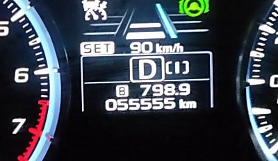

# 我がVMG LEVORG君55555km突破，そしてガソリン満タンで1000km走ったよ

📅 投稿日時: 2020-07-28 02:07:09

🏷️ カテゴリ: [車](cba0e8330b3f2ded7c1addfacc75d4547.md)

えー．

この4連休前半．

ちょっと至急の用事で，急ぎ関西某所の

妻実家に行かねばならなくなり．

（それもあまりの急な日程だったので，娘を連れずに行くはめに…)

まぁ，詳細はここではあまり書けないのですが，

現地1泊を挟んで，2日間で片道500kmずつ，

往復1000kmの長距離運転をしてきました…

…まぁ，月山日帰りの，

一日1000km走って，そのうえスキーをしてくる

ってのに比べると，ずっと楽ですけど(笑)．

で．

この移動で，我がVMG LEVORG君．

走行距離55555kmを突破しました～！

…この7月で，LEVORG君の購入から2年．

年平均3万～3.5万kmを走る私としては，

普通なら，購入2年で6.5万km程度走って

いるところですが…

今年はやはりコロナ騒ぎのおかげで，

走行距離が1万kmくらい減ってますね…

しかし．

この関西往復．

かなりのエコランチャレンジをしてみたところ．

なんと．ぎりぎりフルタンク1000km

走りました～！！

いや…きわどかった．

燃費計の表示は，リッター18km走ったことに

なってますが…

この燃費系，リッター1kmくらい多めに表示

されるので．

満タン法で図ると，大体リッター17kmくらい

でした…．

うーむ．

1600回転を超えたら負け，…って感じの

エコラン走法で，BRレガシィ君だと，

この走りで20km/L超えてたんだけどな～．

エアコンOnだったので，エアコンを切ったら

もう少し行ったかな…

とりあえず．

わがVMG LEVORG君．

購入時から56000kmほど走って，

生涯燃費は12.8km/L．

高速道路の走行が，総走行距離のうち

かなりの割合を占めるとはいえ．

街乗りの通勤にも使っているし．

ルーフボックスも積みっぱなしと

考えれば．

LEVORG 2.0としてはまあまあの燃費かな？

## 💬 コメント一覧

### 💬 コメント by (Noname)
**タイトル**: Unknown
**投稿日**: 2020-07-28 10:39:37

ルーフボックスは高速燃費に響きますね。

外せば10%くらい違う気がします（個人の主観ですw）

### 💬 コメント by (アリス)
**タイトル**: 素晴らしい燃費ですね
**投稿日**: 2020-07-28 18:05:13

Skier_S様

スマートウォッチの取り扱いには大変お世話になりました。

ブログ拝見して驚いています。国産車2Lクラスで無給油で1,000ｋｍ走行は。

まあまあどころか、文句のつけどころがないですね。

想像ですが燃料タンク60Lぐらいだと思います、よほど急アクセルを控えてエコ運転の賜物でしょうか。

### 💬 コメント by (Skier_S)
**タイトル**: エコランする車じゃないんだけど…
**投稿日**: 2020-07-28 23:59:08

＞Nonameさま

ルーフボックスは，1割弱くらい燃費に効く感じでしょうか．

スピードを高速の制限速度の30%増量キャンペーンくらいまで行くと，

もう少し悪化しそうですが…

でも，高速ではスキーキャリアの方が，ボックスよりよっぽど

燃費に悪さをした思い出があります．

キャリアの方が軽くて，前面投影面積もボックスより小さそうですが，

やっぱりボックスの方が空気抵抗少ないんですね…

＞アリスさま

LEVORG2.0でフルタンク1000kmは珍しいと思います．

なんてたって，普通は我慢して走る車じゃないですから(笑)．

おっしゃる通りタンク容量60Lで，むちゃくちゃエコランしてます．

レガシィの時は，フルタンク65L，燃費20km/Lでフルタンク1300km走った

記録もあるのが自慢です(笑)．

でも，最近のハイブリッド車は燃料タンク40L程度なのに，

余裕でフルタンク1000kmくらい走るのがすごい…

### 💬 コメント by (しんちゃん)
**タイトル**: 脱帽(^^;
**投稿日**: 2020-07-29 00:19:06

エコラン、すごいですね。

90km/hでエコランしようって決心して高速道路を走ってみても、1時間ももたずに、ついつい気持よく走ってしまいます（汗）

エコランしてる時って、目的地への到着も遅くなってしまうのですが、どんな気持ちで運転しエコランのモチベーションを維持しているのでしょうか？

好きな音楽を時間を気にせず楽しみまくっているのか？それとも燃費系とタコメーターをにめっこしながらリッター18kmいった～なんて言いながら、にやにやして走っているのか？

はたまた決めた目標を達成するぞという、意志が固いのか、集中力が維持できる体質なのか。

片道５～６時間エコランで運転する集中力はすごいです!!

### 💬 コメント by (Skier_S)
**タイトル**: ＞しんちゃんさま
**投稿日**: 2020-07-29 00:46:11

高速道路でエコランしている間は，ひたすらタコメーターとのにらみ合いです．

リニアトロニックが最高ギア比からずれたら負けです．

…っていうか，4時間も5時間も運転する時は，何かこういう

ゲーム的要素を入れないと飽きちゃうので，最近では

ひたすらエコランの燃費記録更新にチャレンジしてます．

…そうです．リッター18km行った～…なんて言いながら，にやにやして

走ってます（笑）．

### 💬 コメント by (ほっぽ)
**タイトル**: Unknown
**投稿日**: 2020-07-29 13:58:04

Sさん

レヴォーグ2.0でその数字はスゴいですね❗😳

私もスキー往復は基本エコランで燃費計の数字見て喜んでるタイプですが、前のゴルフオールトラックでは15kmいきませんでした。

そして夏タイヤで高速使って遠出することはほぼ無いので、夏タイヤでの本気のエコランはしたことがありません。

コロナ禍で走行距離が伸びないと、買い換えも遅れますかね❓😅

ところで私の方はコロナのせいで車を買い換えました😅

と言っても例の如く過走行激安中古車、今度はアウディA4アバントのクワトロです。

かなりキレイな個体で今ではアウディライフ満喫しています❗😊

この冬はクワトロの実力を志賀高原で堪能したいと思ってます。

### 💬 コメント by (Skier_S)
**タイトル**: ＞ほっぽさま
**投稿日**: 2020-07-30 01:22:39

ええええ！！

1年足らずで買い替えですか…！

しかし，A4アバントとは，クラスアップしましたね…

走行距離は何kmくらいの車ですか？

私の車は，今のところ相変わらず5年目の買い替え予定でいますよ～！

### 💬 コメント by (ほっぽ)
**タイトル**: アウディ
**投稿日**: 2020-07-30 09:40:42

Ｓさん

そうなんです。ゴルフは中古車買って10か月で買い替えてしまいました。

これも全部コロナのせいです。(^^;

まさかの大物物欲選手権に大敗してしまいました。(^^;

### 💬 コメント by (Skier_S)
**タイトル**: >ほっぽさま
**投稿日**: 2020-07-30 23:08:30

10万4000kmなら，まだまだ走りますね…！

足回りもショック替えたんですね．

ダンパー抜けてたんですか？

とりあえず，車内は広くなったと思うので，アルハイの出番が

無くなるんじゃないでしょうか（笑）

### 💬 コメント by (ほっぽ)
**タイトル**: アウディＡ４
**投稿日**: 2020-07-31 07:16:05

Ｓさん

アブソーバー、何となく柔らかいなとは思ったのですが、交換したら特にリアはお亡くなりになっていました。(^^;

結果、このタイミングで交換して正解でした。

Ｓトロニックオイル、センターデフオイル、リアデフオイルも交換

プラグも交換、エアクリ、エアコンフィルターは近日交換、

これだけ交換しておけば、当分は安心して乗れると思っています。

プラグは水平対向を経験しているので、直４は超簡単で、ものの１０分で４本交換出来ました。

確かに室内、カーゴルームともに広いですが、

スキーの足としてはアルハイの広さは魅力的なんですよね。

なので半々程度に活用していこうと思っています。

馬力211psですが、トランスミッションの伝達ロスが少ないためか、数値以上に速いと感じます。

これでサブコン付けたら270psオーバーまで持っていけるので、サーキット走行も楽しめそうです。

アウディの一般的な使い方からは大きく逸脱しますが。(^^;

### 💬 コメント by (Skier_S)
**タイトル**: ＞ほっぽさま
**投稿日**: 2020-08-01 03:09:09

ショックまで変えたなら，長く乗りたいですね…

そして，水平対向に乗ってたら，直4のプラグ交換なんて超おてがるですよね（笑）．

でも，輸入車はエアコンフィルターやらエアクリーナーやらも

国産車より高そうですね…

