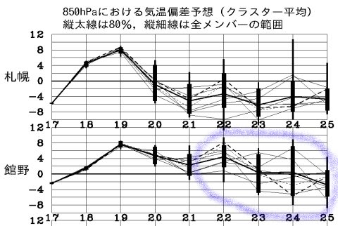

# 今週末もYetiだなぁ．でも，明日は昼過ぎまで雨…（涙）．

📅 投稿日時: 2016-11-19 01:15:35

あー．

そうです．

予想通り．

熊の湯も，今週末のオープンをあきらめたようです（涙）．

これで．

19日オープン予定のスキー場．

全滅ですか…（泣）．

さらに．

今日の天気図を見ると．

23日以降の850hpa気温予想．

…青色で囲ったように，予想はもう完全にバラバラ．

24日も，ホントに冷えるのかどうか，微妙な

予想になってきました…（涙）．

とりあえず．

19日から22日まで，悲しいほどの高温が続きそうですが．

24日以降は冷え込むはず…っ！！！

と，強く信じる．

そう．

「今週はもう仕方ないけど，せめて23日以降

　ガンガン冷え込んで，来週26日以降は

　たっぷりの雪で滑れるよう神々に捧げる踊り」

の効果を見せるのだ！

私が踊り続けているからには，

24日以降はがっつり冷えるはずなのだ！！！

＃ということで，24日以降に冷えたら私のおかげですので，みなさんよろしく

…もし，冷えなかったら．

来週もYetiか…？

…そ，そんな恐ろしいこと，

か，考えたくないっ！！（ガクブル）

とりあえず．

今週末は．

アサマもかぐらも熊の湯もオープンしなかったので．

Yeti確定です…（涙）．

土曜は残念ながら，昼過ぎまで雨．

それも，時折強く降る，雨．

昼過ぎ，午後は晴れてきそうですが…

生暖かい風が吹く，高い気温の夜になりそうです．

あー．日曜は，朝からすっきり晴れるでしょう．

でも．

結構暖かくて，板が滑らない雪になりそうな感じ…

私は，いろいろな事情で．

土曜に行くか日曜に行くか，まだ未定です．

それとも今週末は行けないかも…

もし，行けたらまたレポートします…

＃しかしホントに元気が出ない天気が続く…（涙）．
