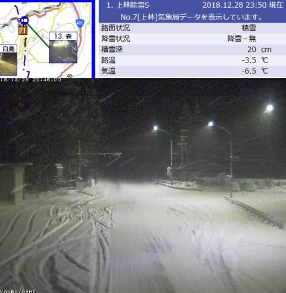
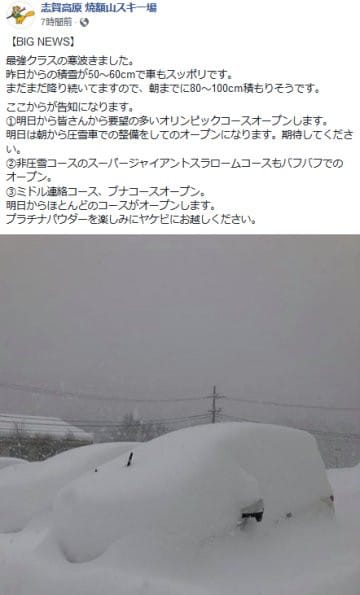

# 志賀高原，すごい雪が積もったよ！31日まで降り続くよ！…そして2018年も暮れていく…

📅 投稿日時: 2018-12-29 00:17:40

えー．

どうやら，今日の志賀高原．

かなり積もったようですね…！

（北[信建設事務所HP](http://www.q0.ws302.smilestart.ne.jp/index.htm)より）

だもんで．

焼額はオリンピックコースやらスーパーGSコースが

オープンするようです～！！

（[焼額山FB](https://www.facebook.com/yakebitaiyama/photos/a.533933973368620/1974389755989694/?type=3&permPage=1)より）

でも．

オリンピックコースは圧雪後のオープンですか…

明日，新雪パフパフはできないんだな…（ちょいと残念）

…そして，奥志賀連絡コースとミドルコースは

まだオープンしないのか…

で．

明日から，東館山，西館山，ジャイアントも無事

オープンするようです…

これでようやっと，志賀らしくなりましたね～！！

明日29日は，朝の風の予想がちょっと弱くなってきたので．

焼額は第1，第2ゴンドラとも，減速ながら運転するかな…

奥志賀ゴンドラはヤバそうですが．

明日の朝は，ブーツ～脛パフくらいの新雪が楽しめそう！

…オリンピックコースに圧雪が入るのが残念…（ちょっと涙）

明日も一日雪が積もり続けますよ～！

っていうか，31日の朝まで降り続けますよ～！

上信越道は，深夜0時現在で坂城から先，

長野道は安曇野から先でチェーン規制が入っています．

明日スキーに行く方は，雪道ですので，安全運転で

余裕を見て出発してくださいね～！

あと，寒いので寒さ対策も忘れずに！

…ってなわけで．

あと3日ほどで，2018年も終わろうとして

います…（信じられないけど）

うーん．

ついこの間，2018年の正月でお雑煮を食べたばっかり

のような気がしたんですけどね～…

とりあえず．2018年．

今年もいろいろありました．

新雪パフパフの正月から始まり．

雪不足で志賀がクローズしてしまったGW，

そして，夏の娘のCカード取得…

…このあたりまでは普通だった気がしますが．

行きがかり上のLEVORGの購入，

それに引き続く自宅の購入，

そして引っ越し，

さらに追い打ちをかける，

物欲選手権の大物3点セット完敗，

その上に，ここに書いていないけど．

身内のいろいろなイベントがありました…

我が人生にとっても，激動の一年だった

気がします…←あなたの人生は波乱万丈なのが通常でしょ

ってな感じで．

今年もあと3日ですが．

…当然，私は残り3日間，しっかり志賀で過ごします．

年末年始は9連休．

うち8日間，焼額で滑っている予定です～！

では，志賀高原でお会いしましょう！

## 💬 コメント一覧

### 💬 コメント by (寺友のシン)
**タイトル**: スタック車だらけ
**投稿日**: 2018-12-29 00:57:04

28日夜に奥志賀まで上がりました。

坊平前後、スタック車の回転競技状態です。

アクセル緩めず元気よく上がる必要があります。

### 💬 コメント by (しんちゃん)
**タイトル**: 良いお年を
**投稿日**: 2018-12-29 02:07:24

今年一年お疲れ様でした。

ついこの間タケノコ採りを経験したのに、気が付くと年末。時が経つのは早いですね。

これだけ積雪があれば、笹の中に突っ込むこともなくなりますね（恥）手首は順調に回復に向かっています。

年末年始、事故などお気をつけて。

良いお年を。!(^^)!

### 💬 コメント by (地元民)
**タイトル**: 大雪です
**投稿日**: 2018-12-29 12:49:56

大雪警報、出っぱなしです。

山雪型の冬型なので、まだまだ降りますよ。クリスマスで志賀高原中央部が滑れないなんて、過去にあっただろうか・・・・。記憶にないです。すごい12月でした。

### 💬 コメント by (ホンダ)
**タイトル**: 今日もモサモサです。
**投稿日**: 2018-12-29 14:11:49

今日のヤケビ朝から視界悪く雪もモサモサです。ファーストトラックはやりましたが参加者があまりいませんでした。視界悪くよくわかりませんでした。その後奥志賀いきましたが寒くて寒くて耐えられず退散しました。明日もモサモサみたいですよ。

### 💬 コメント by (Skier_S)
**タイトル**: 志賀はまだ降り続けてます
**投稿日**: 2018-12-29 23:20:51

＞寺友のシンさま

コメントありがとうございます～！

私が山に登ってきた朝は，除雪もされていて

スタック車もなく無事上がってこれました…

…今日は午後，奥志賀はゴンドラ＆リフトが止まって

大変じゃなかったですか？

＞しんちゃんさま

もう，コース脇の笹は雪に隠れて全く影も形も見えなくなりました(笑)．

もう，笹薮に突っ込む心配はありません．

ぜひ，焼額に復活を．

次はいつ頃参戦予定ですか…？

＞地元民さま

いやー．

31日の午前中くらいまでは降り続けそうですね…

今日の段階でも，これでもう十分って感じで積もったんですが，

まだまだ積もりそうですね…

とりあえず，これで志賀高原も大丈夫そうです！

＞ホンダさま

朝は出遅れました(涙）

ファーストトラックは視界が悪かったんですね…

奥志賀は昼頃に止まったのですが，それ以前にもう

退散されてたんですね．

明日も，今日と同じようなパウダーデーですよ～！

（またの名をモサモサデー）

