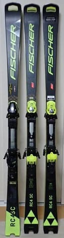

# 臨時の物欲選手権開催！？？今度は中古板．またスキー板が増殖するのか？？

📅 投稿日時: 2025-01-29 01:41:00

えー．

本日も，特派員から志賀高原の写真を

送っていただきましたが…

どうやら今日の志賀高原．朝のうちは天気が

良かったようですね…！！

ただ，ここ数日，気温が高めでそんなに

雪が降ってないので，雪は硬めのようです…

でも，だんだん雲が増えていき，

午後2時ごろには完全な曇りになった

と思ったら…

午後4時近くには完全にガスって

視界が悪くなってしまったようです．

これは，あれです．

明日からの雪降りの前兆で．

明日水曜と，明後日木曜の2日間，

降りますよ～！

西風なので，志賀ではそこまですごい

ドカ雪にならないけど．

西風でもそこそこ強い寒気が入るので，

根性のある雪雲が北アルプスを越える

ので，志賀高原にも雪が積もります…！

水曜日に結構積もって，木・金と

パウダーデーが楽しめそう…！！

そして，やっぱり来週は4日の火曜から

3－4日間，ものすごく冷えて，来週も

かなりの量の雪が積もりそうですね…！！

この辺りの天気は，いつもの水曜深夜と

なる明日に，また詳細予想を書きます…

ってなことで．

本題へ．

皆さんからの期待値が異常に高い物欲選手権．

今回は番外編的なお話です…

最近このBlogを読み始めた人で，

物欲選手権ってなんじゃい！！

と思う人は．

過去の物欲選手権を[こちら](ee52ba7c4767c18b841a00d5f752d43c1.md)から見てみてください…

ーーー

アナウンサー　「みなさんこんにちは．

　本日は，皆さんお待ちかね，

　『第1回 スキーヤーの物欲を

　刺激する危険なスキーを

　見せられて，物欲にまみれた

　スキーヤーが買わずに

　我慢できるか選手権』

　をお送りします！」

解説　「あの…

　お待ちかねって…

　またこの選手権，聞いたことのない

　名前に変わってるんですけど？

　こんな聞いたことのない初めての

　選手権を待ってる人って，

　いるんですか？」

アナウンサー　「今回のこの選手権．

　神田でもなく長岡の某スキー専門店

　でもなく，Skier_S選手のホームの

　焼額山で開催されるホームゲームと

　なります！」

解説　「…ホームゲームって…」

アナウンサー　「今回の参加選手も，

　某長岡のお店でブーツと板を買った後

　リミッターが外れて2セット目の板と

　ヘルメットとゴーグルを買い足して

　しまうとか，某スキーショップ社長に

　物欲を刺激されまくった結果

　板2セットにフォーミングブーツまで

　買ってしまうという，

　凡人の理解を激しく超越する

　素晴らしい記録を残し続けている，

　Skier_S選手です！！！！」

解説　「…素晴らしい記録って…

　だから負けてるんですよね？

　負けてるのに素晴らしいって…

　繰り返し言いますが，そこは

　ほめるところじゃないですから」

アナウンサー　「どうやら今回，

　Skier_S選手の石ころふみ用の

　板がちょっと残念なことになって

　しまったことを知ったとある焼額の

　常連さんが，

　『ほとんど履いてない板があるから

　中古で買わないか』という提案を

　Skier_S選手にしたらしいんですよ」

解説　「あぁ…あの，転んだのでも

　なんでもなく，[イエティのリフトに
　乗った時に，乗り場の雪に板を
　ひっかけて，FISCHERのRC4 SCを
　ひん曲げたという](e39bec1eeb068119ed5b757ec613f827b.md)，そんなことで

　板を曲げる人はいないよねという

　ツッコミを入れたくなる，かなり

　恥ずかしいあの事件ですね」

アナウンサー　「その事件を知って，

　ほとんど履いてない，同じFISCHERの

　SCを持っていた焼額の常連さんが，

　中古で譲るというオファーをしたそう

　なんですよ…」

解説　「うーん．曲げたのは石ころ

　踏み用の古い板でしたからね…

　最新モデルの新品よりはかなり安い

　とはいえ，ほとんど履いてない

　そこそこの値段の中古を買うより，

　石ころふみ用なんでボロくても

　安いのでいいと考えるのが普通

　なんですけどね～」

アナウンサー　「そうなんですよ．

　Skier_S選手もそこで悩んでいるようで．

　今回曲げたFISCHERのSCはすでに

　もう1セット持っていて．

　Skier_S選手は最近ショートの板を

　あんまり履かないので，この板も

　ほぼ新品状態で残ってるという

　ことなんですよ…」

解説　「ほぼ新品のFISCHERのSCを

　持っているのに，また全く同じような

　ほとんど履いてないほぼ新品の

　FISCHERのSCを買うって…

　ほぼ新品の同じ板が完全に2台並ん

　じゃうので，普通なら買わない

　ところですよね…」

アナウンサー　「はい．

　普通なら…」

解説　「まぁ，普通なら，

　石ころふみ板を曲げたら，

　どうでもいいような安いボロボロ

　板をもらうとか格安で買うとか

　しますよね」

アナウンサー　「ええ，普通なら…」

解説　「そもそもSkier_S選手．

　今でもファット・セミファット・

　GS・ロング2セット・ショートと，

　数多くの板を持っているから，

　この板のどれかが今シーズンの

　終わりにはヘタって，石ころふみ

　用になるだろうから，石ころふみ

　用の板が欲しいだけなら，板を買う

　必要は無いはずなんですよ」

アナウンサー　「そうですよね．

　普通なら買う必要はないですよね…」

解説　「買うとしても，

　石ころふみ用のただ同然の板を

　買うべきであって…

　ただでさえ最近ほとんど履かなく

　なってほぼ新品で小回り板が残って

　いるのに，また同じ小回り板を

　買ってどうするんですか？？

　普通なら買わないですね」

アナウンサー　「そうなんですよ…

　Skier_S選手もそれで悩んでいて．

　中古のオファーを受けた時も即答

　せずに，実物を見てから判断する…

　ということでしばし回答を保留して，

　本日実物を見せてもらうという

　ことになったようです」

解説　「それで本日の選手権となった

　わけですか…」

アナウンサー　「ということで．

　Skier_S選手，選手権会場に到着し，

　早速板を見せてもらいました…！！

　息をのむ選手権のスタートです！」

解説　「息をのむって…

　全く同じ’23のFISCHERのSCを

　持ってますからね…

　いったい何を見て，どう思ったら

　買うつもり…」

アナウンサー　「あ，決まりました．

　購入決定ですね」　

　

解説　「は，早っ！！！！！！」

アナウンサー　「実物を見て

　5秒で決まりました！」

解説　「早い…早すぎる…！

　なんでそんなに即決？？

　それも同じ板を…？」

アナウンサー　「さすが

　物欲大魔王のSkier_S選手．

　悩んでいたのに，板を見て

　たった5秒で翻心して購入を

　決めちゃいましたよ！！？？」

解説　「いったい何があったのか…」

アナウンサー　「どうやら板の

　表面を見て即決だったらしいの

　ですが…」

解説　「…なるほど…

　どうやらこのFISCHERのSC．

　Skier_S選手が持っているのは同じ

　'23モデルでも，一般市販向けの

　ウクライナ製なんですが．

　今回の板は，試乗会で[Skier_S選手が
　めちゃくちゃ気に入った，
　オーストリア製のSC](e987349984f149be3ae8d6c1ecb1daa55.md)だったのを

　確認したので，即決だったよう

　ですね…」

アナウンサー　「なるほど…

　あのウクライナ工場の火事のため，

　一時やむなくオーストリア工場で

　生産したけど，シーズンに入ると

　ウクライナ工場が復活したので，

　’23年モデルのごく一部だけ

　オーストリア製が出回ったという，

　あのレアものの板ですか…！」

解説　「そうです．

　Skier_S選手はそのレアものの

　[オーストリア製の板を手に入れられず，
　ちょっと悔しい思いをしていた](ebb49c0255a644671dbd9627e88322875.md)ので，

　今回オーストリア製ということで

　即決しまた勝手に増殖したたようですね」

アナウンサー　「とはいえ…

　普通，ほとんど履いてない板を

　持っているのに，それとまったく

　同じ板を買いますかね？？」

解説　「まぁ，[同じ板を置いておくと
　増殖](e8a53c5e38b2ebcf1a084dc391aaad69d.md)すると言い張るSkier_S選手

　ですから…

　とでも

　言い張るんじゃないですか？」

アナウンサー　「ということで，

　今回は選手権開始から5秒で

　勝負が決まるという，見事に

　最短記録を更新したSkier_S選手！

　さすがは物欲大魔王！！

　実に素晴らしい，見事な記録

　でした！！！」

解説　「いや…だから，

　負けたんでしょ？

　負けに見事も何もないでしょ？？」

アナウンサー　「ということで，

　今回もいつも通り，見事な

　負けっぷりで終わった選手権．

　また次回お会いしましょう！」

解説　（これで板が7セットに

　ブーツが3セットになったというのに，

　まだ買うものあるのか…？？）

　　

ーーー

ということで．

また板が増殖しました…

（左から曲げた板，もともと持ってた

　ウクライナ製，今回追加のオーストリア製）

## 💬 コメント一覧

### 💬 コメント by (レインボー77)
**タイトル**: Unknown
**投稿日**: 2025-01-29 14:26:31

水曜日の志賀高原情報

朝の蓮池-7℃。小雪ぱらつき時折晴れ間が見える日。昨夜は物欲選手権で、私も敗れさりました。思っても見なかったBOAブーツを突如購入。着脱が超楽。足をふんわりと包み込んでくれる感触の心地よさ。クローチングがなんか上手くできる。長年の悩みの後傾姿勢からの脱却にも、一役かってくれそう。

とにかく物欲選手権は負けた者勝ち。特に時間が残されていない年寄りこそ道具に頼るべきだと、勝手に納得しているレインボー77なのでした。

朝の白樺は微かに積もった雪で滑りは今いちだけど4点/5。唐松も4点。オリンピックは硬めフラットに雪が少し残って快適バーンで何度もお代わりしました。この日のベストで文句なしの5点。GSも気持ちよくて4点。パノラマ5点。イースト4点。サウス4点と、どこも良かったし、ブーツのせいもあって、ハイテンションな一日でした。

### 💬 コメント by (ミニミー)
**タイトル**: ワークマン手袋
**投稿日**: 2025-01-29 18:13:19

いつも楽しく拝見しております。

今季チューンナップの仕上がりがピンピンだった為

手袋を駄目にしてしまいました。

金欠の為ワークマン手袋購入予定ですが手にいつも大汗を掻くタイプなので躊躇してしまっております。

その後の使用感は如何でしょうか？

### 💬 コメント by (アリス)
**タイトル**: Unknown
**投稿日**: 2025-01-29 20:52:04

こんばんは😀

物欲選手権楽しいですね😀　私も大好きです。

明日から志賀高原参戦します。

先ずは二高スタートです。

脛パフを期待してセミファットにします。

### 💬 コメント by (Northfox)
**タイトル**: いつも楽しく拝見しています。
**投稿日**: 2025-01-29 21:02:16

物欲選手権、待っていました！

しかし恐縮ですが今回の戦いはやや物足りなく感じました。

次はBOAのブーツはどうでしょう？

お店にブーツの手直しにいったら、BOAのブーツが有って．．．という流れで。

多分見ごたえのある戦いになると思います。

宜しくお願いいたします。

### 💬 コメント by (ひろき)
**タイトル**: Unknown
**投稿日**: 2025-01-29 23:44:46

いつも楽しく拝見しています😊

先日赤倉に行きましたが､ザックカバーを忘れたので急遽上越のアルペンに行ったところ､さすが雪国見たこともない程の売り場の広さ😱

東京の大手スキー用品店に比べると､お手頃品がわんさか有り驚きの連続でした　地域によってこんなに品揃えが違うんですね〜😔

ちなみに地元（神奈川県）でも売り場は狭いですが､

神田と比べると安いですよ　レキでも8000円弱でした

### 💬 コメント by (Skier_S)
**タイトル**: 板増殖中
**投稿日**: 2025-01-30 01:05:03

＞レインボー77さま

物欲選手権敗退おめでとうございます！

そうです！道具に頼るところは道具に頼るんです！

道具でスキーが上手くなるなら，道具を買うのは必然なんです！

…FISCHERのBOAブーツ，いいなぁ…

＞ミニミーさま

あぁ…ワークマン手袋，透湿性が悪いのが最大の欠点なので…

汗をいっぱいかく人は避けたほうがいいかも．中がかなりしっとりというか，

結構濡れてきます．

夜にしっかり乾かさないといけないレベルで濡れますので，違う手袋がいいかも…

もしワークマングローブにするなら，二つ買って交互に使うとかしたほうが良いです．

＞アリスさま

明日も30cm以上，運が良ければ50cmくらい積もりそうです…！

新雪楽しんできてください！

＞Northfoxさま

…すごい負けっぷりが期待されている…いろいろ期待値が高い…

今回は予定になかった番外編なので，負けっぷりは弱いかも（笑）．

BOAブーツは試し履きしたけど，足首が緩くて私には合わなかったんですよ（涙）

＞ひろきさま

上越のアルペンって，そんなにでかいお店があるんですか…

K奈川県はもうアルペンはほぼ生き残ってないので，スポーツデポには

行きますが，ときどき掘り出し物がありますよね…！

