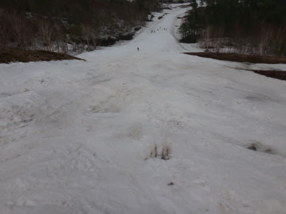

# 5月25日のかぐら詳細…ファイナルデーまでしっかり滑れました！

📅 投稿日時: 2014-05-27 02:23:07

ってことで．

昨日速報した，かぐらファイナルデー．

本日は，詳細をば…

えー．

まず．

朝7時半のロープウェー開始時間の，10分前くらいに

もうこれだけ並んでいたので…

…なんだか，今日も混みそうな気配…

10分前に並んだ私は，5台目くらいのロープウェイに

乗車だったかな．

で，みつまたエリアに上がると…

うむ．まだ，雪はあるな．

けど，先週に比べると，かなり減ったかな～

みつまた高速リフトからゴンドラへ向かっていく

ところも，完全廊下状態になっちゃってるよ…

んでも．

今シーズンも，最後までバス移動にならずに済みましたな！

で．

ゴンドラに乗って，かぐらエリアに着くと…

ほう！

ここはまだ，全面全然大丈夫ではないかっ！

さすが，かぐら…

朝イチは圧雪がかかったフラットバーンで．

メインバーンの，この写真の左側はちょっと土が

出てきちゃってるものの…

そこそこの滑りが楽しめるコンディション！

…さすがに雪はちょいと崩れ気味で，トップスピード

大回りは無理ですよ～

って感じで．

朝イチは人が少ないので．

そこそこたのしめるけど…

だんだん人が増えていき…

9時には，リフト待ち5分を超えて…

10時には，リフト待ち10分を余裕で超えちゃってる

んですが（涙）．

高速リフトと並行したペアが動いたのに，リフト待ち最大15分…

この3週間で，一番の混雑だったかも？？

10時台は，1時間でリフト2.5本分しか滑れなかったの

ですが…（泣）．

この時期に，こんなに混むか～！！！←かぐらは，この時期だから混むんですよ

まぁ．

当然ゲレンデも．

10時ごろには，こんな感じで．

焼額では絶対ありえない人口密度になってきます．

…よくもまぁ．

この時期に滑ろうっていうスキーバカが，

こんなにも集まったもんだ…←お前が言うな！

ってことで．

メインバーンが混んできたので，ジャイアントコースにでも…

と，ジャイアントコースに行ってみると．

ふえ？？

へ？？

雪，すごい減った？？

コース上部は，かなり土がコンニチハしてきてます．

コース途中は，コブラインがまだ生き残ってますが…

滑る人が減って，先週より，コブが浅くなったかな？

コース下部も，もうやばい感じ．

おそらく，あと2－3日雪解けが早ければ，

アウトだったでしょう．

んで．

メインバーンの方はと言いますと．

12時にはほぼ全面コブ化が進み…

午後1時には，これだけの大量なスキーバカの皆さんの

たゆまざるコブ掘削作業のおかげで，コブはすくすくと

順調な成長を見せ…

午後2時には，さらに飽きなく続けられる

コブ掘削作業の結果として，完全全面コブ祭り

バーンと化しました．

おかげで，午後2時ごろには，メインバーンにも

ちょっとヤバげな香りが漂ってきています．

だもんで，午後1時頃からは，リフト待ちは2分以下に

減ったかな～．

午後3時ごろには，ほぼ飛び込みで乗れるように

なってましたね．

しかしまぁ．

見事に育ったものよのお…

いや，コブ好きの私は嬉しいんですけどね（笑）．

…ってことで．

夕方は，結構やばい個所もあったものの

この日もリフトストップまで，かなり多くの人が

滑り続けていたという．

…やっぱりかぐらは，おかしい人が多いですね←だから，お前が言うなって

そして．

下山コースも．

ゴンドラコースもまだ全く問題なく

滑って帰ってこれて．

みつまたコースも，今年は営業最終日まで，

やばそうなところもなく，廊下状態とはいえ

しっかり整備された無事滑ってこれたという…

いや，かぐら．

すごいよ．

良く雪をもたせたな～．

だって．

朝はこんな感じだった，みつまた～ゴンドラ連絡コース．

午後は人が滑らないから，コース整備を放棄したんでしょうけど．

そうしたら，夕方にはもうこんなになっちゃってたんですから…

いやーー．

今年も．

最後までしっかり，コースを維持しよう！という

スキー場の方々の努力がひしひしと伝わってくる

コース状況でした．

ありがとう，かぐらの皆さん！！

最後まで楽しめましたよ！

## 💬 コメント一覧

### 💬 コメント by (ひろちゃん)
**タイトル**: かぐらファイナルお疲れ様
**投稿日**: 2014-05-27 22:15:09

ゲレンデ怪しかったデスよね、スキー板無事かしら？私の板も大分いたんでいるが、月山6,7がんばるですよ、また、コブ壺レッスンお願いしたいです(o^^o)

### 💬 コメント by (Skier_S)
**タイトル**: ひろちゃんさま
**投稿日**: 2014-05-28 02:13:17

私の板は，なんとか石を踏まずに済んだみたい

です…

月山ですが，今のところ6，7日に行く確率は

60％ってところでしょうか…

7日日帰りになる可能性が高いです．

