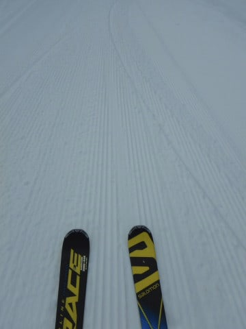

# 2020/1/26(日)の志賀高原スキー場，速報レポート！…晴天の一日，全体的に締まったバーン．でも，木曜の雨を考えるとよくここまで回復したもんだ…

📅 投稿日時: 2020-01-27 02:22:03

えー．

本日も，帰宅後板のワクシングだなんだを

していると．

もうこんな時間じゃないですか！！

…ってことで．

今日も日曜深夜恒例，速報モードでの

志賀高原レポートです…！

まず．

曇り空で始まった本日ですが…

ゲレンデは，ガッツリエッジが効く，

結構いい感じの，締まったシマシマバーンで

スタート！

朝イチに曇っていた天気は，

すぐに晴れ上がり．

午前9時半ごろには，すっきり晴天に！

昨日に引き続いてのいい天気！

そして，木曜の雨で壊滅的な

雪になるかと覚悟していたけど．

ちょいと固い感じがあるけど，

ガリガリバーンではなく，エッジが

ある程度効く雪質で．

ゲレンデもそれほど混まず．

…これは．

割と恵まれたコンディションなのでは？？

昼ごろには，0℃近くまで気温が

上がってしまい．

日が射す南斜面は，ちょっと雪が

緩んだところもあったけど…

でも，オリンピックコースやGSコースは，

終日雪が緩まず，いい感じの締まったバーン！

でも．

今日の雪は，ガチガチに固まったアイスバーン

ではなく．

さらに，表面がサラサラに崩れていく

雪だったので．

GSコースは，午後には硬い下地の上に，

崩れた雪が溜まったコブがところどころ

形成される，ちょっと荒れ気味のバーンに

なっちゃいました…（涙）

とはいえ．

8日の雨の影響を心配した今週末でしたが．

実際にフタを開けると，焼額は硬めながらも

結構いい雪質をキープし．

2日とも晴れたのもあって．

意外と楽しめた，いい週末だったかも…

…

…

で．

これからの天気ですが．

28日．

ちょいとヤバい感じ…

また，液体が降ってくる危機が！

明日27日（月）夜9時の850hpa図を見ると…

うーむ．

まだこの時間なら，赤い0℃線は志賀より南．

雨にはなりませんね…

そして．

降水域は志賀にもかかっているので．

27日夜から28日朝にかけて，

志賀高原は雪がちょっと積もってくれそうです…

ただ，そんなに軽い雪ではないので．

軽いパウダーが楽しめるほどじゃなさそうですが

そして，28日（火）夜9時の850hpa図ですが…

うぎゃー！

この時間だと，赤い0℃線は志賀より

北まで上がってますね…（涙）

そして，降水域がほぼ本州全土を覆って

いるので．

おそらく28日朝は雪だけど．

28日午後はみぞれ～雨に変わりそう（泣）

ただ，山頂付近のみギリギリ雪かも…

で．29日（水）夜9時の850hpa図は…

この時間なら，もう赤い0℃線は志賀より

南に下がってます！

そして，この時間も降水域が予想されているので…

この日は，明け方に雨が雪に変わり．

雪がぱらつく天気になるかも…

ということで．

27日（月）：一日雪がぱらつく．

　気温はそれほど低くなく，重い雪．

28日（火）：朝は前日からの雪がまだパラパラ

　降り続いていそう…運が良ければ，

　思いながらもブーツパフ．

　ただ，昼頃のどこかの段階で，標高が

　低いところは雪が液体に変わっていきます…

　志賀の山頂は雪のままで行ってくれるかも

　しれないけど，全体的に霙～雪の天気．

29日（水）：明け方に雨が雪に変わり．

　終日雪が降る感じ．

ってな感じで，28日が極端に気温が上がる

雨の危機で．

それ以降，29日からはなんとか液体が降らない

程度の冷えがしばらくキープしそうです…

で．

運が良ければ，それ以降30，31日に

ちょっと雪が積もって．

また来週末までにゲレンデ状況は

回復するかも…？

とりあえず．また明日詳細レポートやりますので，

お楽しみに…

## 💬 コメント一覧

### 💬 コメント by (学生)
**タイトル**: Unknown
**投稿日**: 2020-01-27 22:12:21

明日から31日まで横手山で滑ります。

風が強そうなので心配です……

初めてのスキーなので滑れるか心配です…

打撲だらけになりそうですが頑張るので応援よろしくお願いします🙏

### 💬 コメント by (しんちゃん)
**タイトル**: いっぱい滑りました
**投稿日**: 2020-01-28 00:01:09

週末をはさみ、四日間も滑ってしまいました。

こんなに長く連続して雪の上に立っていたのは、学生の時以来かもしれません。雪質・天気・仲間にも恵まれ、楽しい時間を過ごせました。

平日の間にしっかり雪が振ってほしいものですね。

フレフレ踊りのほか、洗車すると雪が降るとか、雪女と言われているとかあらゆる手段を結集して平日に志賀に雪を降らせないといけないですね(笑)

### 💬 コメント by (Skier_S)
**タイトル**: 今週末はいいコンディションかも？
**投稿日**: 2020-01-28 01:49:31

＞学生さま

あら！

初スキーですか！！

スキーを全く滑ったことが無い方が読んで楽しめるBlodではない気がするのですが(笑)．

とりあえず，明日からの天気ですが．

明日，明後日はちょっと荒れます（涙）

明日28日は，雪が降り続け，横手山も麓の第1リフトは，

午後になると，ちょっとみぞれっぽい，ウエアに着くと

解けちゃう雪で．

風もあるので，寒く感じるかも…

暖かい格好をして滑ってくださいね！

29日は終日曇り空．時折小雪が舞うかもしれませんが，

昼間の気温は0℃近くまで上がり，志賀の1月としては暖かいです．

30日は…激冷えです．

-10℃の世界なので，しっかり防寒を！

フェイスマスクやネックウォーマーなどで顔も隠しておかないと，すごい寒いです．

この日は，時折吹雪っぽく雪が吹き付けるかも．

とりあえず，4日間，楽しんできてください！！

＞しんちゃんさま

4日間の志賀滞在，お疲れ様でした．

意外と天気に恵まれて良かったですね…

売り切れ伝説以外にも，厨房機器破損伝説を残しましたが(笑)．

今週末は，冷え冷えのGoodコンディションになりそうですよ！

