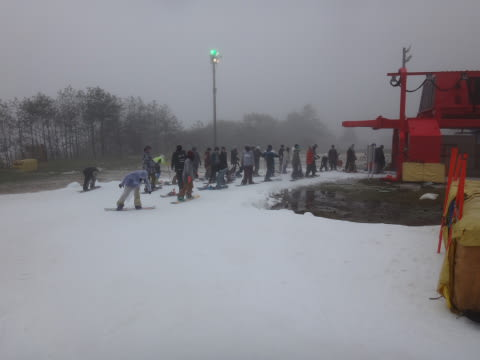

# 2016/17シーズンスタート！！10月29日，イエティのゲレンデ状況は…雨（泣）

📅 投稿日時: 2016-10-30 01:44:48

🏷️ カテゴリ: [2017スキー滑走日記](c7d777cecfc91bdf0fa464ad62c6d49ab.md)

はいはいはいはいはい．

行ってきましたよ～！

ついに始まりました！

スキーシーズンがっ！！！！

ってことで．

本日，Yetiで滑ってきました～！

…

…が．

…なんだ，この天気は…（涙）

Yetiは，朝から雨．

それも，そこそこの降り…（涙）．

麓まではそれほど降ってなかったのに…（泣）．

ってことで．

ゲレンデオープンが遅れた本日．

10時オープン予定ってことでしたが．

10分ほど早めに，ゲレンデがオープンしましたが…

雨です．

本格的な雨です…

それも．

雨雲レーダーでは，富士山の山頂付近にだけ

雲がかかっているような．

狙ったような雨…

…なぜ．

なぜ，私の初滑りの日を狙い，それもYetiだけ

ピンポイントで雨が降るのか…？←日ごろの行いが悪すぎるのでは？？

ってことで．

ゲレンデは幅が狭めでしたが…

でも，人が少なく．

硫安がガッツリ効いて，

朝イチはかなりイケる！

何にしろ，悪天候で人が少ないのがいい！

もう，シーズン1本目，大切に行こう…

という考えが吹き飛ぶようなクリアラップだったので．

今シーズンの1本目からガンガン飛ばしてしまいました…

で．

悪天候のため，リフトもガラガラ！

終日，ほぼ待ち時間なし．

待っても搬器4-5台待てばいいくらい．

ふはははは．

そうか！

分かったぞ！

私の初滑りの日なので．

スキー場が混雑しないよう．

私のために，神様が雨を降らせてくれたに

違いないっ！！←違う．絶対違うから．なぜそこまで楽観的になれるのだ？

とりあえず，午前中は比較的クリアラップが

とりやすいゲレンデ状況だったけど…

昼近くになると．

さすがにゲレンデの人は，ちょっと増えてきたかな…

天気は，止むことなくぽつぽつと．

時折パラパラという感じで，

雨が降り続いており…

昼を過ぎると，ゲレンデの一部に，

ちょいと土が…

夕方の整備前には，こんな感じに…

そして．

午後になると．

雨だけではなく．

ガスが…

時折ガスがかなり濃くなり．

ボーダーやスキーヤーが，こんな感じの

ガスの中に消えていくような状況に…

前が…

前が見えません…（泣）．

リフト待ちの方はというと．

午後1時過ぎまで，リフトはガラガラだったけど．

午後は時々，最大でこのくらいまで待ったかな～．

でも，タイミングによってはこんな感じで．

で，搬器は時折空きがあるくらいだったので．

リフトが混まなかったのが，イイ！

この時期，かなり混雑するイエティなのに．

やはり，雨が降った日は，混まなくていい！

雨の日がねらい目！←負け惜しみでは？

…でも．

コース幅が狭いので．

午後は，コース上はクリアラップが取れることはほとんど

無かったなぁ…（残念）

で．

16時から17時まで，営業を中断して，

一旦コース整備が入ったあとは…

そう．

今日は，ナイターまで行ってきました～！

…しかし．ナイターでも，天気は降ったり

やんだり（涙）

時折パラパラと雨が降り．

おかげで，

いつもなら混雑するナイターも，

今日はリフト待ちが少なくて，ほぼ

飛び乗り状態でした…

ってことで．

夜10時のナイター営業終了まで．

ほぼ一日中雨に降られながらも

滑り続けた，初滑り．

リフトがガラガラだったので，いっぱい

滑れて良かったな！！←負け惜しみ

PS.いつもなら，初滑り期間はリフト券が安かったのに…

　今シーズンは，初滑りから一日券が\4000（泣）．

　メルマガ会員割引で500円安くなるけど…

　高いよ～！

## 💬 コメント一覧

### 💬 コメント by (Unknown)
**タイトル**: Unknown
**投稿日**: 2016-10-30 02:20:38

3200円のレインウェアはデビューしたのでしょうか？

### 💬 コメント by (いー)
**タイトル**: Unknown
**投稿日**: 2016-10-30 16:08:02

初滑りお疲れ様です。

今季も楽しいレポお願いします‼

私もレインウェアが気になります⁉

### 💬 コメント by (まいる)
**タイトル**: 雨の初滑りお疲れ様でした
**投稿日**: 2016-10-30 19:15:51

Sさん、こんばんは

予告通り今日は神田スポーツ祭りで散財してきました。

アノンのゴーグルとDICEのメットです。

あとは近場の早売りリフト券で

Ogasakaのボードもと思いましたが、ほかのメーカーと違い旧品がまるでなかったです。

### 💬 コメント by (Skier_S)
**タイトル**: レインウェアデビュー済み
**投稿日**: 2016-10-31 01:39:33

＞Unknownさま

3200円のレインウェア，デビューしました～！

…でも．

ちょっと水がしみ込んでくる…（涙）

前回も，ホームセンターでレインウェア買ったのですが．

それは4000円以上の高めのやつだったからか．

水がしみ込んでくることは無かったのですが…

うーん．残念（泣）．

＞いーさま

レインウェアデビューしたのですが…

ちょっと残念でした．

また，今シーズンもガンガンスキー場

レポートしますので，お楽しみに！

＞まいるさま

神田で物欲全開でしたか（笑）．

リンク見ました！

スタンプラリーで何かもらえたんですか？

